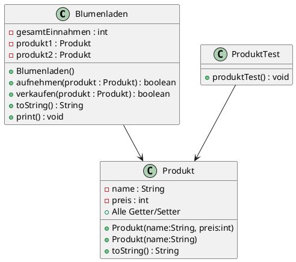

# Kolloquium POS1 WS

## 15. Mai 2025

### Allgemeine Informationen

- Achten Sie auf die Formatierungen Ihres Codes. Unformatierter Code führt zu
  Punktabzügen.
- An- und Abgabe erfolgen über das Z-Laufwerk, darin befindet sich das zu
bearbeitende Java Projekt.
- Nicht kompilierender Code ergibt negative Note.
- Der Code der Testklassen **darf nicht verändert** werden.

## Projekt: Blumenladen

Eine Blumenhändlerin benötigt für die Verwaltung ihrer Produkte eine Java-Applikation.

## UML Diagramm



### Klasse Produkt

Erweitern Sie die Klasse Produkt.java und implementieren Sie folgende Punkte:

- Beide Konstruktoren gemäß UML-Diagramm.
- Alle Getter und Setter zu den Attributen sind bereits vorgefertigt.

Erweitern Sie die Klasse Produkt nun um folgende Plausibilitätsprüfungen:

### Product::setName(…)

- Der Name darf nicht null sein.
- Wenn der Parameter name den Wert null hat, ist eine
`new IllegalArgumentException("Name für das Produkt darf nicht leer sein!")` zu werfen.

### Product::setPreis(…)

- Der Parameter preis darf nicht kleiner als 0 sein.
- Wenn der Parameter preis einen Wert unter 0 hat, ist eine
`new IllegalArgumentException("Preis muss einen positiven Wert haben!")` zu werfen.

### Produkt::toString()

Implementieren Sie in der Klasse Produkt die Methode toString() gemäß folgender Vorgabe:

Format: `Name: NAME, Preis: PREIS Euro`. Achten Sie darauf was der Test erwartet.

```txt
Name: Korallenkaktus Rhipsalis, Preis: 6 Euro
```

### Klasse Blumenladen

- Ergänzen Sie die Klasse Blumenladen.java mit allen Variablen und Methoden lt. UML-Diagramm.
- Überlegen Sie sich, ob Sie einen Konstruktor implementieren müssen (siehe UML-Diagramm).

Für die Methoden der Klasse Blumenladen.java sind folgende Anforderungen gegeben:

### Blumenladen::aufnehmen(Produkt) : boolean

Anforderungen an die Methode:

- Prüfen Sie den Parameter auf null und werfen Sie im Fehlerfall  eine
IllegalArgumentException: "kein Produkt übergeben".
- Versucht, zuerst das Attribut produkt1 zu befüllen. Ist das Attribut bereits befüllt so wird
das Attribut produkt2 befüllt, sofern es nicht ebenso schon mit einer Referenz
befüllt ist. Die Aufruferin der Methode soll `true` als Feedback für das
erfolgreiche Aufnehmen erhalten.
- Sind beide Attribute bereits befüllt, kann kein Produkt mehr aufgenommen werden.
In diesem Fall soll a) eine Fehlermeldung auf die Konsole ausgegeben werden:
"Fehler, kein Platz mehr im Laden!" und b) soll `false` von der Methode retournier
werden.
- Es soll nicht möglich sein, dass das gleiche Produkt zweimal aufgenommen wird. (return false)

### Blumenladen::verkaufen(Produkt) : boolean

Das übergebene Produkt (Instanz) soll verkauft werden. Dazu sollte

- der Parameter nicht `null` sein (`false` ist zu retournieren).
- geprüft werden, ob produkt1 oder produkt2 der Parameter sind. Wenn nicht: `return false`.
- die gesamtEinnahmen des Ladens sollen um den Preis des Produktes wachsen und
- die entsprechende Variable auf `null` zurückgesetzt werden.

### Blumenladen::toString() : String

Geben Sie sämtliche Informationen eines Blumenladens als String zurück, inlusive der
toString()s der Produkte.

## Schachbrett

Stellen Sie die `zeichne()`-Methode in der Klasse Schachbrett fertig. Es sollen sowohl gerade
als auch ungerade Eingaben korrekt verarbeitet werden, wie im folgenden Beispiel: zeichne(8):

```text

    L = 8                 L = 7

# . # . # . # .        # . # . # . #
. # . # . # . #        . # . # . # .
# . # . # . # .        # . # . # . #
. # . # . # . #        . # . # . # .
# . # . # . # .        # . # . # . #
. # . # . # . #        . # . # . # .
# . # . # . # .        # . # . # . #
. # . # . # . #
```

## Beurteilung

- 6 Testfälle: pro grünem Test 5 Punkte
- Schachbrett: 10 Punkte erreichbar

Erreichbar: 40 Punkte

0-20 / 21-25 / 26-30 / 31-35 / 36-40

## Gutes Gelingen
