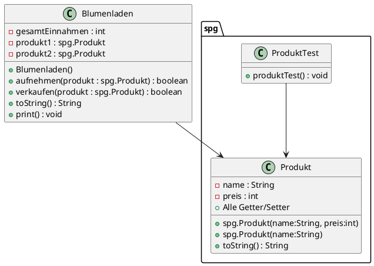

# Kolloquium POS1 WS

## 15. Mai 2025

### Allgemeine Informationen

- Achten Sie auf die Formatierungen Ihres Codes.
- An- und Abgabe erfolgen über das Z-Laufwerk, darin befindet sich das zu
bearbeitende Java Projekt.

## Projekt: Blumenladen

Eine Blumenhändlerin benötigt für die Verwaltung ihrer Produkte eine Java-Applikation.

### UML Diagramm



### Aufgabe 1: Klasse spg.Produkt (2P)

Erweitern Sie die Klasse spg.Produkt.java und implementieren Sie folgende Punkte:

- Beide Konstruktoren gemäß UML-Diagramm.
- Alle Getter und Setter zu den Attributen sind bereits vorgefertigt.

Erweitern Sie die Klasse spg.Produkt nun um folgende Plausibilitätsprüfungen:

#### setName(…) (2P)

- Der Name darf nicht null sein.
- Wenn der Parameter name den Wert null hat, ist eine
`new IllegalArgumentException("Name für das spg.Produkt darf nicht leer sein!")` zu werfen.

#### setPreis(…) (2P)

- Der Parameter preis darf nicht kleiner als 0 sein.
- Wenn der Parameter preis einen Wert unter 0 hat, ist eine
`new IllegalArgumentException("Preis muss einen positiven Wert haben!")` zu werfen.

#### spg.Produkt::toString() (2P)

Implementieren Sie in der Klasse spg.Produkt die Methode toString() gemäß folgender Vorgabe:

Format: `Name: NAME, Preis: PREIS Euro`. Achten Sie darauf was der Test erwartet.

```txt
Name: Korallenkaktus Rhipsalis, Preis: 6 Euro
```

### Aufgabe 3: Klasse Blumenladen (5P)

- Ergänzen Sie die Klasse Blumenladen.java mit allen Variablen und Methoden lt. UML-Diagramm.
- Überlegen Sie sich, ob Sie einen Konstruktor implementieren müssen (siehe UML-Diagramm).

Für die Methoden der Klasse Blumenladen.java sind folgende Anforderungen gegeben:

#### aufnehmen(spg.Produkt) : boolean (7P)

- Prüfen Sie den Parameter auf null und werfen Sie im Fehlerfall wieder eine
IllegalArgumentException: "kein spg.Produkt übergeben".
- Befüllt zuerst das Attribut produkt1. Ist das Attribut bereits befüllt so wird
das Attribut produkt2 befüllt, sofern es nicht ebenso schon mit einer Referenz
befüllt ist. Die Aufruferin der Methode soll `true` als Feedback für das
erfolgreiche Aufnehmen erhalten.
- Sind beide Attribute bereits befüllt, kann kein spg.Produkt mehr aufgenommen werden.
In diesem Fall soll a) eine Fehlermeldung auf die Konsole ausgegeben werden:
"Fehler, kein Platz mehr im Laden!" und b) soll `false` von der Methode retournier
werden.

#### verkaufen(spg.Produkt) : boolean (5P)

Das übergebene spg.Produkt (Instanz) soll verkauft werden. Dazu sollte

- der Parameter nicht `null` sein (`false` ist zu retournieren).
- geprüft werden, ob produkt1 oder produkt2 der Parameter sind. Wenn nicht: `return false`.
- die gesamtEinnahmen des Ladens sollen um den Preis des Produktes wachsen und
- die entsprechende Variable auf `null` zurückgesetzt werden.

#### toString() (5P)

Geben Sie sämtliche Informationen eines Blumenladens als String zurück.

### Aufgabe 4: spg.Schachbrett (bonus) (8P)

Stellen Sie die `zeichne()`-Methode in der Klasse spg.Schachbrett fertig. Es sollen sowohl gerade
als auch ungerade eingaben korrekt verarbeitet werden, wie im folgenden Beispiel: zeichne(8):

```text

    L = 8                 L = 7

# . # . # . # .        # . # . # . #
. # . # . # . #        . # . # . # .
# . # . # . # .        # . # . # . #
. # . # . # . #        . # . # . # .
# . # . # . # .        # . # . # . #
. # . # . # . #        . # . # . # .
# . # . # . # .        # . # . # . #
. # . # . # . #
```

erreichbar: 48P (-24/25-30/31-36/37-42/43+)

```text
  __           _                  ____       _            __  __            _
 / _|_ __ ___ | |__   ___  ___   / ___|  ___| |__   __ _ / _|/ _| ___ _ __ | |
| |_| '__/ _ \| '_ \ / _ \/ __|  \___ \ / __| '_ \ / _` | |_| |_ / _ \ '_ \| |
|  _| | | (_) | | | |  __/\__ \   ___) | (__| | | | (_| |  _|  _|  __/ | | |_|
|_| |_|  \___/|_| |_|\___||___/  |____/ \___|_| |_|\__,_|_| |_|  \___|_| |_(_)
```
