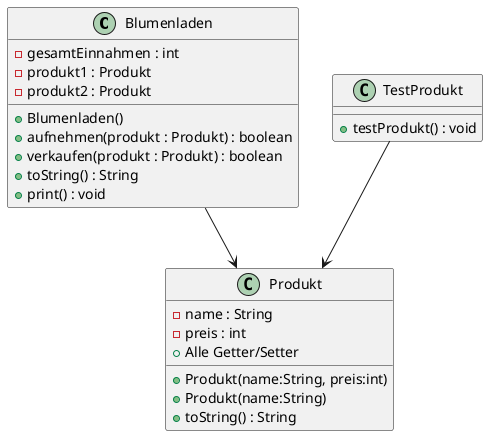

# Praktische Leistungsfeststellung POS

## Klasse: 3BKIF, Datum: 2024-12-18

### Allgemeine Informationen

- Achten Sie auf die Formatierungen Ihres Codes.
- An- und Abgabe erfolgen über das Z-Laufwerk, darin befindet sich das zu bearbeitende BlueJ-Projekt.
- Als Arbeitsverzeichnis empfiehlt sich der "Desktop" Ordner. Zur Abgabe BlueJ schließen und das Projekt  nach `Z:` verschieben.

## Projekt: Blumenladen

Eine Blumenhändlerin benötigt für die Verwaltung ihrer Produkte eine Java-Applikation.

### UML Diagramm



### Aufgabe 1: Klasse Produkt erstellen

Erstellen Sie die Klasse Produkt.java und implementieren Sie folgende Punkte:

- Alle Konstruktoren und Attribute gemäß UML-Diagramm.
- Alle Getter und Setter zu den Attributen.

Erweitern Sie die Klasse Produkt um folgende Plausibilitätsprüfungen:

#### setName(…)

- Der Name darf nicht null sein.
- Wenn der Parameter name den Wert null hat, ist eine `new IllegalArgumentException("Name für das Produkt darf nicht leer sein!")` zu werfen.

#### setPreis(…)

- Der Parameter preis darf nicht kleiner als 0 sein.
- Wenn der Parameter preis einen Wert unter 0 hat, ist eine `new IllegalArgumentException("Preis muss einen positiven Wert haben!")` zu werfen.

### Aufgabe 2: Produkt::toString()

Implementieren Sie in der Klasse Produkt die Methode toString() gemäß folgender Vorgabe:

Format: `Name: NAME, Preis: PREIS Euro`. Beispiel:

```txt
Name: Korallenkaktus Rhipsalis, Preis: 6 Euro
```

### Aufgabe 3: Testklasse `TestProdukt`

Um die Zuverlässigkeit Ihrer Implementierung zu prüfen, erstellen Sie eine Testklasse `TestProdukt.java` und implementieren Sie

#### Testmethode `testToString()`

- Instanzieren Sie dazu ein Objekt vom Typ Produkt und verwenden Sie dabei den Konstruktor mit zwei Parametern: name, preis.
- Erstellen Sie eine String-Variable `expected` mit dem erwarteten Inhalt (siehe Bsp. oben) und
- "assert"-en Sie die Gleichheit dieses Strings mit dem tatsächlichen Rückgabewert von `product.toString()`.

#### Testmethode `testThrows()` (bonus)

Hier ist die Aufgabe, mittels `try - catch` zu "assert"-en, dass bei unerlaubten (Parameter `null` bzw. negativer Preis) Konstruktor- bzw. Setter- Aufrufen eine Exception geworfen wird.

### Aufgabe 4: Klasse Blumenladen

- Erstellen Sie die Klasse Blumenladen.java mit allen Variablen und Methoden lt. UML-Diagramm.
- Überlegen Sie sich, ob Sie einen Konstruktor implementieren müssen (siehe UML-Diagramm).

Für die Methoden der Klasse Blumenladen.java sind folgende Anforderungen gegeben:

#### aufnehmen(Produkt) : boolean

- Prüfen Sie den Parameter auf null und werfen Sie im Fehlerfall wieder eine IllegalArgumentException: "kein Produkt übergeben".
- Befüllt zuerst das Attribut produkt1. Ist das Attribut bereits befüllt so wird das Attribut produkt2 befüllt, sofern es nicht ebenso schon mit einer Referenz befüllt ist. Die Aufruferin der Methode soll `true` als Feedback für das erfolgreiche Aufnehmen erhalten.
- Sind beide Attribute bereits befüllt, kann kein Produkt mehr aufgenommen werden. In diesem Fall soll a) eine Fehlermeldung auf die Konsole ausgegeben werden: "Fehler, kein Platz mehr im Laden!" und b) soll `false` von der Methode retourniert werden.

#### verkaufen(Produkt) : boolean

Das übergebene Produkt (Instanz) soll verkauft werden. Dazu sollte

- der Parameter nicht `null` sein (`false` ist zu retournieren).
- geprüft werden, ob product1 oder product2 der Parameter sind. Wenn nicht: `return false`.
- die gesamtEinnahmen des Ladens sollen um den Preis des Produktes wachsen und
- die entsprechende Variable auf `null` zurückgesetzt werden.

#### toString() (bonus)

Geben Sie sämtliche Informationen eines Blumenladens als String zurück.

```text
  __           _                  ____       _            __  __            _
 / _|_ __ ___ | |__   ___  ___   / ___|  ___| |__   __ _ / _|/ _| ___ _ __ | |
| |_| '__/ _ \| '_ \ / _ \/ __|  \___ \ / __| '_ \ / _` | |_| |_ / _ \ '_ \| |
|  _| | | (_) | | | |  __/\__ \   ___) | (__| | | | (_| |  _|  _|  __/ | | |_|
|_| |_|  \___/|_| |_|\___||___/  |____/ \___|_| |_|\__,_|_| |_|  \___|_| |_(_)
```
