:toc-title: Inhaltsverzeichnis
:chapter-signifier: Kapitel
:source-highlighter: rouge
:rouge-style: slm-rouge-theme.rb
:source-language: java
:doc-type: book

= Einführung in die Java-Programmierung : Version 1.4.1, 25. April 2023
:author: Author: CHA, SLM (HTL Spengergasse) 
// :description: Version 1.3.3, 16. März 2023

:toc:

:sectnums:

// TODO
// Bibliographie
// Kapitelnamen

// Inhaltliche TODOs
// 

= TEIL 1

Erstes Semester der 6-jährigen Ausbildungsform; erste Hälfte des ersten Semesters der 4-jährigen Ausbildungsform;

== Grundlagen

Dieses Skriptum beinhaltet die Grundlagen der Programmierung in der Programmiersprache Java. Programmieren durchdringt unser Leben heute in vielen Bereichen, die resultierende Software findet sich in zahlreichen Bereichen: mobile Applikationen auf Smartphones und Tablets, Webanwendungen, Spiele, Server-Anwendungen, Cloud-Computing u.v.m. Die hier vorgestellten Konzepte stellen die Grundlage für all jene Anwendungsgebiete dar, der primäre Fokus liegt auf der Entwicklung von _Backends_, also Programmen die auf Servern laufen und die _Frontends_ (also die Clients) mit den entsprechenden Daten und Berechnungen versorgen.

Programmierung bedeutet grundsätzlich, eine Folge von Operationen auf einem Mikroprozessor (CPU) anzusteuern, welche die Daten im Hauptspeicher oder Permanentspeicher verarbeiten. Die Programmierung auf Prozessorebene (Assembler-Sprachen) ist jedoch sehr aufwändig, und wird heutzutage nur noch für wenige Spezialanwendungen genutzt. Die sogenannten höheren Programmiersprachen wie beispielsweise Java, C# oder Python setzten auf einer höheren Abstraktionsebene an, die mehr dem menschlichen Denken entspricht, und eine schnellere und robustere Programmentwicklung ermöglicht.

Das Programm besteht dabei zunächst aus dem Quelltext oder Code, d.h. ein oder mehrere Dateien im reinen Text-Format. Um das Programm tatsächlich ausführen zu können, muss es zunächst _übersetzt_ werden. Diese Aufgabe übernimmt der _Compiler_. Enthält der Programmcode Fehler, konkret Elemente die nicht der Vorgabe der Programmiersprache entsprechen, so werden entsprechende Fehlermeldungen erzeugt, die dem Programmierer oder der Programmiererin bei der Behebung ebendieser helfen. Konnte das Programm zur Gänze übersetzt (compiliert) werden, so kann es anschließend ausgeführt werden. Die reine compilier-fähigkeit des Programmes sagt natürlich noch nichts über seine Korrektheit aus. Viele Fehler machen sich erst zur Laufzeit bemerkbar, und müssen anschließend behoben werden. In der modernen Programmierung versucht man die Anzahl der Fehler in Programmen durch _Tests_ zu minimieren. Das Aufspüren von Fehlern oder unerwartetem Verhalten in Programmen wird durch _Debugger_ unterstützt, welche es ermöglichen das Programm an bestimmten Stellen anzuhalten und aktuelle Werte zu analysieren.

Verschiedene Programmiersprachen unterscheiden sich in der Art der Übersetzung erheblich. So wird beispielsweise Python-Code erst bei der Programmausführung (zur Laufzeit) übersetzt (=interpretiert). In C++ wird der Programmcode direkt in ein maschinenlesbares Format übersetzt, das dann direkt vom Prozessor ausgeführt werden kann. Bei Java (und C#) hingegen existiert eine Zwischenebene, die sogenannte _Virtuelle Maschine_. Der Programmcode wird zunächst vom Compiler in _Bytecode_ übersetzt. Dieser Bytecode wird dann auf der virtuellen Maschine (JVM, Java Virtual Machine) ausgeführt. Dieses Konzept ermöglicht es die resultierenden Programme auf verschiedenen Betriebssystemen und Hardware-Architekturen auszuführen.

Die Werkzeuge Compiler, Debugger, Text-Editor und vieles mehr werden üblicherweise in einer sogenannten _Entwicklungsumgebung_ verwendet. Diese ermöglicht einen komfortablen und intuitiven Umgang mit allen benötigten Werkzeugen. Bekannte Entwicklungsumgebungen sind beispielsweise Eclipse oder IntelliJ. Für die ersten Schritte ist jedoch eine einfachere Entwicklungsumgebung zu empfehlen.

=== Entwicklungsumgebung BlueJ

Wir verwenden im Unterricht im ersten Semester die Entwicklungsumgebung _BlueJ_, die speziell für didaktische Zwecke entwickelt wurde. Diese Entwicklungsumgebung soll dem angehenden Programmierer, bzw. der angehenden Programmiererin dabei helfen, die ersten Schritte zu meistern und ein grundlegendes Verständnis für die Java-Programmierung zu erlangen.

[.center.text-center]
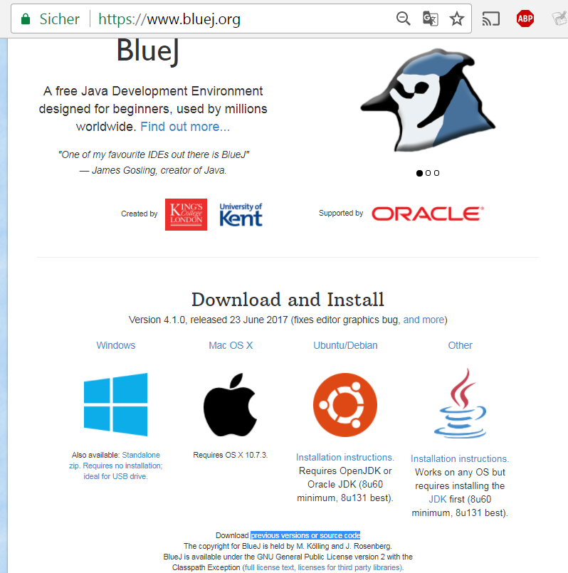

Wurde BlueJ installiert, so erhält man nach dem Programmstart in etwa das folgende Fenster.

[.center.text-center]
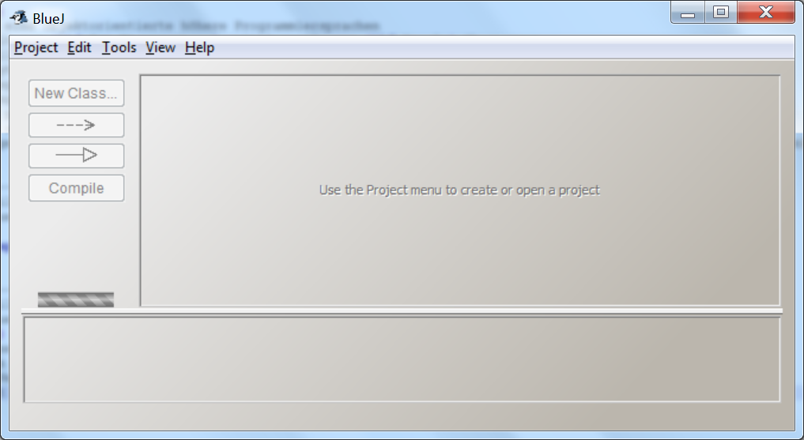

In neuen Programmversionen von BlueJ kann sich das Design und Layout des Fensters geringfügig unterscheiden, die wesentlichen Komponenten sind jedoch seit einigen Versionen nahezu unverändert. Der erste Schritt bei der Erstellung eines ersten Programmes ist die Erstellung eines sogenannten _Projektes_. Dieses enthält dann alle dem Programm zugehörigen Dateien. Hierzu erstellt man im Menü ein neues Projekt und wählt den Speicherort aus.

[.center.text-center]
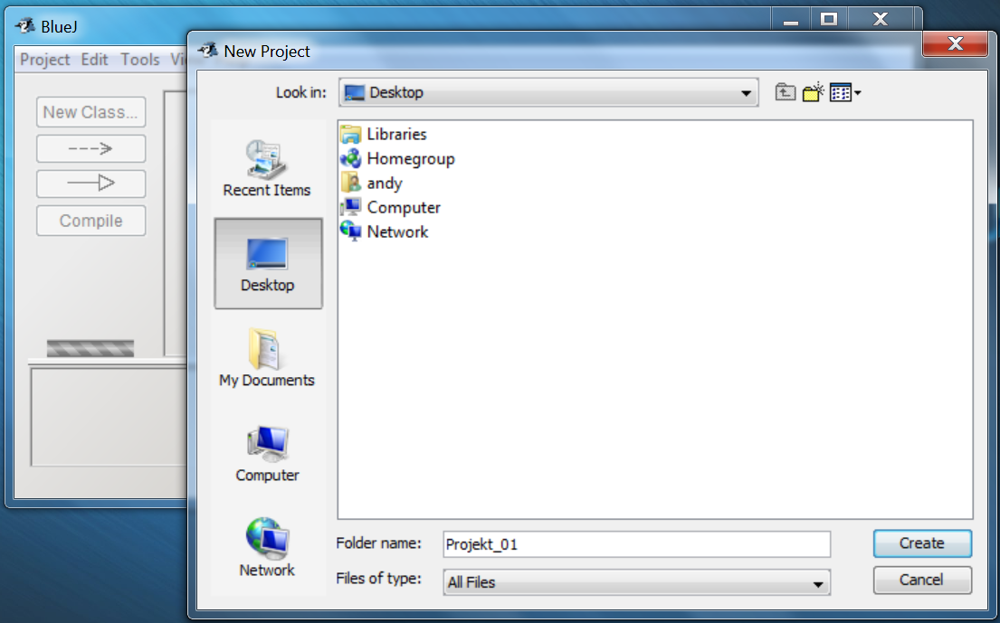

Innerhalb des Projektes kann dann eine sogenannte _Klasse_ erstellt werden. Wie wir in Kürze sehen werden, stellen _Klassen_ die zentralen Einheiten von Programmen dar. Wir wählen als Klassennamen zunächst "Person"…

[.center.text-center]
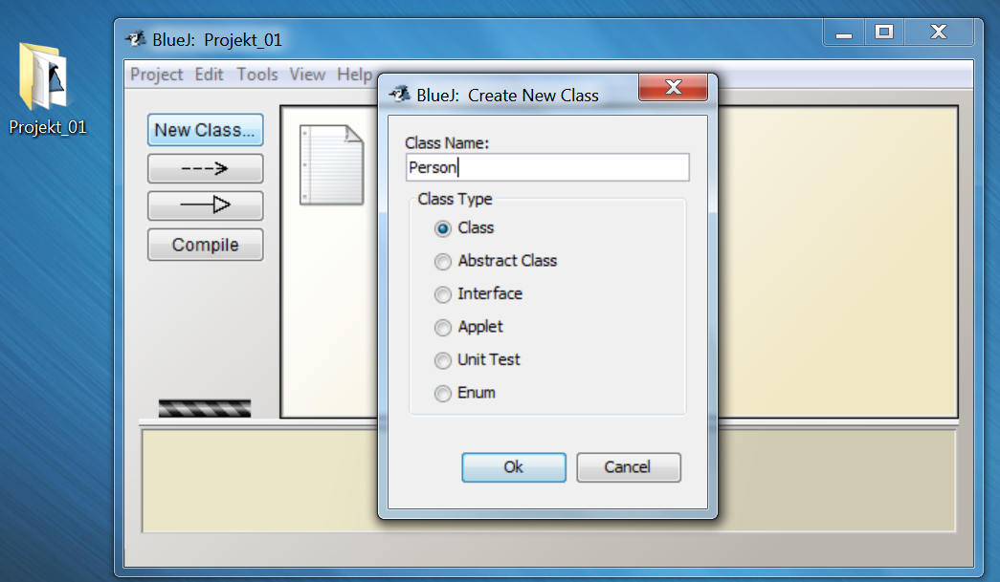

… und erhalten dann folgende Ansicht. Das orangefarbene Rechteck zeigt den gewählten Klassennamen an, …

[.center.text-center]
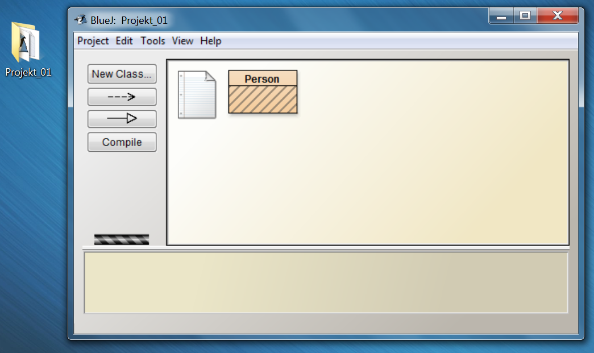

… ein Doppelklick auf dieses Rechteck öffnet ein weiteres Fenster, welches den zugehörigen Programmcode enthält.

[.center.text-center]
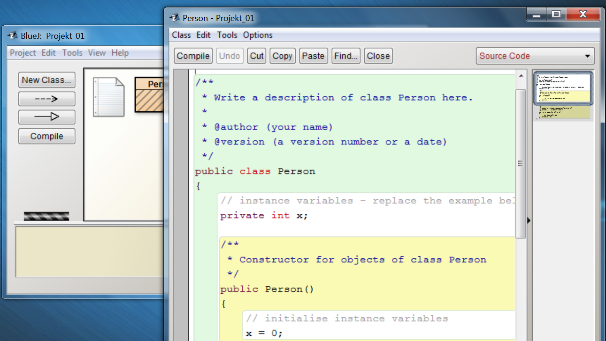

Der Programmcode ist standardmäßig schon mit einer Vorlage befüllt, und somit compilierfähig. Wir übersetzten die Klasse entweder durch einen Klick mit der rechten Maustaste auf das Rechteck und Wahl von "Compile"  oder "Übersetzen" im Kontextmenü, oder durch Klick auf den entsprechenden Button ganz links im Hauptfenster.

[.center.text-center]
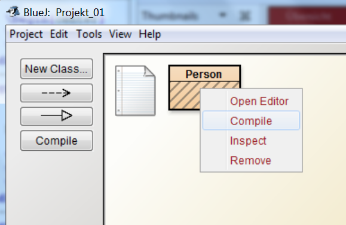

Konnte die Klasse fehlerfrei übersetzt werden, so ändert sich der Hintergrund des orangenen Rechtecks. Bei Klick mit der rechten Maustaste auf dieses Rechteck findet man nun einen neuen Eintrag im Kontextmenü, "new Person()".

[.center.text-center]
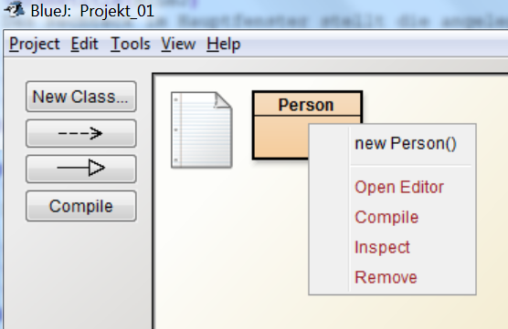

Nach Klick auf "new Person()" öffnet sich ein weiteres Fenster, wobei hier einfach auf "Ok" geklickt wird.

[.center.text-center]
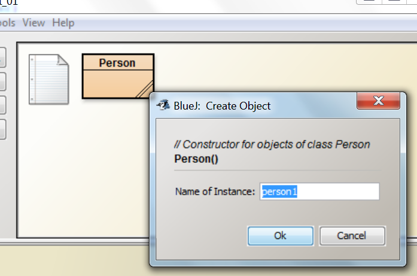

Das Ergebnis ist nun ein rechtes rotes Rechteck im unteren Bereich des Hauptfensters. Dies zeigt uns an, dass eine _Instanz_ einer Klasse erstellt wurde. Die Bedeutung dieser Begriffe wird im nächsten Abschnitt erläutert. Sie werden später den Programmcode der Klasse selbst verändern, und mittels der Instanz testen ob Sie das gewünschte Verhalten erzielt haben.

[.center.text-center]
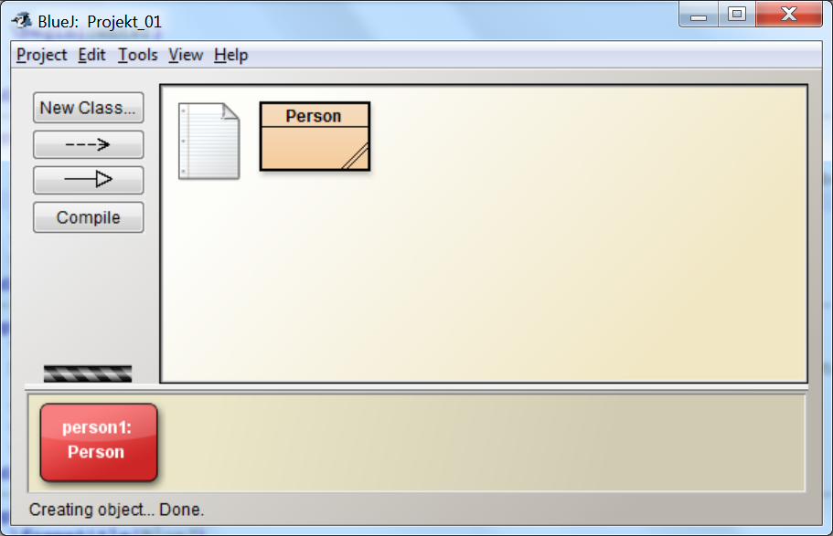

Sie können die letzten Schritte wiederholen, und werden festestellen, dass man dadurch eine weitere Instanz erhält.

[.center.text-center]
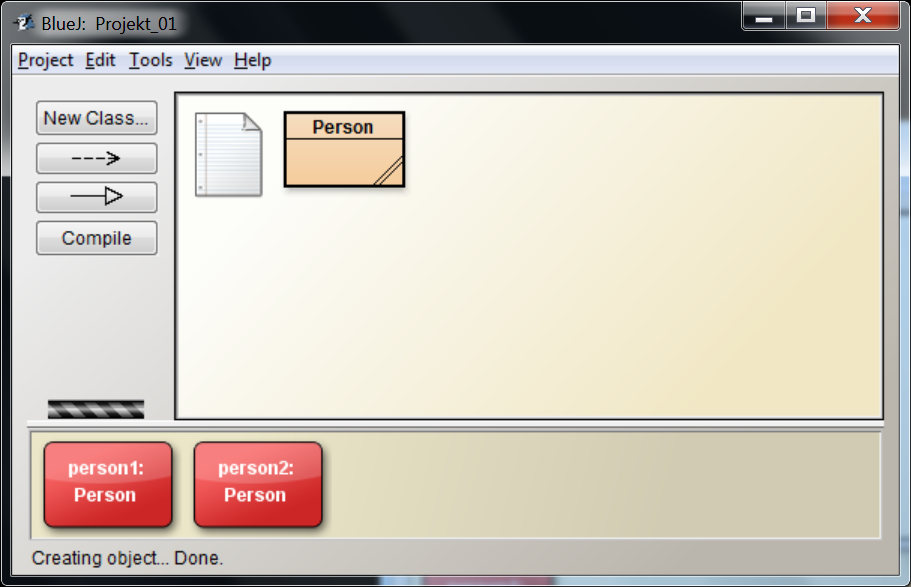

Durch Klick auf "int sampleMethod(int y)" im Kontextmenü (bei rechter Maus-Klick auf die Instanz) rufen Sie eine schon definierte Methode auf.

[.center.text-center]
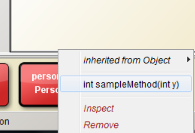

In diesem Abschnitt wurden Sie durch wichtige Schritte in der Entwicklungsumgebung BlueJ geführt. Dabei wurden einige Begriff wie Klasse, Instanz, oder Methode verwendet, deren Bedeutung in den nächsten Abschnitten genau erläutert wird. Wenn Sie diese Schritte ausführen konnten, dann ist Ihre Entwicklungsumgebung und Sie bereit für die Java-Programmierung!

== Klassen, Objekte und Methoden

Klassen sind ein grundlegendes Konzept moderner Programmiersprachen. Sie enthalten den wesentlichen Programmcode, ganze Programme entstehen durch ein Zusammenspiel mehrerer Klassen.

Klassen können unterschiedlichste Aufgaben in Programmen übernehmen. Wir wollen aber zunächst eines der wichtigsten Einsatzgebiete betrachten. Häufig modellieren Klassen Entitäten aus der realen Welt. Eine Anwendung könnte beispielsweise dazu dienen _Studenten_ einer Schule zu verwalten. Dazu erstellen wir zunächst eine Klasse die einen Studenten modelliert.

[source,java]
----
public class Student {
    private String name;
    private int geburtsjahr;
}
----

Dieser Student hat nur zwei *Eigenschaften* (auch *Attribute* genannt), nämlich einen Namen und ein Geburtsjahr. Der Name (`name`) ist dabei eine Text-Zeichenkette (`String`), das Geburtsjahr (`geburtsjahr`) ist eine ganze Zahl (`int`). Die Angaben `public` und `private` legen fest, welche Elemente in bestimmten Programmteilen sichtbar sind. Dies wird später genauer behandelt. An dieser Stelle sei nur festgehalten, dass die Eigenschaften stets `private` zu setzen sind.

Es ist unbedingt zu beachten, dass Groß- und Klein-Schreibung eine Rolle spielen. Der Name der Klasse (in diesem Fall `Student`) beginnt stets mit einem Großbuchstaben. Die Eigenschaften (`name` und `geburtsjahr`) beginnen stets mit Kleinbuchstaben. Beachten Sie ebenso, dass `String` mit einem Großbuchstaben beginnt, und `int` nur klein geschrieben ist. Den Grund dafür werden wir später kennenlernen.

Die Strichpunkte am Ende einer Zeile sind hier ebenso wesentlich. Sie beenden eine sogenannte _Anweisung_. Werden sie weggelassen, kann das Programm nicht übersetzt werden.

Beachten Sie weiters die Formatierung dieses Codestückes. Die beiden Zeilen zu den Eigenschaften sind eingerückt, die schließende geschwungene Klammer ist wieder ganz links gesetzt. Dies ist eine wichtige Konvention, die unbedingt einzuhalten ist. Die Einrückung des Programmcodes spiegelt die Struktur des Programmes wieder, und ist somit ein wesentlicher Teil des Programmcodes.

Wenden wir uns nun der Bedeutung von Klassen zu. Eine Klasse modelliert eine Entität aus der realen Welt, wie zum Beispiel Studenten, Personen, Aktien, Wohnungen, Fahrzeuge, usw. Konkret wird festgelegt, welche Daten diese Entitäten enthalten sollen, in unserem Beispiel einen Namen und ein Geburtsjahr. Die Klasse selbst dient im Programm als _Vorlage_ für konkrete Daten. Konkrete Daten zur Klasse `Student` mit `Name` und `Geburtsjahr` können beispielsweise sein: Peter (1981), Sandra (1985), Ercan (1991), Sarah (1994); derartige konkrete Ausprägungen einer Klasse werden *Objekte* genannt. Erstellt man also einen konkreten Studenten, so erzeugt man im Programm ein *Objekt* oder eine *Instanz* einer Klasse. Die Klasse stellt also einen "Bauplan" dar, während Objekte oder Instanzen dann konkrete Ausprägungen desselben sind.

Wir werden in weiterer Folge kennenlernen wie auf die Eigenschaften zugegriffen werden kann (Abfragen von Informationen eines Objektes), und wie diese verändert werden können. Weiters werden wir die Erzeugung von Objekten näher betrachten. Am Ende des Abschnittes werden Sie eine wichtige weitere Eigenschaft von Klassen kennenlernen. Sie können nämlich nicht nur Daten enthalten, sondern auch _Methoden_. Dies sind Programmstücke, die auf den Daten Berechnungen vornehmen, oder auch Veränderungen vornehmen. Klassen organisieren also das Zusammenspiel von Daten und Programmlogik, Programme selbst entstehen durch die Interaktion von mehreren Objekten.

=== Get- und Set-Methoden

Generell versuchen Klassen zu vermeiden, dass ihre Daten "unkontrolliert" geändert werden können. Man unterbindet (durch das Schlüsselwort `private`), dass andere Programmteile oder Anwender direkt Änderungen vornehmen können. Es soll zum Beispiel unterbunden werden, dass das Geburtsjahr auf ein negatives Jahr (oder z.B. ein Jahr vor 1900), oder ein leerer Name gesetzt wird.

==== Get-Methoden

Da die Objekt-Eigenschaften `private` gesetzt werden, besteht zunächst keine Möglichkeit von außen darauf zuzugreifen. Die Get-Methode ermöglicht genau das! Im Folgenden sehen Sie die Implementierung der beiden Get-Methoden zur Klasse `Student`:

[source,java]
----
public class Student {
    private String name;
    private int geburtsjahr;
    
    public String getName() {
        return name;
    }
    
    public int getGeburtsjahr() {
        return geburtsjahr;
    }
}
----

Get-Methoden beginnen stets mit `public` gefolgt vom _Datentyp_ der Objekteigenschaft, also `String` im Falle von `name` und `int` im Falle von `geburtsjahr`. Danach kommt der _Methodenname_. Dieser beginnt bei Get-Methoden stets mit `get`, gefolgt vom Namen der jeweiligen Eigenschaft. Dieser beginnt dann stets mit einem Großbuchstaben! Nach dem Namen enthalten Methoden stets runde Klammern. Danach folgen geschwungene Klammern, die _Implementierung_ (also der Programmcode) der Methode steht innerhalb dieser Klammern. Die Get-Methode enthält nur eine einzige Zeile Programmcode, nämlich das Return-Statement. Dieses reicht die jeweilige Objekteigenschaft an den Aufrufer der Methode durch.

==== Set-Methoden

Set-Methoden ermöglichen, die Eigenschaften zu ändern. Die gewünschte Änderung muss dabei mittels *Parameter* an die Methode übergeben werden.

[source,java]
----
public class Student {
    private String name;
    private int geburtsjahr;
    
    public String getName() {
        return name;
    }
    
    public void setName(String neuerName) {
        name = neuerName;
    }
    
    public int getGeburtsjahr() {
        return geburtsjahr;
    }
    
    public void setGeburtsjahr(int neuesGeburtsjahr) {
        geburtsjahr = neuesGeburtsjahr;
    }
}
----

Dieser Parameter befindet sich innerhalb der runden Klammern der Methoden-Definition. Da `name` vom Typ `String` ist, muss auch beim Parameter angegeben werden, dass es sich um einen `String` handelt. Analog beim Geburtsjahr mit `int`. Innerhalb der Methode erfolgt die Zuweisung des Parameters an die Objekteigenschaft. Der übergebene `neuerName` wird dabei an `name` (Attribut des Objektes) zugewiesen. Vor dem Methodennamen der Set-Methoden befindet sich das Schlüsselwort `void`. Es gibt an, dass diese Methode nichts zurückliefert. Sie nimmt nur eine Änderung des Objektes vor.

=== Kommentare

Fallweise möchte man im Programm ergänzende Kommentare aufnehmen. Diese stehen zwar im Quelltext, werden aber vom Compiler ignoriert. Das folgende Beispiel zeigt die zwei Arten Kommentare zu setzen:

[source,java]
----

/*
Dies ist ein mehrzeiliges Kommentar. Am Beginn einer Klasse kann es zum Beispiel
Informationen zum Zweck der Klasse, Autor, Erstellungsdatum etc. enthalten.
*/
public class Student {
    // dies ist ein Kommentar! Diese Zeile wird vom Compiler ignoriert
    
    private String name;
    private int geburtsjahr;
    
    public String getName() {
        // Kommentare können auch in Methoden vorkommen!
        return name;
    }
    
    /*
    public int getGeburtsjahr() {
        return geburtsjahr;
    }
    */
}
----

Beachten Sie, dass die Methode `getGeburtsjahr` zur Gänze auskommentiert wurde. Sie wird also vom Compiler ignoriert. Dies ist eine gängige Methode, um unfertige oder fehlerhafte Codestücke vor dem Compiler "zu verstecken".

=== Konstruktoren

Der Konstruktor legt fest, _wie_ ein Objekt erzeugt wird, also welche Werte dabei den Objekteigenschaften zugewiesen werden können. Wir verwenden im _parameterlosen Konstruktor_ die Set-Methoden, um für alle Objekteigenschaften _Default-Werte_ zu setzen.

[source,java]
----
public class Student {
   
    private String name;
    private int geburtsjahr;
    
    public Student() {
        setName("n/a");
        setGeburtsjahr(1970);
    }

    // die Get-/Set-Methoden sind hier der Uebersicht halber weggelassen
}
----

Konstruktoren können ebenso wie Set-Methoden _Parameter_ enthalten, wobei die einzelnen Parameter durch einen Beistrich getrennt werden.

[source,java]
----

public class Student {
    
    private String name;
    private int geburtsjahr;
    
    public Student() {
        setName("n/a");
        setGeburtsjahr(1970);
    }

    public Student(String name, int geburtsjahr) {
        setName(name);
        setGeburtsjahr(geburtsjahr);
    }
    
    // die Get-/Set-Methoden sind hier der Uebersicht halber weggelassen
}
----

Der zweite Konstruktor ist also eine alternative Möglichkeit ein Student-Objekt zu erzeugen. Dabei werden `name` und `geburtsjahr` als Parameter übergeben, und dann den Set-Methoden übergeben.

=== Schlüsselwort: this

Wir betrachten nochmals die Methode `setName`.

[source,java]
----
public class Student {
    private String name;
    
    public void setName(String neuerName) {
        name = neuerName;
    }
}
----

Der Parameter wurde hierbei `neuerName` genannt. Wählt man anstatt dessen die Bezeichnung `name` (die Bezeichnung ist an sich frei wählbar), so ergibt sich folgendes Problem:

[source,java]
----
public class Student {
    private String name;
    
    public void setName(String name) {
        name = name; // !?
    }
}
----

In der Zuweisung in der Methode `setName` ist jetzt allerdings unklar _welcher_ `name` mit `name` gemeint ist. Die Objekteigenschaft, oder der Parameter? Es liegt hier ein sogenannter Namenskonflikt vor: zwei verschiedene Dinge wurden gleich bezeichnet. In diesem Fall wird bei beiden Verwendungen der Parameter herangezogen, und nicht die Objekteigenschaft. Dieses Verhalten ist keinesfalls gewünscht, und funktioniert nicht korrekt. Um hier eindeutig unterscheiden zu können wann die Objekteigenschaft gemeint ist, existiert das Schlüsselwort `this`. Dieses gibt an, dass die Eigenschaften _dieses_ Objektes gemeint sind (und nicht etwaige andere gleich lautende Elemente, wie z.B. der Parameter). Der Code sieht dann wie folgt aus:

[source,java]
----
public class Student {
    private String name;
    
    public void setName(String name) {
        this.name = name; // this.name bezieht sich auf die Objekteigenschaft
    }
}
----

Bei Uneindeutigkeiten muss `this` verwendet werden, anderenfalls _kann_ man `this` verwenden (muss aber nicht).

=== Methoden

Methoden sind Bestandteile von Klassen, die bestimmte Aufgaben durchführen, wie zum Beispiel Änderungen von Werten, Durchführung von Berechnungen, etc. Sie haben schon Get- und Set-Methoden kennengelernt, auch Konstruktoren sind spezielle Methoden. Allgemein bestehen Methoden aus einem _Methodennamen_, einem _Rückgabewert_, _Parametern_, sowie einem _Methodenrumpf_, der den eigentlichen Code enthält. _Methodennamen_, _Rückgabewert_ und _Parametern_ (sowie der Zugriffs-Modifier) bilden den _Methodenkopf_. Wir betrachten folgende Methode zur Berechnung des aktuellen Alters einer Person:

[source,java]
----
public class Student {
   
    private String name;
    private int geburtsjahr;

    public int alterBerechnen(int aktuellesJahr) {
        return aktuellesJahr - this.geburtsjahr; // Anmerkung: this kann hier weggelassen werden!
    }
}
----

Die Methode `alterBerechnen` bekommt als Parameter das aktuelle Jahr übergeben. Das Alter der Person ergibt sich dann aus der Differenz von `aktuellesJahr` und `geburtsjahr`. Im Methodenkopf wurde der Typ des Rückgabewertes mit `int` festgelegt. Dies sagt dem Aufrufer, dass er nach dem Methodenaufruf als Ergebnis eine ganze Zahl erhält. Die Berechnung dieses Wertes erfolgt dann im Methodenrumpf. In diesem Fall besteht dieser nur aus einer einzigen Zeile, bei komplexeren Berechnungen können jedoch auch mehrere Codezeilen vorkommen. Das Schlüsselwort `return` gibt an, dass nun der angesprochene Rückgabewert retourniert wird. Meist steht `return` am Ende einer Methode, es ist aber grundsätzlich auch möglich an anderen Stellen in der Methode Return-Statements anzugeben.

==== Ausgabe, Print-Methode

Mittels `System.out.println` ("Print-Line") können Ausgaben auf die Konsole gemacht werden. Berechnungen und Ergebnisse können somit dem Benutzer (Anwender) des Programmes angezeigt werden. Zur Ausgabe von Objekten erstellen wir jeweils eigene Methoden, die nichts anderes machen, als den Inhalt des Objektes auszugeben.

[source,java]
----
public class Student {
   
    private String name;
    private int geburtsjahr;
    
    // Konstruktoren hier ausgelassen
    
    // Get-/Set-Methoden hier ausgelassen

    public void printStudent() {
        System.out.println("Name: " + name + " (Geburtsjahr: " + geburtsjahr + ")");
    }
}
----

`System.out.println` ist hierbei eine spezielle Methode, die von Java zur Verfügung gestellt wird. Als Parameter übergeben wir dieser Methode eine Verkettung mehrerer Zeichenketten (Strings). Die Verkettung wird durch den Operator "\+" erreicht. Ein String selbst wird in doppelten Anführungszeichen angegeben, der Inhalt innerhalb dieser doppelten Anfuehrungszeichen wird von `System.out.println` genau so auf die Konsole ausgegeben. Nach dem ersten "\+" wird die Objekteigenschaft `name` angegeben. Dies führt dazu, dass beim Aufruf der Methode `printStudent` der aktuelle Wert von `name` ausgegeben wird. Anschließend wird auch `geburtsjahr` ausgegeben. Dies ist eigentlich ein Zahlenwert (`int`), jedoch wandelt Java diesen Wert in den hier benötigten `String` um.

==== Konventionen

Beim Programmieren sind einige wichtige Konventionen unbedingt einzuhalten. Diese werden zwar vom Compiler nicht erzwungen, führen also zu keiner Fehlermeldung, sind aber dennoch unbedingt einzuhalten. So müssen beispielsweise Klassennamen immer mit einem Großbuchstaben beginnen. Danach folgen Kleinbuchstaben. Methodennamen müssen hingegen stets mit Kleinbuchstaben beginnen. Beispiel: `getName`, `alterBerechnen`; Bei zusammengesetzten Worten wird die sogenannte Camel-Case-Schreibweise verwendet: statt `getname` wird `getName` mit großem `N` verwendet. Selbiges gilt für Objekteigenschaften.

Der Code von Methoden (Methodenrumpf) oder ganze Klassen befinden sich innerhalb von geschwungenen Klammern. Alles was nach einer öffnenden geschwungenen Klammer "\{" steht wird stets eingerückt (üblicherweise mit einem Tabulator). Die Einrückung endet mit der schließenden Klammer "}". Hierbei existieren verschiedene "Stile". Bei einem gängigen Stil wird die öffnende Klammer in der selben Zeile gesetzt, bei einem wird hingegen eine neue Zeile verwendet.

Stil "1TBS"

[source,java]
----
public class Student {
    private String name;
    private int geburtsjahr;
    
    public String getName() {
        return name;
    }
    
    public int getGeburtsjahr() {
        return geburtsjahr;
    }
}
----

Alternativer Stil: "Original K&R"

[source,java]
----
public class Student 
{
    private String name;
    private int geburtsjahr;
    
    public String getName() 
    {
        return name;
    }
    
    public int getGeburtsjahr() 
    {
        return geburtsjahr;
    }
}
----

Beide Stile haben Vor- und Nachteile. Bei "Original K&R" ist die Struktur besonders gut erkennbar, da die öffnende Klammer immer genau über der schließenden Klammer steht. Andererseits werden hierbei sehr viele zusätzliche Codezeilen verwendet, was den Code wiederrum unübersichtlich machen kann. Die Mehrheit der Java-Programmierer bevorzugt deshalb "1TBS" (One True Brace Style). Entscheiden Sie sich für einen Stil, und verwenden Sie diesen konsistent!

Achten Sie ebenso auf eine konsistente Verwendung von Leerzeichen, z.B. "`getName() {`" statt "`getName(){`". Die meisten Entwicklungsumgebungen und Editoren unterstützen den Programmierer hierbei, indem Methoden zur Codeformatierung bereitgestellt werden, und gängige Stile in den Einstellungen gesetzt werden können.

Vor dem nächsten Kapitel finden Sie hier noch den gesamten bisher erstellten Code:

[source,java]
----
/* 
  Die Klasse Student modelliert einen Studenten mit zwei Eigenschaften (Name und Geburtsjahr)
  Autor: Code Guru
  Datum: 11. 11. 2011
*/ 
public class Student {
  
    // Objekteigenschaften (Attribute, Instanzvariablen)
    private String name;
    private int geburtsjahr;
    
    // Konstruktoren
    public Student() {
        setName("n/a");
        setGeburtsjahr(1970);
    }

    public Student(String name, int geburtsjahr) {
        setName(name);
        setGeburtsjahr(geburtsjahr);
    }
    
    // Get-/Set-Methoden
    public String getName() {
        return name;
    }
    
    public void setName(String neuerName) {
        name = neuerName;
    }
    
    public int getGeburtsjahr() {
        return geburtsjahr;
    }
    
    public void setGeburtsjahr(int neuesGeburtsjahr) {
        geburtsjahr = neuesGeburtsjahr;
    }
    
    // Weitere Methoden
    public int alterBerechnen(int aktuellesJahr) {
        return aktuellesJahr - this.geburtsjahr; // Anmerkung: this kann hier weggelassen werden!
    }
    
    public void printStudent() {
        System.out.println("Name: " + name + " (Geburtsjahr: " + geburtsjahr + ")");
    }
}
----

== Variablen, Datentypen und Methoden

Im letzten Abschnitt wurden bereits die Datentypen `String' und `int' verwendet. Diese fanden Anwendung bei _Objekteigenschaften_ und _Parametern_. Der Oberbegriff dafür lautet *Variablen*, wir werden später noch eine weitere Art von Variablen, nämlich _lokale Variablen_ kennen lernen.

Der Datentyp legt fest, welche Art von Werten bei einer Variablen hinterlegt sind. Wir haben bereits `int` als Datentyp für ganze Zahlen kennengelernt, und `String` als Datentyp für Zeichenketten. Diese Zeichenketten müssen dabei stets in doppelten Anführungszeichen angegeben werden, also z.B. `"Max Maier"`, jedoch sind auch leere Zeichenketten möglich: `""`. Wir betrachten zunächst die sogenannten _primitiven Datentypen_ genauer.

=== Primitive Datentypen

Die primitiven Datentypen (i.S.v. einfache, grundlegende Datentypen) sind in der Programmiersprache Java "fest eingebaut". Die primitiven Datentypen umfassen `byte`, `short`, `int`, `long`, `float`, `double`, `boolean` und `char`.

Ganze Zahlen werden mittels `byte`, `short`, `int` und `long` dargestellt, wobei sich diese durch den Bereich der darstellbaren Zahlen unterscheiden. Mit `byte` und `short` können nur relativ kleine Zahlen dargestellt werden, weshalb sie nur in Spezialanwendungen Verwendung finden. Für ganze Zahlen ist meist `int` die beste Wahl, nur wenn extrem große Zahlen dargestellt werden sollen muss `long` verwendet werden. Der Wertebereich von `int` ist -2147483648 bis 2147483647, jener von `long` -9223372036854775808 bis 9223372036854775807. Umso größer der darstellbare Zahlenbereich, desto mehr Platz im Hauptspeicher wird benötigt. Derartige Überlegungen spielen jedoch vorerst nur eine untergeordnete Rolle.

Die Datentypen `float` und `double` stellen Kommazahlen dar, und unterscheiden sich in Genauigkeit und Wertebereich. Meist wird hier `double` verwendet, und nur in Ausnahmefällen `float`.

Der Datentyp `boolean` stellt logische Wahrheitswerte dar, und ist nach dem Logiker George Boole benannt. Variablen dieses Typs können ausschließlich die Werte `true` und `false` annehmen.

Der Datentyp `char` (Character, dt. Zeichen) enthalten ein einzelnes Textzeichen. Die Werte werden in einfachen Hochkommata angegeben, z.B. `a', `X', `9' oder `?'.

=== Referenzdatentypen

Im vorigen Kapitel haben wir die Klasse `Student` entwickelt, und damit einen eigenen _Datentyp_ erstellt! _Alle_ Klassen definieren einen Datentyp, im Gegensatz zu den primitiven Datentypen, die ja ein integraler Bestandteil der Programmiersprache sind, handelt es sich hierbei im einen *Referenzdatentyp*. Auch beim schon verwendeten Typ `String` handelt es sich um einen derartigen Referenzdatentyp. Das bedeutet, dass auch `String` eine Klasse ist, die ein Bestandteil der Java-Library ist. *Referenzdatentypen beginnen laut Konvention stets mit einem Großbuchstaben!*

Ein wesentlicher Unterschied von Referenzdatentypen zu primitiven Datentypen ist, dass sie nicht den eigentlichen _Wert_ selbst enthalten, sondern eine _Referenz_ (in andreren Worten: einen Verweis) auf den Speicherort, an dem die Daten tatsächlich gespeichert sind.

Daraus ergeben sich die folgenden Konsequenzen für den Umgang mit Referenzdatentypen:

* Der Verweis kann auch "ins Leere" gehen, also auf nichts Eigentliches verweisen. Der Wert der Objektreferenz ist dann *`null`*. *Ist der Wert einer Objektreferenz _`null`_, so können darauf keine Methoden aufgerufen werden. Dies würde zu einem Laufzeitfehler führen, also eines Absturzes des Programmes!*
* Umgekehrt ist es möglich, dass auf ein und den selben Inhalt (im Speicher) *mehrere Referenzen* existieren. Es kann also eine Variable `stud1` auf den selben Studenten wie die Variable `stud2` verweisen!

Die Eigenschaften von Referenzdatentypen sind Wesentlich für die Programmierung und werden deshalb auch in den folgenden Kapiteln, nach der Behandlung weiterer wichtiger Grundlagen, ausführlich behandelt werden.

Zunächst widmen wir uns jedoch einem weiteren zentralen Konzept von Programmiersprachen, nämlich _Methoden_.

=== Methoden (Fortsetzung)

Wir haben schon spezielle Methoden kennengelernt, nämlich Get- und Set-Methoden, sowie Konstruktoren. Methoden sind also zusammengehörige Code-Stücke, die Teil einer Klasse sind. Eine Methode setzt sich aus dem _Methodenkopf_ und dem _Methodenrumpf_ zusammen. Der Methodenkopf enthält einen Zugriffs-Modifier (`private` oder `public`), einen Rückgabewert, einen Methoden-Namen, sowie eine möglicherweise auch leere Parameterliste.

Der Zugriffsmodifier steuert die _"Sichtbarkeit"_ der Methode. Dies wurde auch schon bei den Objekteigenschaften verwendet. Alle `private` gesetzten Elemente sind außerhalb der Klasse _nicht_ sichtbar, d.h. sie können von dort aus nicht aufgerufen werden. Hingegen bedeutet `public`, dass das Element überall sichtbar ist, und somit von Methoden anderer Klassen aufgerufen werden kann. Methoden die ausschließlich innerhalb der Klasse verwendet werden sollen, werden also `private` gesetzt, alle anderen `public`.

Der *Rückgabewert* einer Methode ist entweder eine zurückgegebene private Objekteigenschaft, oder das Ergebnis einer Berechnung der Methode. Der *Rückgabewert* einer Methode ist entweder ein Datentyp, oder `void`. Hierbei steht `void` dafür, dass _nichts_ zurückgegeben wird. Anderenfalls kann der Rückgabewert ein primitiver Datentyp oder ein Referenzdatentyp sein.

In den runden Klammern sind die Parameter einer Methode angegeben. Parameter sind jene Werte die der Methode übergeben werden; sie können ebenso primitive Datentypen oder Referenzdatentypen sein. Mehrere Parameter werden durch Beistriche voneinander getrennt. Man beachte folgenden Unterschied bei der Verwendung von primitiven Datentypen und Referenzdatentypen. Im ersten Fall wird der übergebene _Wert_ in den Parameter "kopiert" (es gibt ja keine andere Möglichkeit!). Werden innerhalb der Methode Änderungen eines solchen Parameters vorgenommen, hat das keine Auswirkungen außerhalb der Methode. Diese Art der Parameterübergabe wird _call-by-value_ genannt.

Anders verhält es sich bei Referenzdatentypen. Hier wir ja nur ein _Verweis_ auf einen Speicherbereich mit dem Inhalt des Objektes übergeben (_call-by-reference_). Dies hat zur Konsequenz, dass Änderungen einer Objektreferenz die als Parameter an die Methode übergeben wurde auch außerhalb der Methode Auswirkungen haben. Es gibt in diesem Fall keine Kopie wie dies bei den primitiven Datentypen der Fall war. In vielen Fällen ist es ratsam, keine Änderungen an den als Parameter übergebenen Objektreferenzen vorzunehmen, wenngleich dies auch in manchen Fällen das gewünschte Verhalten ist.

Der Methodenrumpf befindet sich innerhalb der geschwungenen Klammern und enthält den eigentlichen Code der Methode. Der Rumpf kann aus nur einer, oder auch sehr vielen Codezeilen bestehen. Ist der Rückgabewert _nicht_ `void`, so muss die Methode mindestens ein `return`-Statement enthalten. Im Regelfall befindet sich das `return`-Statement in der letzten Zeile der Methode. Dieses Statement reicht den Rückgabewert wieder "nach Außen". Der zurückgegebene Datentyp muss dem im Methodenkopf angegebenen Typ entsprechen, im Falle von Referenzdatentypen ist grundsätzlich auch `null` möglich.

Methoden können in BlueJ ausgehend von einer Instanz (rotes Kästchen) aufgerufen werden, indem sie im Kontextmenü (via Klick mit der rechten Maustaste) ausgewählt werden. Methoden können mittels ihres Namens auch direkt aus der Klasse in der sie definiert sind aufgerufen werden. Das folgende Codestück zeigt die Methode `alterBerechnen`.

[source,java]
----
public class Student {
   
    private String name;
    private int geburtsjahr;

    // Konstruktoren und Get-/Set-Methoden wurden hier (teilweise) ausgelassen
    
    public int getGeburtsjahr() {
        return geburtsjahr;
    }
    
    public int alterBerechnen(int aktuellesJahr) {
        return aktuellesJahr - getGeburtsjahr(); 
    }
}
----

Hier wird innerhalb der Methode eine andere Methode, nämlich `getGeburtsjahr` aufgerufen.

=== Signatur von Methoden

Die Signatur einer Methode ist gegeben durch den Methodennamen, sowie Typen und Reihenfolge der Parameter. In einer Klasse dürfen nicht mehrere Methoden mit der selben Signatur vorkommen. Mehrere Methoden mit gleichem Namen sind sehr wohl zulässig, da sie eindeutig durch die Parameter unterschieden werden können. Man nennt dies auch _Überladen_ von Methoden.

Wir betrachten das folgende Codebeispiel, das einige Methoden mit teilweise gleicher Signatur enthält. Der Methodenrumpf wird hier nicht angegeben, da er für das Beispiel unwesentlich ist. Stattdessen finden Sie im Rumpf nur ein Kommentar `// TODO`.

[source,java]
----
public class SignaturDemo {

    public int foo(int a, int b) {
        // TODO
    }
    
    public int foo(int a) { // Zulässig, da andere Parameteranzahl als obige Methode
        // TODO
    }
    
    public int foo(double a, double b) { // Zulässig, da andere Parametertypen
        // TODO
    }
    
    public double foo(int a) { // Unzulässig, da schon eine Methode mit Namen foo und  
                               // einem int-Parameter existiert. Es ist hierbei 
                               // unerheblich, dass sich der Rückgabewert unterscheidet. 
                               // Es handelt sich dennoch um die gleiche Signatur wie 
                               // in der zweiten Methode.
        // TODO
    }
} 
----

Das Überladen von Methoden ist oft sinnvoll, weil man sehr ähnliche Aufgaben, jedoch mit unterschiedlichen Parametern durchführen möchte. Das folgende Beispiel zeigt eine Klasse `Berechnung` mit zwei Methoden `summe`.

[source,java]
----
public class Berechnung {

    public int summe(int a, int b) {
        return a + b;
    }
    
    public int summe(double a, double b) {
        return a + b;
    }
} 
----

Hier ist es sinnvoll die Methode zur Summenbildung von int-Parametern sowie double-Parametern gleich zu benennen, also zu überladen.

=== Parameter-Prüfungen

Wir betrachten in diesem Abschnitt die Klasse `Person` gemäß des folgenden UML-Diagramms.

[.center.text-center]
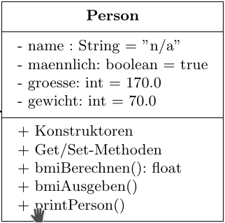

Das folgende Codebeispiel zeigt die Parameterprüfungen in den Set-Methoden. Dadurch wird sichergestellt, dass die entsprechenden Eigenschaften stets gültige Werte aufweisen.

[source,java]
----
public class Person {

    private String name;
    private boolean maennlich;
    private int groesse;
    private int gewicht;   
    
    public Person() {
        setName("n/a");
        setMaennlich(true);
        setGroesse(170);
        setGewicht(70);
    }
    
    public Person(String name, boolean maennlich, int groesse, int gewicht) {
        setName(name);
        setMaennlich(maennlich);
        setGroesse(groesse);
        setGewicht(gewicht);
    }
    
    public void setName(String name) {
        if (name != null) {
            this.name = name;
        } else {
            System.out.println("Fehler, name darf nicht null sein");
            this.name = "n/a";
        }
    }
    
    public void setMaennlich(boolean maennlich) {
        this.maennlich = maennlich;
    }

    public void setGroesse(int groesse) {
        if (groesse >= 110 && groesse <= 220) {
            this.groesse = groesse;
        } else {
            groesse = 170;
            System.out.println("Groesse ungültig, setze defaultwert");
        }
    }

    public void setGewicht(int gewicht) {
        if (gewicht > 30 && gewicht < 150) { // zwischen bedeutet exklusiv
            this.gewicht = gewicht;
        } else {
            this.gewicht = 70;
            System.out.println("Gewicht ungültig, setze default");
        }
    }
    
    public void printPerson() {
        if (maennlich == true) {
            System.out.println("Name: " + name + " (m), Groesse: " 
                    + groesse + ", Gewicht: " + gewicht);
        } else {
            System.out.println("Name: " + name + " (f), Groesse: " 
                    + groesse + ", Gewicht: " + gewicht);
        }
    }

}
----

In der Methode `setName` wird mittels einer If-Bedingung geprüft ob der Parameter `name`, bei dem es sich ja um einen Referenzdatentyp handelt, ungleich `null` ist. Nur dann erfolgt eine Zuweisung an die Objekteigenschaft `this.name`. Anderenfalls wird eine Fehlermeldung auf die Konsole ausgegeben. In der Methode `setGroesse` und `setGewicht` wird in der If-Bedingung geprüft, ob der Parameter im gültigen Wertebereich (laut Angabe) liegt. Nur wenn dies gegeben ist, erfolgt die Zuweisung, anderenfalls wird wieder eine Fehlermeldung ausgegeben.

In diesen If-Bedingungen werden Vergleichsoperatoren `<`, `<=`, `>` und `>=` verwendet, die einen Vergleich zwischen der Variable und dem Zahlenwert (Literal) durchführen. Zusätzlich wird der Operator `&&` verwendet, der das logische Und darstellt. Nur wenn beide Bedingungen (links und rechts von `&&`) erfüllt sind, ist der gesamte Ausdruck erfüllt! In anderen Fällen wird möglicherweise oder logische Oder-Operator benötigt, der in Java als `||` festgelegt ist. In diesem Fall liefert der gesamte Ausdruck `true` wenn einer der beiden Ausdrücke (oder beide!) `true` sind.

In der Methode `printPerson` wird die Ausgabe je nach Geschlecht der Person geringfügig unterschiedlich formatiert, nämlich (m) vs. (f). Dies wird erreicht indem geprüft wird, ob die Objekteigenschaft `maennlich` den Wert `true` (oder `false`) hat. Dazu wird der Vergleichsoperator `==` verwendet. Die Gleichheit zweier Werte wird in Java immer mittels des Doppel-Istgleich-Operators ermittelt. Es ist ein häufiger Fehler, dass an dieser Stelle nur `=` verwendet wird. Dies entspricht jedoch der Zuweisung, und nicht dem Vergleich!

=== Lokale Variablen, Berechnungen und Typkonvertierung

Wir betrachten nun die folgende Aufgabenstellung:

[.center.text-center]
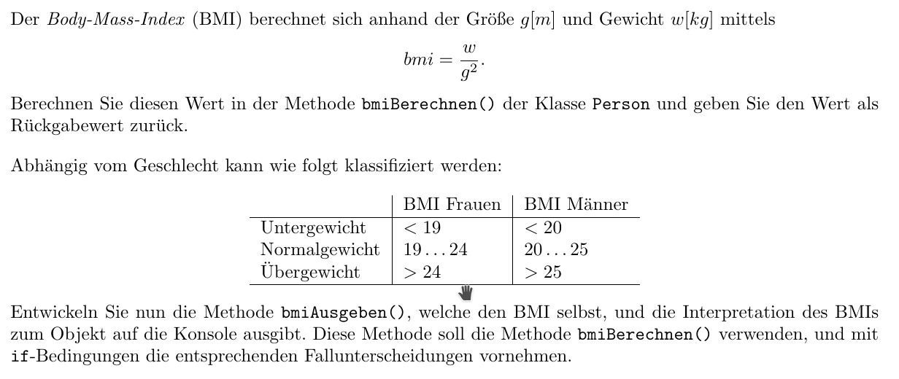

Dazu ergänzen wir die Klasse `Person` um die folgenden beiden Methoden:

[source,java]
----
    public float bmiBerechnen() {
        float groesseMeter = (float)groesse / 100;
        float bmi = (float)gewicht / (groesseMeter * groesseMeter);
        return bmi;
    }
    
    public void bmiAusgeben() {
        String bmiTyp = "";
        float bmi = bmiBerechnen();
        if (maennlich == true) {
            // Frauen
            if (bmi < 19) {
                bmiTyp = "Untergewicht";
            } else {
                if (bmi >= 19 && bmi <= 24) {
                    bmiTyp = "Normalgewicht";
                } else {
                    bmiTyp = "Übergewicht";
                }
            }
        } else { // Maenner
            if (bmi < 20) {
                bmiTyp = "Untergewicht";
            } else if (bmi >= 20 && bmi <= 25) {
                bmiTyp = "Normalgewicht";
            } else {
                bmiTyp = "Übergewicht";
            } 
        }
        System.out.println("BMI: " + bmi + " Typ: " + bmiTyp);
        
    }
----

In der Methode `bmiBerechnen` wird zunächst eine lokale Variable `groesseMeter` verwendet, um die Größe in der Einheit Zentimeter abzuspeichern. Dafür wird `groesse` durch 100 dividiert. Es ist zu beachten, dass hier zwei `int`-Werte dividiert werden. Java verwendet hierzu die ganzzahlige Division, was jedoch nicht beabsichtigt ist, da dadurch im Ergebnis alle Nachkommastellen gleich 0 wären. Um die Division der Kommazahlen (float, double) zu verwenden, muss einer der Operanden in eine Kommazahl konvertiert werden. Dies wird durch das vorangestellte `(float)` erreicht. In der nächsten Zeile wird der berechnete BMI dann in eine lokale Variable `bmi` gespeichert, welche dann in der folgenden Zeile retourniert wird.

Die Methode `bmiAusgeben` ist etwas umfangreicher. Hier wird zunächst eine lokale Variable `bmiTyp` angelegt, welche schließlich (in der letzten Zeile der Methode) für die Ausgabe herangezogen wird. Die lokale Variable `bmi` speichert zunächst den numerischen Wert für den BMI, welcher mittels der Methode `bmiBerechnen` ermittelt wird. Dann folgt eine Fallunterscheidung ob die Person männlich oder weiblich ist. In weiteren If-Bedingungen wird dann geprüft in welchem Intervall der BMI liegt, um die entsprechende Kategorisierung in `bmiTyp` speichern zu können. In der letzten Zeile wird das Ergebnis schließlich auf der Konsole ausgegeben.

== Entwicklungswerkzeuge -- Teil 1

=== Debugger

Der Debugger ermöglicht es, die Ausführung des Programmes anzuhalten, um den aktuellen Zustand (also die aktuellen Werte der Variablen und Eigenschaften) zu überprüfen. Diese Methode ermöglicht Fehler relativ einfach zu lokalisieren und zu beheben ("de-buggen").

[.center.text-center]
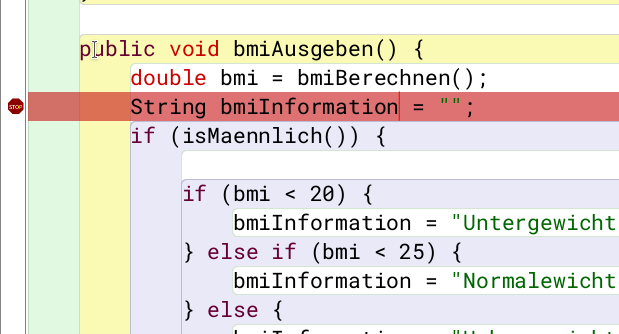

In BlueJ setzt man dazu auf der linken Seite im Code-Fenster einen sogenannten _Haltepunkt_. Die nächste Ausführung des Programmes stoppt dann bei genau dieser Codezeile. Im Debugger-Fenster werden dann die Werte der  Objekteigenschaften ("Instanz-Variablen") sowie die lokalen Variablen angezeigt.

[.center.text-center]
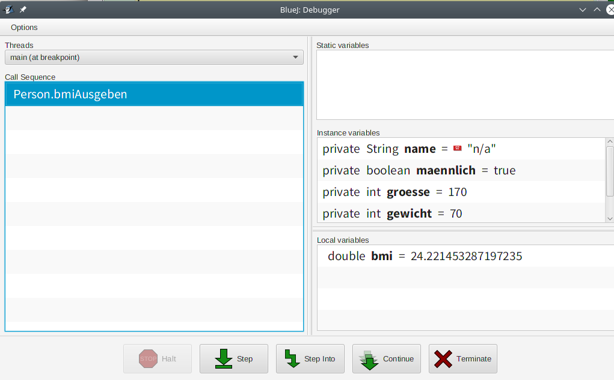

Mittels "Step" wird das Programm bis nach der nächsten Codezeile ausgeführt. "Step-Into" arbeitet auch etwaige Methodenaufrufe nur Zeile für Zeile ab. "Continue" setzt hingegen die normale Ausführung des Programmes fort. Diese wird erst beim nächsten Haltepunkt unterbrochen, oder das Programm wird regulär beendet.

[.center.text-center]
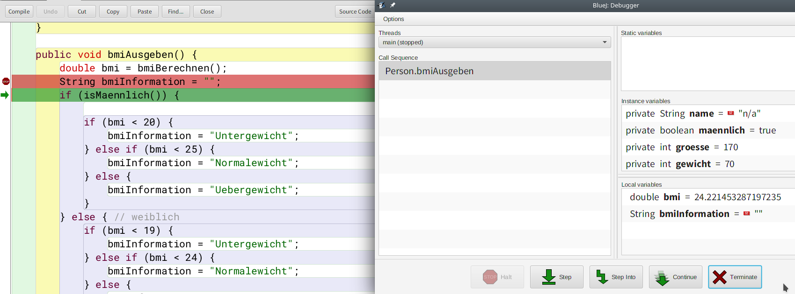

=== Testklassen

Um Fehler in der zu entwickenden Software zu vermeiden, ist die Durchführung von zahlreichen Tests unerlässlich. Diese können ad-hoc durchgeführt werden, indem in BlueJ entsprechende Objekte erstellt werden, diese mit geeigneten Werten befüllt werden, und entsprechende Methoden aufgerufen werden. Dieses Vorgehen kann jedoch zu erheblichem Aufwand führen, konkret müssen nach allen Änderungen immer wieder alle Testschritte durchgespielt werden. Ebenso besteht die Gefahr, dass neue entstandene Fehler nicht gefunden werden.

Testklassen stellen ein geeignetes Mittel dar, um alle Testfälle auf Knopfdruck durchspielen zu können. Das folgende Codestück zeigt eine rudimentäre Testklasse zu der im vorigen Abschnitt entwickelten Klasse `Person`.

[source,java]
----
public class TestPerson {

    public void testPersonErzeugen () {
        Person p1 = new Person("Franz Maier", true, 180, 62);
        p1.print();
        p1.bmiAusgeben();
        
        Person p2 = new Person("Sandra", false, 180, 62);
        p2.print();
        p2.bmiAusgeben();
        
        Person p3 = new Person("Petra", false, 170, 50);
        p3.print();
        p3.bmiAusgeben();
        
        Person p4 = new Person("Ferdinand", true, 181, 100);
        p4.print();
        p4.bmiAusgeben();
        
  
        Person p6 = new Person("Elisa", false, 180, 59);
        p6.print();
        p6.bmiAusgeben();
        
        Person p7 = null;
        p7.print();
    }
}
----

==== JUnit-Testklasse

Die fortgeschrittene Variante der Testklasse ist der _JUnit-Test_. Eine derartige Testklasse kann durch Rechts-Klick auf Person und Auswahl von "Create Test Class" erstellt werden.

[.center.text-center]
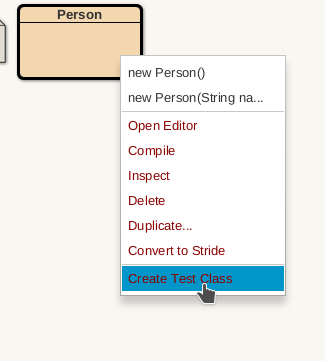

Man erhält dann eine zur jeweiligen Klasse zugehörige JUnit-Testklasse.

[.center.text-center]
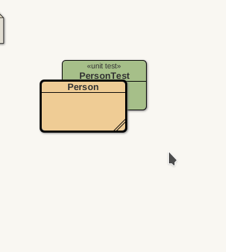

Der Quellcode sieht in etwa wie folgt aus.

[source,java]
----
public class PersonTest {
    
    Person p; <1>

    /**
     * Sets up the test fixture. Called before every 
     * test case method.
     */
    @BeforeEach <2>
    public void setUp() { 
        p = new Person("David", true, 180, 80);
    }

    
    @Test <3>
    public void testBmiBerechnen() {
        assert(p.bmiBerechnen() > 24.6);
        assert(p.bmiBerechnen() < 24.7);
    }
    
}
----

<1> Eine Objekteigenschaft `Person p` macht die Person in der ganzen Testklasse verfügbar. 

<2> Die Annotation `@BeforeEach` gibt an, dass diese Methode vor jedem Testfall ausgeführt wird. Innerhalb der Methode wird eine neue Instanz der Person erzeugt. Im Allgemeinen werden Vorbereitungen für die konkreten Testfälle getroffen.

<3> Die Annotation `@Test` gibt an, dass es sich hierbei um eine konkrete Testmethode handelt. Oft erstellt man für jede Methode einer Klasse eine derartige Testmethode, manchmal sogar mehrere. Die Testmethode verwendet `assert` um das erwartete Verhalten des Programmes sicherzustellen. 

[.center.text-center]
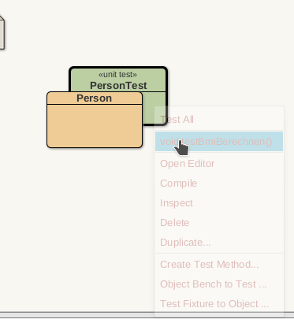

[.center.text-center]
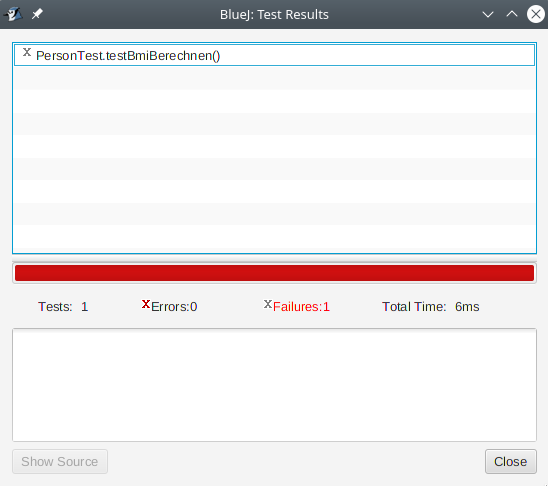

== Objekt-Beziehungen

Oftmals stehen Objekte in Beziehung zueinander. Ein häufiger Fall ist, dass in Objekten einer Klasse mehrere Instanzen einer anderen Klasse verwaltet werden. Im vorigen Abschnitt wurde die Klasse `Person` entwickelt. In diesem Abschnitt wird eine Klasse `Auto` entwickelt, in das bis zu drei Personen "einsteigen" können.

Die Plätze im Auto werden durch Objekteigenschaften, konkret durch Referenzen auf Objekte vom Typ `Person` umgesetzt. Steigt eine konkrete Person in das Auto ein, so wird im Objekt des Typs Auto eine Objektreferenz auf das Objekt der Person gesetzt. Hat eine der Objektreferenzen `fahrer`, `beifahrer` oder `rueckbank` den Wert `null`, so bedeutet dies, dass keine Person auf dem entsprechenden Platz sitzt.

[source,java]
----
public class Auto {
    
    private String name;
    private int eigengewicht;
    
    private Person fahrer;
    private Person beifahrer;
    private Person rueckbank;
    
    public Auto() {
        setName("n/a");
        setEigengewicht(1300);
    }
    
    public Auto(String name, int eigengewicht) {
        setName(this.name);
        setEigengewicht(this.eigengewicht);
    }
    
    public String getName() {
        return name;
    }
    
    public int getEigengewicht() {
        return eigengewicht;
    }
        
    public void setName(String name) {
        if (name != null) {
            this.name = name;
        } else {
            System.out.println("Fehler: kein Name!");
            this.name = "n/a";
        }
    }
    
    public void setEigengewicht(int eigengewicht) {
        if ((eigengewicht >= 600) && (eigengewicht <= 3000)) {
            this.eigengewicht = eigengewicht;
        } else {
            System.out.println("Fehler: kein gültiges Eigengewicht (600..3000)!");
            this.eigengewicht = 1300;
        }
    }
    
    public void einsteigen(Person person) {
        // 1. Pruefung ob Referenz person nicht null
        if (person != null) {
            if (this.fahrer == null) {
                this.fahrer = person; // this kann man hier weglassen
            } else {
                if (this.beifahrer == null) {
                    this.beifahrer = person;
                } else {
                    if (this.rueckbank == null) {
                        this.rueckbank = person;
                    } else {
                        System.out.println("Fehler: das Auto ist voll!");
                    }
                }
            }
        } else { // entsprechende Fehlermeldung
            System.out.println("Fehler: Parameter person ist null!");            
        }
        
    }

    public void aussteigenFahrer() {
        fahrer = null;
    }
    
    public void aussteigenBeifahrer() {
        beifahrer = null;
    }
    
    public void aussteigenRueckbank() {
        rueckbank = null;
    }
    
    public void aussteigen(Person person) {
        if (person != null) {
            if (this.fahrer == person) {
                aussteigenFahrer();
            } else {
                if (this.beifahrer == person) {
                    aussteigenBeifahrer();
                } else {
                    if (this.rueckbank == person) {
                        aussteigenRueckbank();
                    } else {
                        System.out.println("Fehler: Person nicht im Auto.");
                    }
                }
            }
        } else {
            System.out.println("Fehler: Parameter person ist null.");
        }
    }
    
    public void aussteigen(String name) {
        if (name != null) {
            // Achtung: String-Vergleich immer mit der equals-Methode!
            if (this.fahrer != null && name.equals(fahrer.getName())) {
                aussteigenFahrer();
            } else {
                if (this.beifahrer != null && name.equals(beifahrer.getName())) {
                    aussteigenBeifahrer();
                } else {
                    if (this.rueckbank != null && name.equals(rueckbank.getName())) {
                        aussteigenRueckbank();
                    } else {
                        System.out.println("Fehler: Person nicht im Fahrzeug");
                    }
                }
            }
        } else {
            System.out.println("Fehler: name ist null.");
        }
    }
    
    public int gesamtGewicht() {
        int gesamtGewicht = getEigengewicht();
        
        if (this.fahrer != null) {
            gesamtGewicht = gesamtGewicht + this.fahrer.getGewicht();    
        }
        
        if (this.beifahrer != null) {
            gesamtGewicht = gesamtGewicht + this.beifahrer.getGewicht();
        }
        
        if (this.rueckbank != null) {
            gesamtGewicht = gesamtGewicht + this.rueckbank.getGewicht();
        }
        
        return gesamtGewicht; 
    }
    
    public void printAuto() {
        System.out.println("Auto: " + name + ", Eigengewicht: " + eigengewicht);
        System.out.println("--------------------------------------------------------");
      
        System.out.print("Fahrer: ");
        if (this.fahrer != null) {
            this.fahrer.print();
        } else {
            System.out.println(" --frei-- ");
        }
        
        System.out.print("Beifahrer: ");
        if (this.beifahrer != null) {
            this.beifahrer.print();
        } else {
            System.out.println(" --frei--");
        }
        
        System.out.print("Rueckbank: ");
        if (this.rueckbank != null) {
            this.rueckbank.print();
        } else {
            System.out.println(" --frei--");
        }
        
        System.out.println("--------------------------------------------------------");        
    }
}
----

Die wesentlichen Überlegungen zu derartigen Aufgaben finden sich in der Methode `einsteigen(Person person)`. Diese Methode hat einen Parameter vom Typ `Person` mittels dem die Objektreferenz auf die einsteigende Person übergeben wird. Die zugrundeliegende Logik ist: die Person nimmt den ersten freien Platz; der erste Platz ist der Fahrer, der zweite Platz der Beifahrer, der dritte Platz auf der Rückbank. Die Programmlogik der Methode prüft im ersten Schritt ob der Parameter `person` ungleich `null` ist. Anderenfalls wird eine Fehlermeldung ausgegeben. Anschließend wird der erste freie Platz gesucht. Dies geschieht wieder mit If-Bedingungen. Es wird zunächst geprüft, ob `fahrer` _gleich_ `null` ist. Ist dies der Fall, so bedeutet das, dass noch niemand am Fahrersitz sitzt, also der Fahrersitz der erste freie Platz ist. In diesem Fall wird die Zuweisung `this.fahrer = person;` vorgenommen. Anderenfalls muss der nächste freie Platz geprüft werden (Beifahrer, Rückbank). Gibt es keinen freien Platz, so wird eine Fehlermeldung ausgegeben, dass das Auto schon voll ist.

[source,java]
----
    public void einsteigen(Person person) {
        // 1. Pruefung ob Referenz person nicht null
        if (person != null) {
            if (this.fahrer == null) {
                this.fahrer = person; // this kann man hier weglassen
            } else {
                if (this.beifahrer == null) {
                    this.beifahrer = person;
                } else {
                    if (this.rueckbank == null) {
                        this.rueckbank = person;
                    } else {
                        System.out.println("Fehler: das Auto ist voll!");
                    }
                }
            }
        } else { // entsprechende Fehlermeldung
            System.out.println("Fehler: Parameter person ist null!");            
        }
        
    }
----

Die Methode `aussteigen` ist ähnlich aufgebaut, allerdings wird hier verglichen ob die Objektreferenz (Parameter) gleich ist zu einem der Plätze. Ist dies der Fall, soll die Person aussteigen, was durch einen entsprechenden Methodenaufruf erreicht wird. Diese Methode setzt die entsprechende Objekteigenschaft auf `null`.

In der Methode `aussteigen(String name)` soll jene Person aussteigen, deren Name mit dem übergebenen Parameter übereinstimmt. Hierzu muss zunächst wieder geprüft werden, ob der Parameter `name` gleich `null` ist. Anderenfalls würden etwaige Methodenaufrufe zu Laufzeitfehlern führen ("`NullPointerException`").

[source,java]
----
    public void aussteigen(String name) {
        if (name != null) {
            // Achtung: String-Vergleich immer mit der equals-Methode!
            if (this.fahrer != null && name.equals(fahrer.getName())) {
                aussteigenFahrer();
            } else {
                if (this.beifahrer != null && name.equals(beifahrer.getName())) {
                    aussteigenBeifahrer();
                } else {
                    if (this.rueckbank != null && name.equals(rueckbank.getName())) {
                        aussteigenRueckbank();
                    } else {
                        System.out.println("Fehler: Person nicht im Fahrzeug");
                    }
                }
            }
        } else {
            System.out.println("Fehler: name ist null.");
        }
    }
----

Die Bedingungen sind hier etwas komplexer: zunächst muss geprüft werden, ob auf dem jeweiligen Platz jemand sitzt (z.B. `this.fahrer != null`). Im zweiten Teil der If-Bedingung (also nach `&&`) wird nun der Name der Person am Platz mit dem im Parameter übergebenen Namen verglichen. _Achtung: bei String-Vergleichen muss immer die `equals`-Methode verwendet werden._ Der `==`-Operator liefert nicht immer das korrekte Ergebnis!

== Strings

Die Klasse `String` ist ein Teil der Java-Bibliothek und enthält zahlreiche nützliche Methoden zur Bearbeitung und Analyse von Zeichenketten. Alle Strings sind Instanzen dieser Klasse `String`, allerdings gibt es im Gegensatz zu Instanzen anderer Klasse einige Besonderheiten bei `String`. Auf diese wird im nächsten Abschnitt genauer eingegangen.

Die zur Verfügung stehenden Methoden der Klasse `String` sind in der Java API (Application Programming Interface) Dokumentation aufgelistet.

https://docs.oracle.com/en/java/javase/16/docs/api/index.html

In dieser API-Dokumentation sind alle Klassen der Java Bibliothek ausführlich beschrieben.

[.center.text-center]
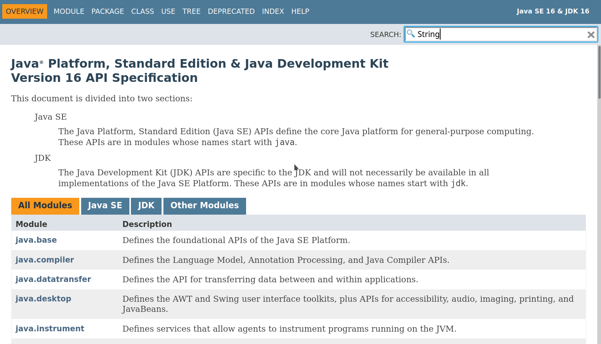

Rechts oben kann nach konkreten Klassen gesucht werden. Wählen Sie `java.lang.String` im Kontextmenü, oder folgen Sie direkt dem Link:

https://docs.oracle.com/en/java/javase/16/docs/api/java.base/java/lang/String.html

um zur folgenden Seite zu gelangen.

[.center.text-center]
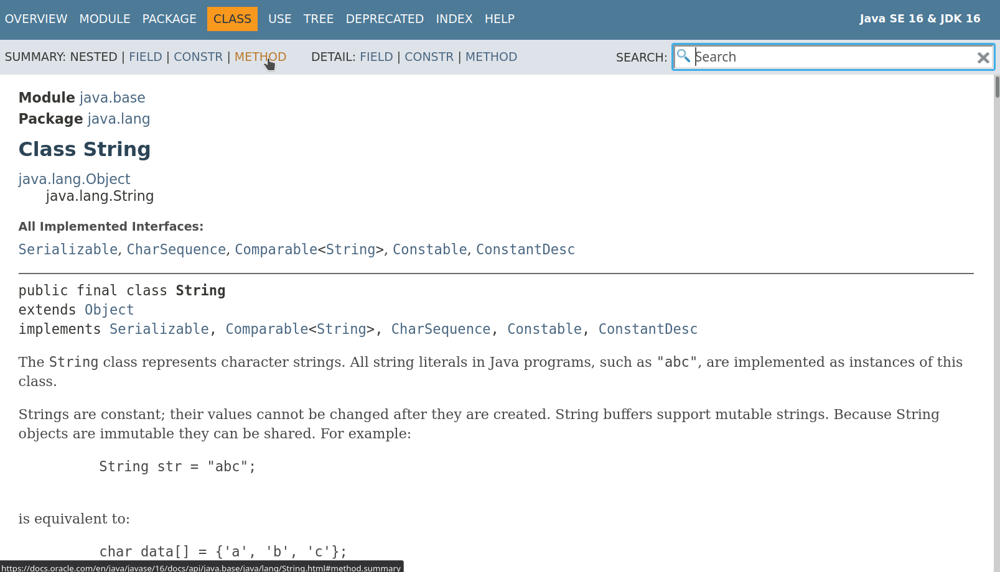

Zunächst findet sich eine genaue Beschreibung des Zweckes der Klasse, jedoch sind viele Informationen erst mit tiefergehendem technischen Verständnis hilfreich und verständlich. Durch Klick auf "Method" (Menüleiste) gelangen Sie zum dem Abschnitt der alle Methoden der Klasse auflistet.

[.center.text-center]
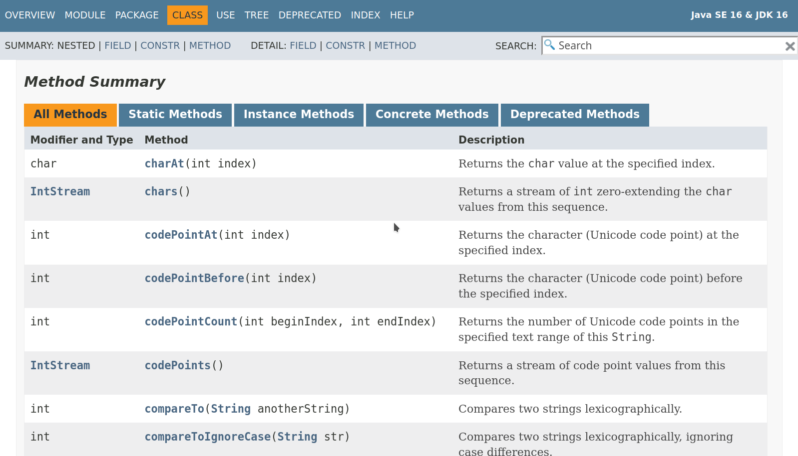

Wichtige Methoden sind:

* `char charAt(int index)`: gibt das Zeichen an der Stelle `index` (erst Stelle hat Index 0!) zurück, sofern vorhanden.
* `int indexOf(String str)`: gibt die Stelle des erste Vorkommens des als Parameter übergebenen Strings zurück.
* `boolean isEmpty()`: gibt an, ob der String leer ist.
* `int length()`: gibt die Länge des Strings zurück.
* `String toLowerCase()`: retourniert den ursprünglichen String mit ausschließlich Kleinbuchstaben.
* `String toUpperCase()`: retourniert den ursprünglichen String mit ausschließlich Großbuchstaben.
* `String trim()`: etwaige Leerzeichen am Beginn und Ende des Strings werden abgeschnitten.

Im folgenden finden Sie eine Klasse, die eine Person mit Vornamen und Nachnamen modelliert. Die Klasse enthält neben den Konstruktoren und Get-/Set-Methoden auch weitere Methoden die die String-Methoden verwenden.

[source,java]
----
public class Person {

    private String vorname;
    private String nachname;
    
    public Person() {
        setVorname("Max");
        setNachname("Mustermann");
    }
    
    public Person(String vorname, String nachname) {
        setVorname(vorname);
        setNachname(nachname);
    }
    
    // Get/Set-Methoden
    public String getVorname() {
        return vorname;
    }
    
    public void setVorname(String vorname) {
        if (vorname != null) {
            this.vorname = vorname;
        } else {
            System.out.println("Fehler, vorname ist null");
        }
    }
    
    public String getNachname() {
        return nachname;
    }
    
    public void setNachname(String nachname) {
        if (nachname != null) {
            this.nachname = nachname;
        } else {
            System.out.println("Fehler, nachname ist null");
        }
    }
    
    public String gesamterName() {
        return vorname + " " + nachname;
    }
    
    public int laengeGesamterName() {
        return gesamterName().length();
    }
        
    public String initialien() {
        if (this.vorname.length() > 0 && this.nachname.length() > 0) {
            return this.vorname.charAt(0) + ". " + this.nachname.charAt(0) + ".";
        } else {
            System.out.println("Fehler, Vor- oder Nachname ist leer!");
        }
    }
    
    public String kuerzel() {
        if (nachname.length() >= 2 && vorname.length() >= 1) {
            return nachname.substring(0, 2).toUpperCase() + this.vorname.charAt(0);
        } else {
            System.out.println("Fehler, kann Kuerzel nicht berechnen.");
            return "n/a";
        }
    }
}
----

In der Methode `int laengeGesamterName()` wird die Länge des Strings zurückgegeben der von `String gesamterName()` zurückgegeben wird. In der Methode `String initialien()` werden die Initialen als String zurückgegeben. Dabei liefert die Methode `charAt(0)` (also aufgerufen mit Parameter index=0) jeweils den ersten Buchstaben des Vornamens und des Nachnamens. Mittels + Operator werden diese `Characters`(!) mit den String "\." verknüpft, und dabei implizit zu `String`s umgewandelt (Typecast). Dafür muss zunächst geprüft werden, ob die Länge der beiden Strings mindestens 1 beträgt, da sonst die Methode `charAt(0)` in diesem Fall einen Laufzeitfehler liefern würde.

In der Methode `String kuerzel()` wird ein Kürzel aus 3 Großbuchstaben ermittelt, wobei die ersten zwei Buchstaben vom Nachnamen kommen. Hierbei ist zu beachten, dass die jeweiligen Strings die entsprechende Länge aufweisen. Anderenfalls würde auch an dieser Stelle ein Laufzeitfehler auftreten.

Zu beachten ist generell, dass die String-Objekte auf welchen die Methoden aufgerufen werden (in unserem Fall `nachname` und `vorname`) nicht `null` sind. Diesfalls würde sonst eine `NullPointerException`, also ein Laufzeitfehler, auftreten. Durch die Parameterprüfungen in den Konstruktoren und Set-Methoden haben dies für diese Klasse bereits sichergestellt. Dadurch gestaltet sich der Code an dieser Stelle etwas übersichtlicher, da die entsprechende Parameterprüfung (`!= null`) an dieser Stelle nicht notwendig ist.

=== Besonderheiten bei der Verwendung von `String`

Bei der Klasse `String` verwendet man bei der Erstellung neuer Instanzen nicht den Konstruktor (also nicht: `String s = new String("ein Text");`), sondern schreibt einfach `String s = "ein Text";`. Im Hintergrund verwaltet Java alle erzeugten String-Instanzen und vermeidet dabei, dass gleiche Werte mehrfach abgespeichert werden ("String-Pool").

Möchte man zwei Strings auf Inhaltsgleichheit überprüfen, so muss die `equals`-Methode verwendet werden. Vielleicht haben Sie dennoch bemerkt, dass auch der `==`-Operator oftmals zu funktionieren _scheint_(!). Und dies, obwohl der `==`-Operator bei Referenztypen die Instanz/Objekt-Gleichheit prüft, und nicht die Inhalts-Gleichheit. Der Grund hierfür ist, dass bei Inhaltsgleichheit meist auch automatisch Instanzgleichheit vorliegt (String-Pool!). Dies ist jedoch nicht immer der Fall, was das folgende Codestück zeigt:

[source,java]
----
String a = "xyz";
String b = "xy";
b += "z";

System.out.println("a: " + a);
System.out.println("b: " + b);

// dieser Stringvergleich funktioniert nicht
System.out.println("a == b: " + (a == b));
System.out.println("a.equals(b): " + a.equals(b));

String c = "xyz";
System.out.println("a: " + a);
System.out.println("c: " + c);

// In diesem Fall liefert auch der ==-Operator das
// gewuenschte Ergebnis
System.out.println("a == c: " + (a == c));
System.out.println("a.equals(c): " + a.equals(c));
----

Die zugehörige Ausgabe ist:

....
a: xyz
b: xyz
a == b: false
a.equals(b): true
a: xyz
c: xyz
a == b: true
a.equals(b): true
....

Aufgrund der Operation `b += "z";` enthält `b` zwar den selben Inhalt wie `a` (`equals` liefert also immer `true`), es handelt sich jedoch _nicht_ um die selbe Instanz.

== Schleifen

Schleifen sind zentrale Sprachkonstrukte in allen Programmiersprachen. Sie ermöglichen es bestimmte Aufgaben mehrmals durchzuführen, beziehungsweise bestimmte Codestücke mehrmals zu durchlaufen. Es existieren verschiedene Ausprägungen von Schleifen, konkret zwei verschiedene `while`-Schleifen und die `for`-Schleife. Allen Varianten ist gemein, dass es eine _Zählvariable_ gibt, die (meist) als Wert enthält wie oft die Schleife schon durchlaufen wurde. Diese Zählvariable wird in jedem Durchlauf der Schleife verändert (hochgezählt, "inkrementiert"). Eine _Fortsetzungsbedingung_ legt fest ob die Schleife erneut ausgeführt werden soll.

Das folgende Beispiel zeigt eine Methode die eine Linie (bestehend aus den Zeichen "-") auf die Konsole schreibt. Die Länge der Linie (also die Anzahl der Zeichen) wird mittels Parameter gesteuert.

[source,java]
----
public void zeichneLinie(int laenge) {
    if (laenge >= 0) {
        int zaehler = 0;
        while (zaehler < laenge) {
            System.out.print("-");
            zaehler++; // entspricht: zaehler = zaehler + 1;
        }
        
        System.out.println();
    } else {
        System.out.println("Fehler: laenge ungueltig: " + laenge);
    }
}
----

Der relevante Code beginnt mit `int zaehler = 0;`, der Initialisierung der Schleifenvariable. Direkt danach beginnt die eigentliche Schleife mit `while`, in der darauffolgenden Bedingung (Ausdruck der `boolean` als Ergebnis hat) wird geprüft ob die Schleife (erneut) durchlaufen werden soll. Ist im konkreten Fall `zaehler` kleiner als die vorgegebene `laenge`, so wird der darauffolgende Block durchlaufen. Es wird einmal ein Zeichen "-" auf die Konsole geschrieben, und danach die Schleifenvariable erhöht.

Wird irrtümlich vergessen die Schleifenvariable zu modifizieren (erhöhen, verringern), kommt es zu einer _Endlosschleife_. In diesem Fall läuft das Programm solange, ohne etwas sinnvolles auszuführen, weiter, bis es manuell unterbrochen wird, z.B. durch Strg-C oder Reset der Virtual Machine.

Von der `while`-Schleife gibt es eine Variante in der die Bedingung am Ende der Schleife angeführt wird.

[source,java]
----
public void zahlenAusgeben() {
    int i=0;
    do {
        System.out.println(i);
        i++;
    } while (i<10);
} 
----

Manchmal erweist sich diese Schleife als "angenehmer" oder "eleganter", aber eigentlich bräuchte man sie nicht unbedingt. Jede `while`-Schleife kann in eine `do-while`-Schleife umgeschrieben werden, und umgekehrt!

=== `for`-Schleife

Eine weitere syntaktische Variante der Schleife ist die `for`-Schleife. Auch diese ist, wie schon die `do-while`-Schleife nur eine Variation die Schleife anzuschreiben. Sie liefert uns aber keine grundsätzlich neuen Möglichkeiten. Jede `for`-Schleife kann durch eine `while`- oder `do-while`-Schleife ersetzt werden.

Das vorige Codebeispiel sieht mit einer `for`-Schleife folgendermassen aus:

[source,java]
----
public void zahlenAusgeben2() {
    for (int i=0; i<10; i++) {
        System.out.println(i);
    }
} 
----

Der Schleifenkopf enthält jetzt sowohl die Schleifenvariable mit deren Initialisierung, die Fortsetzungsbedingung, als auch die Modifikation der Schleifenvariable. Rein syntaktisch wäre auch `double` als Typ der Schleifenvariable zulässig, dies ist aber nicht sinnvoll, und nahezu immer ein Fehler! Nach dem ersten ";" folgt die Bedingung unter der die Schleife erneut durchlaufen werden soll. Auch komplexere boole’sche Ausdrücke sind hier zulässig, aber selten notwendig. Nach dem zweiten ";" wird die Schleifenvariable modifiziert. Man könnte hier zum Beispiel auch schreiben `i += 2` oder `i -= 4`, aber in den meisten Fällen tritt hier entweder `i++` (Inkrementieren um 1) oder `i--` (Dekrementieren um 1) auf.

=== Codebeispiele

==== Beispiel Rechteck mit Diagonale

In diesem Beispiel soll eine Klasse `Quadrat` entwickelt werden, die ein Quadrat mit einer Diagonale von links oben nach rechts unten auf der Konsole ausgeben kann:

....
##########
##       #
# #      #
#  #     #
#   #    #
#    #   #
#     #  # 
#      # #
#       ##
#        #
##########
....

Je nach verwendeter Schriftart sieht die Darstellung mehr oder weniger quadratisch aus – meist eher weniger. Aber die Anzahl der Zeichen pro Zeile entspricht jedenfalls der Anzahl der Zeilen. Die Klasse `Quadrat` enthält zunächst `laenge` als Eigenschaft, zu den Konstruktoren und Get/Set-Methoden ist nichts weiteres anzumerken. Die Methode `printQuadrat` gibt das Quadrat dann auf der Konsole aus. Hierzu werden zwei Schleifen verwendet, die durch die Zeilen und Spalten iterieren. Die If-Bedingung prüft nun ob das Zeichen "\#" oder ein Leerzeichen " " zu zeichnen ist. Das Zeichnen des Leerzeichens ist hier unbedingt notwendig, da der rechte Rand des Quadrates ja durch diese Leerzeichen vom linken Rand getrennt ist. Ein "\#"-Zeichen soll gesetzt werden, wenn wir uns in der ersten oder letzten Zeile befinden (also `zeile == 0` oder `zeile == laenge-1`), oder wenn wir uns in der ersten oder letzten Spalte befinden (also `spalte == 0` oder `spalte == laenge-1`). Zusätzlich soll das Zeichen in die Diagonale gesetzt werden, was genau dann gegeben ist, wenn der Zeilenindex dem Spaltenindex entspricht (`zeile == spalte`).

[source,java]
----
public class Quadrat {

    private int laenge;
    
    public Quadrat() {
        setLaenge(10);
    }
    
    public Quadrat(int laenge) {
        setLaenge(laenge);
    }
    
    public int getLaenge() {
        return laenge;
    }
    
    public void setLaenge(int laenge) {
        if (laenge > 0 && laenge < 100) {
            this.laenge = laenge;
        } else {
            System.out.println("Fehler: ungueltige Laenge: " + laenge);
        }
    }    
    
    public void printQuadrat() {
        int zeile = 0;
        while (zeile < laenge) {
            int spalte = 0;
            while (spalte < laenge) {
                if (zeile == 0 || zeile == laenge-1 
                    || spalte == 0 || spalte == laenge-1
                    || zeile == spalte) 
                {
                    System.out.print("#");
                } else {
                    System.out.print(" ");
                }
                spalte++;
            }
            System.out.println();
            zeile++;
        }
    }

}
----

Als Übungsaufgabe kann man nun folgende Änderung vornehmen (versuchen Sie dies selbst zu implementieren). Eine weitere Methode `printQuadrat2` soll statt der Diagonale von links oben nach rechts unten die andere Diagonale zeichen, also von rechts oben nach links unten. Dabei soll für die Diagonale das Zeichen "*" verwendet werden. Der Code zu dieser adaptierten Aufgabe sieht wie folgt aus:

[source,java]
----
    public void printQuadrat2() {
        int zeile = 0;
        while (zeile < laenge) {
            int spalte = 0;
            while (spalte < laenge) {
                if (zeile == 0 || zeile == laenge-1 
                    || spalte == 0 || spalte == laenge-1) 
                {
                    System.out.print("#");
                } else if (spalte == laenge-1-zeile) {
                    System.out.print("*");
                } else {
                    System.out.print(" ");
                } 
                spalte++;
            }
            System.out.println();
            zeile++;
        }
    }
----

==== Beispiel Rechteck mit Code-Wiederverwendung

Das folgende Codebeispiel demonstriert die Anwendung der bisherigen Sprachelemente: Klassen, Methoden, Parameter, lokale Variablen, Bedingungen und Schleifen. Die grundlegende Anforderung ist, Rechtecke und Quadrate auf die Konsole zu zeichnen. Beispiele:

....
        ###########
        #.........#
        #.........#
        ###########
....

oder

....
            @@@@@@@@@@@@@@@@@@
            @________________@
            @________________@
            @________________@
            @________________@
            @________________@
            @________________@
            @@@@@@@@@@@@@@@@@@
....

Die Größe soll also flexibel über die Parameter einstellbar sein ("parametrierbar sein"). Anhand dieses Beispiels soll nun auch das Konzept der _Code-Wiederverwendung_ vorgestellt werden. Beim Programmieren sollte man stets versuchen bestimmte Teilaufgaben nicht mehrfach zu implementieren. Dies stellt nicht nur Mehrarbeit bei der Entwicklung dar, sondern führt auch zum Problem, dass etwaige spätere Änderungen an mehreren Stellen im Code konsistent durchgeführt werden müssten. Wenn gleiche oder ähnliche Codefragmente mehrfach im Code (eines Programmes) auftreten, ist dies nahezu immer ein Indiz für schlechtes Design.

Das Prinzip der Code-Wiederverwendung sagt, dass schon implementierte Codestücke (in Methoden) nach Möglichkeit überall dort wiederverwendet werden sollen, wo sie als Teilaufgabe einer anderen (größeren) Aufgabe auftreten. Dies erhöht die Flexibilität im Programm, erleichtert es Änderungen im Programm vorzunehmen, und gestaltet das Programm schließlich auch lesbarer und verständlicher.

Wir wollen die Code-Wiederverwendung nun anhand des Beispiels der Rechtecke (vom Beginn dieses Abschnittes) erläutern. Das Zeichnen eines Rechteckes beinhaltet als Teilaufgabe das Zeichnen eine Zeile. Diese Zeile enthält im Falle der ersten oder letzten Zeile des Rechteckes lauter gleiche Zeichen, die anderen Zeilen haben links und rechts außen andere Zeichen als in der Mitte. Das Zeichnen eines _eingerückten_ Rechteckes beinhaltet das Zeichnen von _eingerückten_ Zeilen als Teilaufgabe.

Im folgenden Code wurden zunächst Methoden für das Zeichnen von Linien angegebener Länge (`laenge`) mit Einrückung (`offset`) und vorgegebenen Zeichen für den Rand und den Bereich dazwischen entworfen. Diese Methoden können und sollen in einer Testklasse getestet werden. Und dies völlig unabhängig von der eigentlichen umfangreicheren Aufgabestellung des Zeichnen eines Rechtecks. Die Methoden zum Zeichnen des Rechteckes rufen dann die Methoden `zeichneLinie` mit entsprechenden Parametern auf. Dies erhöht die Lesbarkeit der Methode `zeichneQuadrat` erheblich da auf innersten Einrückungsebene keine komplizierten Schleifen und Bedingungen zu finden sind, sondern einfach ein selbsterklärender Aufruf der Methode `zeichneLinie`.

[source,java]
----
public class SchleifenDemo {

    public SchleifenDemo() {
    }
    
    public void zeichneLinie(int offset, int laenge) {
        zeichneLinie(offset, laenge, '*', '#');    
    }
    
    public void zeichneLinie(int offset, int laenge, char zeichen, char rand) {
        if (offset >= 0) {
            int zaehler = 0;
            while (zaehler < offset) {
                System.out.print(" ");
                zaehler++;
            }
        } else {
            System.out.println("Ungueltiger Offset: " + offset);
        }
        if (laenge >= 0) {
            int zaehler = 0;
            while (zaehler < laenge) {
                if (zaehler == 0 || zaehler == laenge-1) {
                    System.out.print(rand + " ");
                } else {
                    System.out.print(zeichen + " ");
                }
                zaehler++; // zaehler = zaehler + 1;
            }
            System.out.println(); // Zeilenumbruch
        } else {
            System.out.println("Fehler: laenge ungueltig: " + laenge);
        }
    }

    // offset = horizontale Einrueckung
    public void zeichneRechteck(int offset, int laenge, int hoehe, char zeichen, char rand) {
        if (laenge >= 0 && hoehe >=0) {
            int zeile = 0;
            while (zeile < hoehe) {
                if (zeile == 0 || zeile == hoehe-1) {
                    zeichneLinie(offset, laenge, rand, rand);   
                } else {
                    zeichneLinie(offset, laenge, zeichen, rand);
                }
                zeile++;
            }
        } else {
            System.out.println("Fehler, ungueltige laenge oder hoehe: " + laenge + ", " + hoehe);
        }
    }
    
}
----

Das Gliedern des Codes in unabhängige Teilaufgaben erhöht nicht nur die Übersichtlichkeit und Lesbarkeit, sondern ist auch robuster gegenüber potentiellen Änderungen im Programmcode (die dann nicht an mehreren Stellen konsistent durchgeführt werden müssen), und vor allem besser zu testen. So kann im konkreten Fall das Zeichnen einer Linie separat getestet werden. Beim Testen der Methode zum Zeichnen eines Rechteckes kann dann schon angenommen werden, dass das Zeichnen einer Linie funktioniert.

Das Beispiel veranschaulicht auch den sinnvollen Einsatz des Überladens von Methoden. Zur Wiederholung: Überladen bedeutet, es gibt mehrere Methoden mit gleichem Namen, die sich aber in der Signatur unterscheiden. Im konkreten Fall gibt es die Methode `zeichneLinie(int offset, int laenge, char zeichen, char rand)` mit Parametern für die Einrückung, die Länge, das Zeichen (in der Mitte) und das Rand-Zeichen. Die Methode `zeichneLinie(int offset, int laenge)` hat nur zwei Parameter; die Zeichen selbst können hier nicht frei gewählt werden. Hingegen enthält der Methodenrumpf nur eine einzelne Zeile, die die andere Methode (mit 4 Parametern) und Standardwerten für die Zeichen aufgerufen wird.

Die Weiterführung dieser Idee ermöglicht nun eine einfach Implementierung einer weiteren Methode zum Zeichnen von Quadraten:

[source,java]
----
    public void zeichneQuadrat(int offset, int laenge) {
       zeichneQuadrat(offset, laenge, '.', '#');
    }
    
    public void zeichneQuadrat(int offset, int laenge, char zeichen, char rand) {
        zeichneRechteck(offset, laenge, laenge, zeichen, rand);
    }
----

Diese Methoden rufen wiederrum nur schon vorhande Methoden, jedoch mit speziellen Parameterwerten auf. Insbesondere ist in der zweiten Methode ersichtlich, dass ein Quadrat nur ein Spezialfall eines Rechteckes ist, nämlich mit `laenge` gleich `hoehe`. Anmerkung: von der üblichen Bezeichnung Länge/Breite für die Seitenlängen des Rechteckes wurde hier abgewichen, um die Entsprechung zu `laenge` der Linie hervorzuheben.

== Statische Methoden und spezielle Klassen

=== Statische Methoden

Die bisher kennengelernten Methoden werden auf Objekten (Objektreferenzen) aufgerufen. Beispiel: zu einer Objektreferenz `Person p1` kann man beispielsweise aufrufen `p1.setName("Max Maier");` oder `p1.printPerson();`. Diese Methoden ändern den Objektzustand (z.B. neuer Name), oder sie geben Informationen zum Objektzustand zurück (z.B. `p1.getName()`), oder sie führen Berechnungen oder Aktionen aus (z.B. `p1.bmiBerechnen()`, bzw. `p1.printPerson()`).

Manchmal möchte man die Methode jedoch nicht direkt dem Objekt zuordnen. Dies ist dann der Fall wenn die Methode sinnvoll verwendet werden kann, ohne dass es überhaupt ein Objekt gibt, oder dass innerhalb der Methode keinerlei Objekteigenschaften verwendet werden. In diesem Fall ist die Methode _nicht_ dem Objekt zugeordnet, sondern (nur) der Klasse. Derartige Methoden werden _statische Methoden_ genannt.

Wir betrachten als Beispiel eine Klasse `Student` mit den Eigenschaften Name, Matura, Geburtsjahr. Weiters betrachten wir eine Klasse `Kurs`, die einen Kursnamen und bis zu drei Studenten enthält. Analog zum Beispiel `Auto` soll eine Methode in Kurs `aufnehmen(Student student)` einen Studenten aufnehmen, wenn noch ein Platz vorhanden ist, und wenn die Zulassungsvoraussetzungen erfüllt sind. Diese sollen sein, dass der Student eine Matura hat, und das Geburtsjahr vor 2003 liegt. Möglicherweise möchte man schon vor dem (versuchten) Aufnehmen des Studenten prüfen ob der die Zulassungsvoraussetzungen erfüllt sind. Die Methode dazu sieht so aus (alle Eigenschaften und Methoden von `Kurs` wurden hier der Übersicht halber weggelassen):

[source,java]
----
public class Kurs {
    
    ...
    
    public static boolean zulassungMoeglich(Student stud) {
        if (stud != null) {
            if (stud.hasMatura() && stud.getGeburtsjahr() < 2003) {
                return true;
            } 
        } else {
            // TODO Fehlermeldung ausgeben
        }
        return false;
    }
}
----

Beachten Sie, dass hier keinerlei Objekteigenschaften von `Kurs` verwendet werden. Die Methode funktioniert auch unabhängig von konkreten Objekten. Das Schlüsselwort _`static`_ gibt an, dass die Methode auch ohne Objekt aufgerufen werden kann. Anstatt einer Objektreferenz verwendet man hierfür vor dem Punkt einfach den Klassennamen.

[source,java]
----
// in der Testklasse oder sonstigen Klassen
Student std = new Student("Max Maier", true, 2002);
boolean ok = Kurs.zulassungMoeglich(std);
----

Beachten Sie, dass `Kurs` hier die Klasse (und nicht eine Objektreferenz) ist. Aus BlueJ heraus können statische Methoden direkt im Kontextmenü der Klassen aufgerufen werden! Statische Methoden können auch innerhalb der Klasse aufgerufen werden, in der sie definiert wurden. In diesem Fall kann der Klassenname vor dem Methodenaufruf entfallen.

Statische Methoden sollen für Sie zunächst die _absolute Ausnahme_ darstellen. Wenngleich viele Aufgabestellungen auch mit statischen Methoden gelöst werden können, ist dies dennoch als schlechtes Design anzusehen.

=== `main` Methode

Einen wichtigen Spezialfall einer statischen Methode stellt die _Main-Methode_ dar. Die Main-Methode definiert den Einstiegspunkt in ein Programm. Wenn also auf einem Server ein Prozess oder Service angestartet wird, oder auf Ihrem Rechner eine Desktop-Anwendung gestartet wird, so geschieht dies immer über die Main-Methode. In jedem Programm kann es folglich nur eine Main-Methode geben, da der Einstiegspunkt beim Programmstart eindeutig definiert sein muss. Das folgende Codestück enthält eine derartige Main-Methode:

[source,java]
----
public class Programm {

    public static void main(String[] args) {
        // z.B. Kursverwaltung kv = new Kursverwaltung();
        //      kv.start();
    }
    
}
----

Innerhalb der Main-Methode kann z.B. eine Benutzeroberfläche einer Kursverwaltung angestartet werden, wie im Beispiel in den Kommentaren angemerkt. Die Main-Methode enthält einen Parameter (eine "Liste" an Argumenten) die vom Betriebssystem oder der Entwicklungsumgebung an das Programm übergeben werden können. Das kann zum Beispiel eine zu öffnenden Datei, oder Parameter zur Konfiguration des Programmes sein.

=== Weitere wichtige Klassen

Die Klasse `String`, als wichtiger Bestandteil der Java-Klassenbibliothek, wurde schon vorgestellt. Im Folgenden werden zwei weitere wichtige Klassen grob vorangestellt.

==== Klasse `Math`

Die Methoden der Klasse `Math` sind alle _statisch_, es werden also generell keine Instanzen von `Math` erzeugt. Die folgende Auflistung ist nicht annähernd vollständig, sondern soll nur einen groben Einblick in die Vielfalt der vorhandenen Methoden geben. Sehen Sie sich aber auf jedenfall die Javadoc zu dieser Klasse an!

* `static double abs(double a)`: retourniert Absolutbetrag zu `a`
* `static double cos(double a)`
* `static double sin(double a)`
* `static double log(double a)`: Berechnet den natürlichen Logarithmus von a
* `static double exp(double a)`: Berechnet die Exponentialfunktion zur Basis der eulerschen Zahl
* `static double ceil(double a)`: Aufrunden von a
* `static double floot(double a)`: Abrunden von a
* `static double sqrt(double a)`: Quadratwurzel von a

=== Klasse `Random`

Die Klasse `Random` enthält den Zufallszahlengenerator der Java-Bibliothek. Genau genommen handelt es sich um _Pseudo-Zufallszahlen_, also Zahlen die ähnliche Eigenschaften wie tatsächliche Zufallszahlen haben, also von echten Zufallszahlen kaum unterscheidbar sind. Der Computer selbst ist aber eine deterministisch arbeitende Maschine auf der kein _echter_ Zufall existiert. Für die meisten Zwecke sind diese Pseudo-Zufallszahlen jedoch absolut ausreichend.

Um die Klasse `Random` verwenden zu können, muss diese zunächst importiert werden. Dies geschieht mitttels

[source,java]
----
import java.util.Random;
----

am Beginn einer Klasse (in der sie verwendet wird).

= TEIL 2

Zweites Semester der 6-jährigen Ausbildungsform; zweite Hälfte des ersten Semesters der 4-jährigen Ausbildungsform; Anmerkung: der Teil Vererbung wird in der 4-jährigen Ausbildungsform erst im zweiten Semester unterrichtet.

== Entwicklungswerkzeuge -- Teil 2

Während die Entwicklungsumgebung BlueJ vor Allem Einsteigern den Umgang mit Objekten anschaulich gestalten soll, bieten professionellere Entwicklungsumgebungen wesentlich mehr Werkzeuge und Hilfsmittel für die praktische Softwareentwicklung an. Die zwei am weitesten verbreiteten Entwicklungsumgebungen im Bereich Java sind einerseits _Eclipse_ und andererseits _IntelliJ_. Jede der beiden hat eigene Vor- und Nachteile, nahezu alle wichtigen Funktionalitäten sind jedoch in beiden Entwicklungsumgebungen vorhanden. Der Umstieg von einer auf die andere Umgebung sollte deshalb nicht all zu schwer fallen.

=== IntelliJ

Wir wollen in weiterer Folge _IntelliJ_ der Firma _JetBrains_ verwenden, die in den letzten Jahren stark an Popularität gewonnen hat. Ähnliche Entwicklungsumgebungen gibt es auch für andere Programiersprachen wie C# oder Python u.v.m. Die _Community-Edition_ ist kostenlos verfügbar und für ein breites Spektrum an Anwendungen ausreichend.

[.center.text-center]
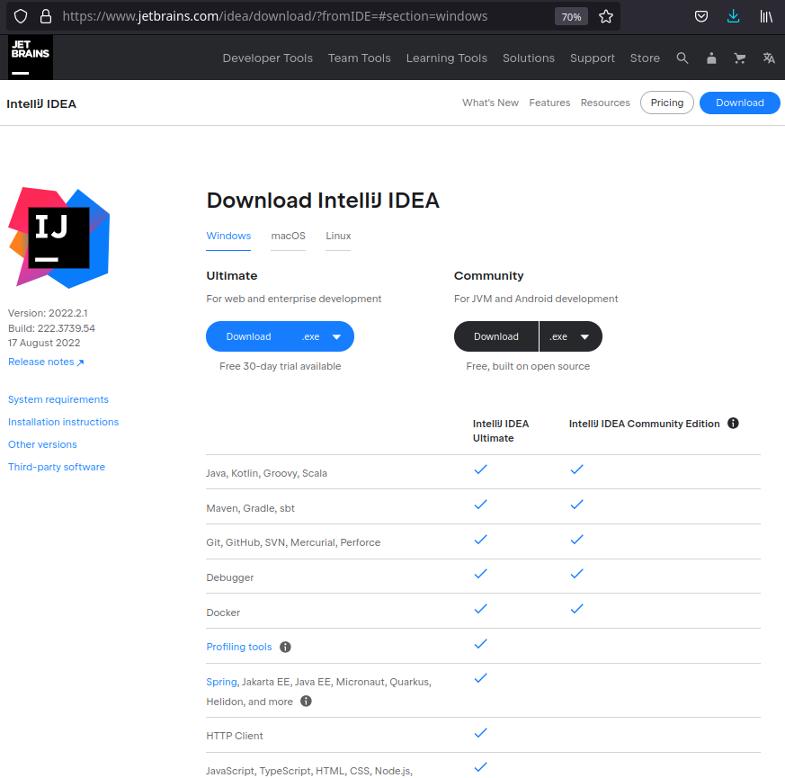

Nach dem Start von IntelliJ kann zunächst ein Projekt erstellt werden.

[.center.text-center]
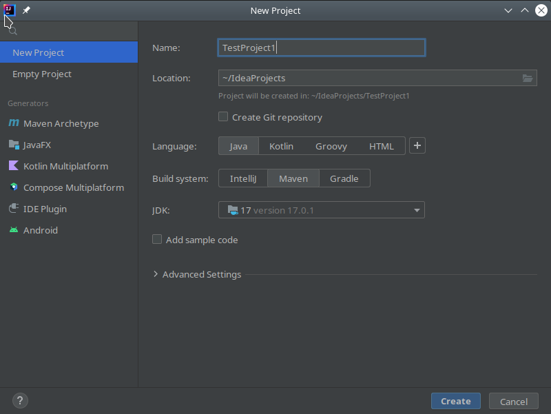

Auf der linken Seite wird die Projektstruktur angezeigt. Die Datei `pom.xml` enthält die Projektkonfiguration inklusive etwaiger Abhängigkeiten. Über das Kontextmenü kann eine neue Java-Klasse im Ordner `src/main/java` erstellt werden.

[.center.text-center]
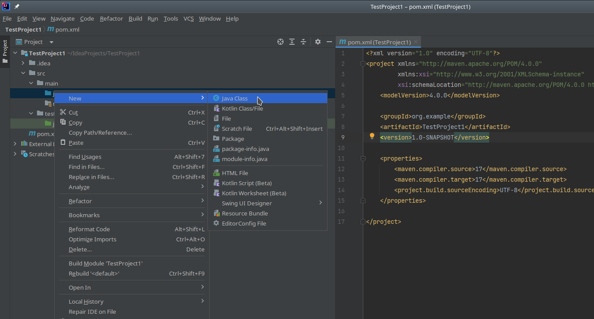

Auf der rechten Seite der Entwicklungsumgebung kann das Maven-Menü ausgeklappt werden. Maven ist ein _Build-Werkzeug_, dass den Prozess der Kompilierung des Projektes und die Verwaltung aller Abhängigkeiten unterstützt. Möchte man externe Bibliotheken verwenden (zum Beispiel für Unit-Tests, Benutzeroberflächen, Schreiben von Logfiles etc.), lädt Maven diese Abhängigkeiten anhand der Konfiguration automatisch herunter und fügt alle Pfade dem Projekt hinzu.

[.center.text-center]
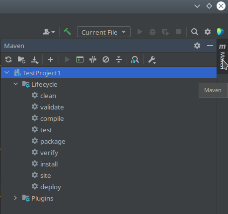

Über _Install_ werden alle Abhängigkeiten geprüft und installiert. Das Projekt ist danach bereit für die Ausführung.

[.center.text-center]
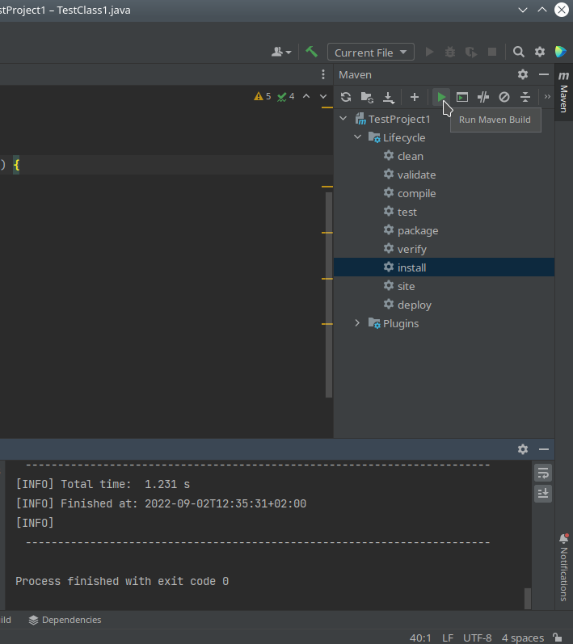

Das Projekt kann nun mittels Klick auf den kleinen grünen Hammer oder `Strg-9` kompiliert werden.

[.center.text-center]
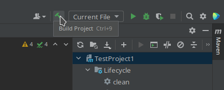

Im Gegensatz zu BlueJ muss bei IntelliJ (und Eclipse) stets eine Main-Methode im Projekt vorhanden sein, um es ausführen zu können. Mittels `Shift-F10` oder Klick auf den kleinen grünen Play-Button kann das Programm gestartet werden.

[.center.text-center]
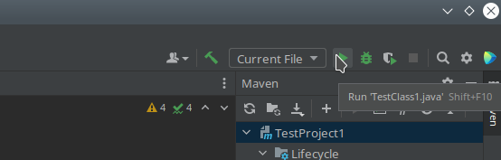

IntelliJ bietet zahlreiche praktische Features an, durch die einiges an Tipp-Arbeit erspart werden kann. So können zum Beispiel die Getter und Setter mittels Menü oder durch Verwendung der Tastenkombination `Alt`-`Einfügen` automatisch generiert werden.

[.center.text-center]
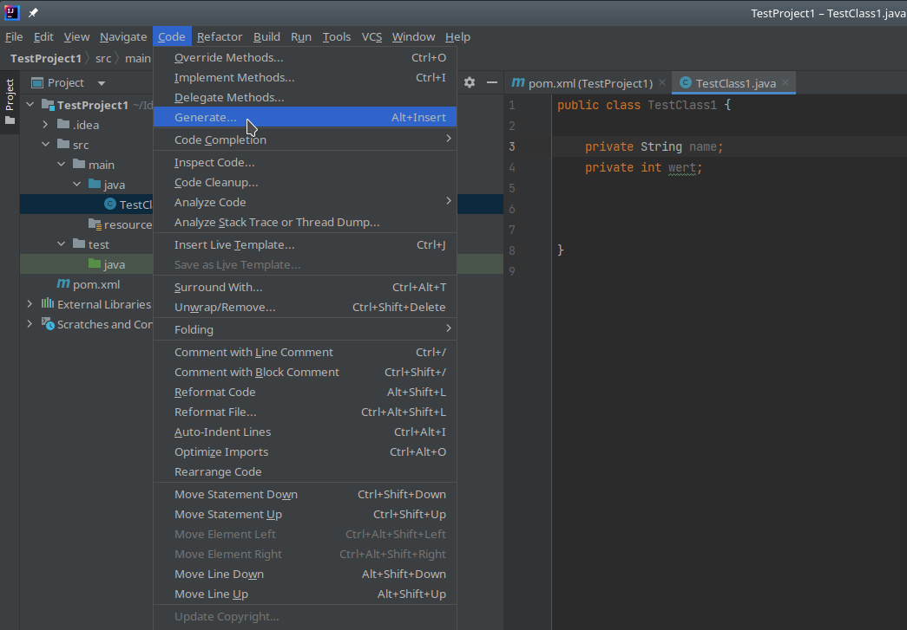

Im Kontextmenü wählt man dazu die gewünschten Attribute aus und bestätigt mit `Ok`.

[.center.text-center]
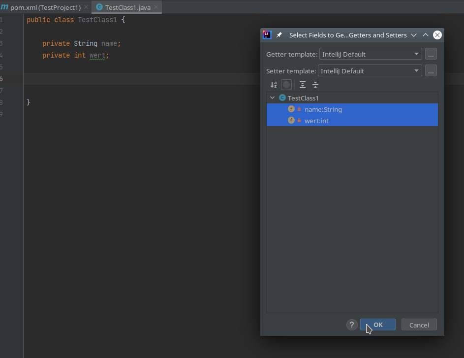

Bei den generierten Varianten handelt es sich um Vorlagen, die dann manuell überarbeitet werden müssen (Parameterprüfungen).

[.center.text-center]
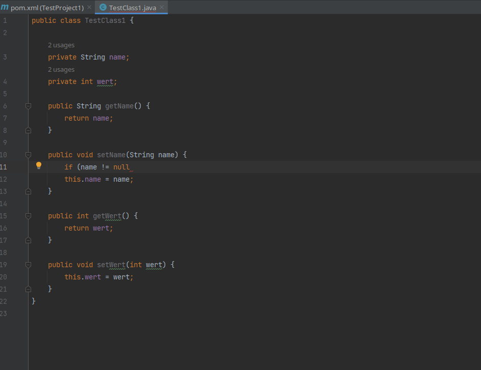

Ein weiteres praktisches Feature ist die Möglichkeit zur _Refaktorisierung_ (Refactoring). Darunter versteht man das Überarbeiten und Verändern von Code-Strukturen im Laufe der Entwicklungsarbeit. Als häufiger Anwendungsfall sei hier nur die Umbenennung von Variablen, Methoden oder Klassen genannt. Hierbei müssen ja alle entsprechenden Vorkommnisse im Code abgeändert werden.

[.center.text-center]
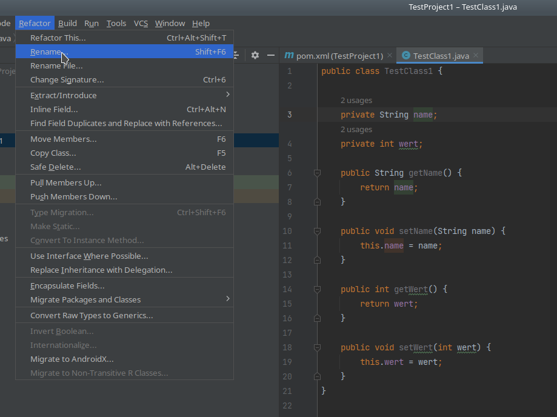

Zu Fehlern oder Problemen gibt es oftmals die Möglichkeit bestimmte Aktionen (im Sinne von Korrekturvorschlägen) auszuführen. Mit `Alt-Enter` gelangt man in das entsprechende Kontextmenü. Um das Tippen von `System.out.println` abzukürzen, kann man einfach `sout` schreiben, im Kontextmenü wird dann die komplette Anweisung vorgeschlagen.

=== Unit-Tests (JUnit)

Um eine JUnit-Testklasse zu erzeugen, drückt man "Alt-Insert" innerhalb der betroffenen Klasse, und wählt "Test...".

[.center.text-center]
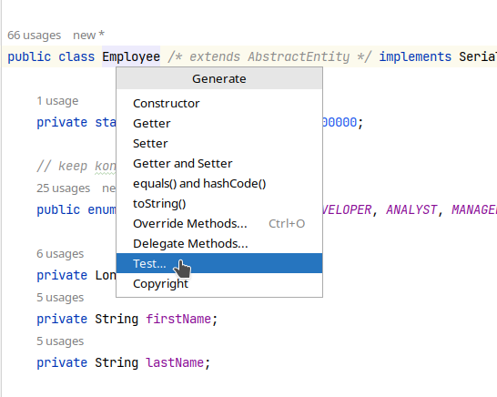

Bei neu angelegten Projekten tritt hier die Fehlermeldubng "JUnit library not found in the module" angezeigt. Drücken Sie auf "Fix" um dieses Problem zu beheben. Haken sie weiters "setUp/@Before" sowie alle Methoden zu welchen Testmethoden angelegt werden sollen an.

[.center.text-center]
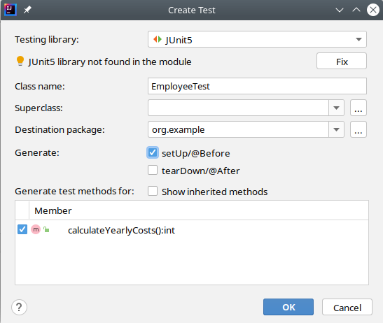

Drücken Sie "OK". Die Testklasse wird sofort erstellt, im Hintergrund werden die Vorbereitungen für JUnit getroffen.

[.center.text-center]

Sollten hierbei Probleme auftreten, kann alternativ auch wie folgt vorgegangen werden:

Wir betrachten eine Testklasse `Firma`, nämlich `TestFirma`, und versehen hierbei die Testmethoden (händisch) mit der Annotation `@Test`. (Anmerkung: Testmethoden dürfen nicht statisch sein)

[.center.text-center]
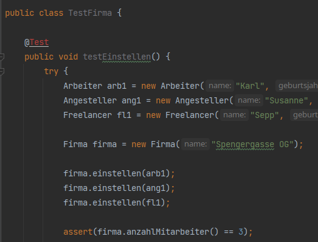

Tritt ein Fehler auf, dass die Annotation nicht erkannt wird, muss JUnit als Abhängigkeit zum Projekt hinzufügt werden.

[.center.text-center]
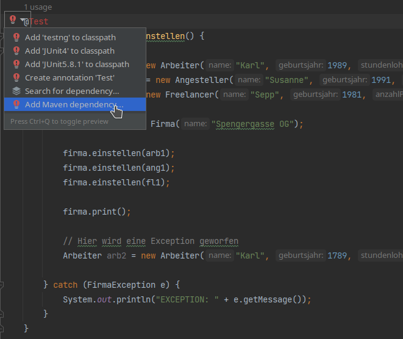

Im Kontextmenü wählen wir die entsprechende Version…

[.center.text-center]
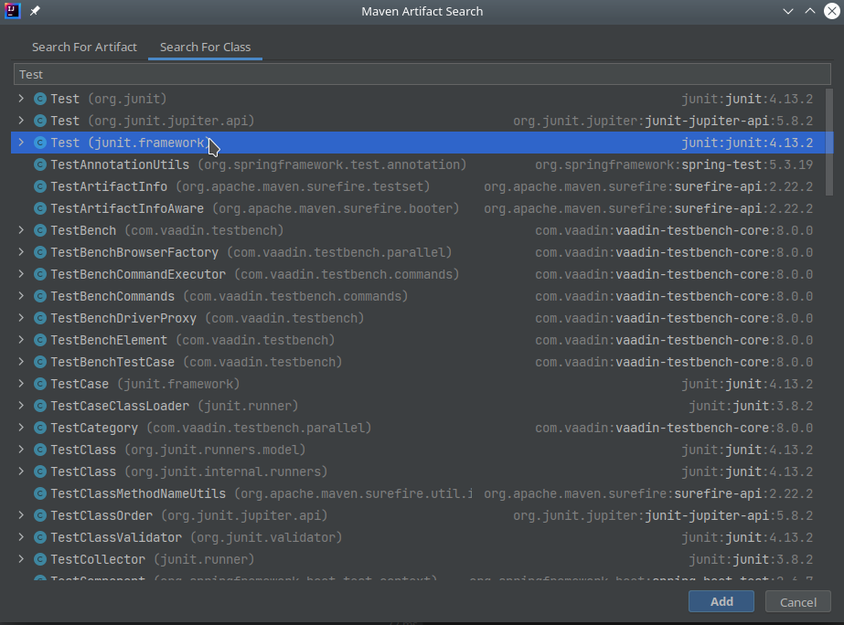

… und führen Maven Install aus.

[.center.text-center]
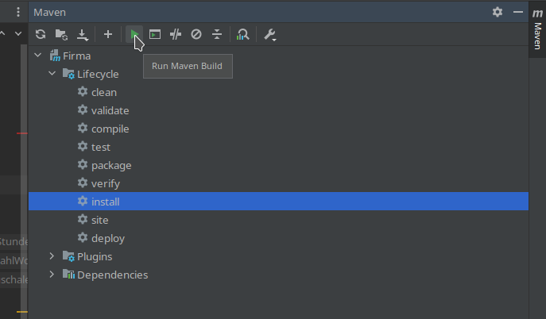

Nun kann IntelliJ per QuickFix das zugehörige Import-Statement hinzufügen. In der Implementierung der Methode findet sich ein `assert`-Statement. Bei der Ausführung des Testcodes soll nun sichergestellt werden, dass die Bedingung innerhalb dieses Ausdrucks zu `true` evaluiert. Da zuvor drei Personen zur Firma hinzugefügt wurden, muss diese nun genau drei Personen enthalten. Ist dies nicht der Fall, so wurde in diesem Testfall ein Fehler aufgedeckt.

[.center.text-center]
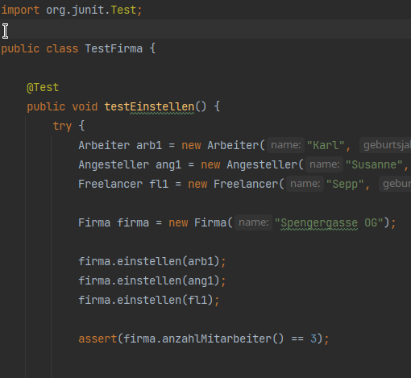

Durch Klick auf _Run with Coverage_ im Kontextmenü zur Testklasse wird der Testfall ausgeführt.

[.center.text-center]
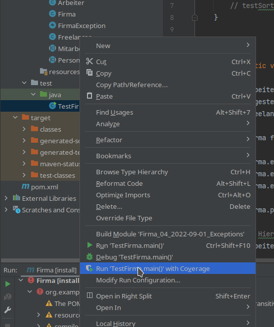

Links unten werden dann die Ergebnisse der Testfälle angezeigt. Das grüne Häckchen gibt an, dass der Testfall erfolgreich (ohne Fehler) ausgeführt wurde.

[.center.text-center]
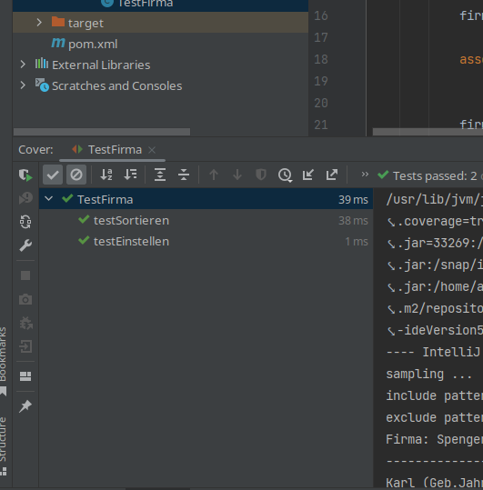

Ziel ist es, eine möglichst hohe Testabdeckung des Codes zu erreichen. Das Ausführen dieser Tests liefert dann quasi per Knopfdruck als Ergebnis, ob (nach etwaigen Änderungen) Fehler im Code vorhanden sind.

== Arrays

Bisher haben wir den Fall kennengelernt, von bestimmten Datentypen jeweils einen Wert zu verwenden. Dies wird durch eine lokale Variable oder eine Objekteigenschaft umgesetzt. Möchte man beispielsweise einen ganzzahligen Wert speichern, so geschieht dies durch die Deklaration `int i;`, was bewirkt, dass im Speicher der Platz für genau einen Integer-Wert angelegt wird, welcher dann über die Variable `i` angesprochen werden kann. Oft benötigt man jedoch gleich mehrere Werte des selben Datentyps. Als Beispiel seien Messwerte (z.B. für Temperatur oder Luftfeuchtigkeit) genannt. Hierbei benötigt man meist nicht nur ein oder zwei Messwerte, sondern ganze _Messreihen_. Als anderes Beispiele sei eine Personalverwaltung genannt, bei der eine Klasse `Firma` Objektreferenzen auf `Mitarbeiter` enthält, also mehrere Mitarbeiter einer Firma zugeordnet sind. Auch hierbei möchte man sich nicht auf ein, zwei oder einige wenige Mitarbeiter festlegen; die Firma soll eine beliebige Zahl von Mitarbeitern enthalten können. Derartige Anforderungen motivieren das Sprachkonstrukt von _Arrays_. Ein Array ist ein "Feld" oder eine Anordnung mehrerer Werte des selben Datentyps, wobei die konkreten Elemente des Arrays mittels _Index_ angesprochen werden. Der Index gibt also die jeweilige Position im Array an, wobei zu beachten ist, dass immer mit 0 zu zählen begonnen wird. Das erste Element hat also Index 0, das zweite Element hat Index 1, usw.

[.center.text-center]
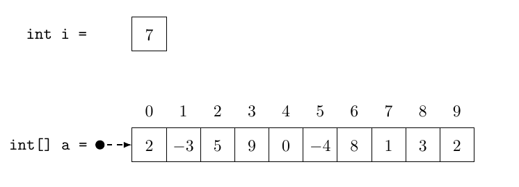

Die Abbildung verdeutlicht den Unterschied von Arrays zu Variablen. Die Variable `i` enthält einen einzigen Wert, während das Array `a` mehrere Werte des selben Datentyps (`int` im konkreten Fall) enthält. Zur Deklaration eines Arrays verwendet man den gewünschten Datentyp gefolgt von den eckigen Klammern. Arrays können bezüglich aller primitiven Datentypen, aber auch Referenzdatentypen angewendet werden.

Arrays weisen einige Ähnlichkeiten zu Referenzdatentypen auf. Vor der Verwendung eines Arrays muss dieses zunächst mittels `new` erzeugt werden, vorher ist der Wert `null`.

[.center.text-center]
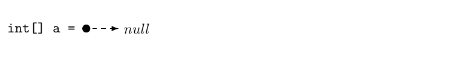

Die obige Abbildung zeigt den Inhalt des Arrays nach dessen Deklaration mit `int[] a;` als lokale Variable. Arrays können genauso für Objekteigenschaften verwendet werden. In diesem Fall hätten wir: `private int[] a;`. Vor der eigentlichen Verwendung des Arrays muss dieses mittels `new` erzeugt werden, wobei auch die Größe des Arrays festgelegt wird. Die Anweisungen lauten insgesamt:

[source,java]
----
    int[] a;
    a = new int[10];
----

bzw. kann dies bei lokalen Variablen auch in einer Zeile geschrieben werden:

[source,java]
----
    int[] a = new int[10];
----

Die Größe wird hierbei mittels eines _Integer-Literals_ (also einer "Konstante") auf 10 festgelegt. Alternativ könnte man auch eine Variable, z.B. einen Parameter zur Festlegung der Größe verwenden.

[.center.text-center]
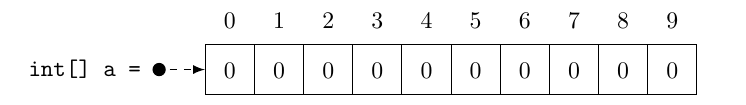

Man beachte, dass die gültigen Indizes immer im Bereich 0 bis Größe minus Eins liegen. Bei Größe 10 ist der kleinste Index 0 und der größte gültige Index 9! Die Inhalte der einzelnen Elemente des Arrays werden zunächst mit 0 festgelegt.

Man kann nun mittels Index auf die konkreten Elemente zugreifen: `a[3]` liefert den Wert des vierten Elementes, `a[0]` den ersten Eintrag des Arrays. Ebenso kann man Zuweisungen vornehmen. Wir weisen dem dritten Platz den Wert 3 und dem 5. Platz den Wert -5 zu:

[source,java]
----
    a[2] = 3;
    a[4] = -5;
----

Das Array enthält nun folgende Werte:

[.center.text-center]
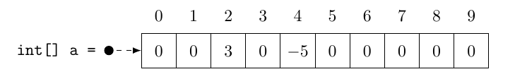

Würde man im gegebenen Fall auf den Wert `a[10]` zugreifen, oder versuchen einen Wert dort abzuspeichern, bekommt man zur Laufzeit des Programmes einen Fehler. Konkret erhält man eine `ArrayIndexOutOfBoundsException`. Diese tritt immer dann auf, wenn der Index nicht innerhalb des gültigen Bereiches liegt. Bei der Verwendung von Arrays muss also stets geprüft werden ob der verwendete Index gültig ist!

Möchte man alle Werte eines Arrays ausgeben, so kann folgendes Codesstück dazu verwendet werden:

[source,java]
----
    for (int i=0; i<a.length; i++) {
        System.out.println(a[i]);
    }
----

Dabei liefert `.length` die Größe des Arrays. Innerhalb der Schleife wird der Schleifen-Index `i` dazu verwendet, um auf die Elemente `a[i]` des Arrays zuzugreifen.

=== Codebeispiel

Im folgenden Codebeispiel sollen mehrere Messwerte der Temperatur (z.B. in Grad Celsius) gespeichert werden. Der parameterlose Konstruktor erzeugt zunächst eine `double`-Array mit 24 Plätzen. Der zweite Konstruktor ermöglicht, die Anzahl der Messwerte mittels Parameter festzulegen. Die Methode `messwerteBefuellen` verwendet den Zufallszahlengenerator, um alle Messwerte im Bereich -20 bis 30 Grad zufällig festzulegen. Die Methode `messen` hat als Parameter einerseits die Temperatur `temp` als auch einen `index`, der die Position festlegt, an welcher der Messwert gespeichert werden soll. Anhand der Methode `temperatur(int index)` kann en konkreter Temperaturwert abgefragt werden. Schließlich ermöglicht noch die Methode `printMessreihe` die formatierte Ausgabe der Messreihe auf die Konsole.

[source,java]
----

import java.util.Random;

public class Messreihe
{
    private double[] temperatur;
   
    public Messreihe() {
        temperatur = new double[24]; // ein Messwert pro Stunde
    }
    
    public Messreihe(int anzahlMesswerte) {
        if (anzahlMesswerte > 0) {
            temperatur = new double[anzahlMesswerte];
        } else {
            System.out.println("Fehler, ungueltige Anzahl: " + anzahlMesswerte);
            System.out.println("Erzeuge Array mit 24 Plaetzen");
            temperatur = new double[24];
        }
    }
    
    public void messwerteBefuellen() {
        Random rand = new Random();
        for (int i=0; i<temperatur.length; i++) {
            temperatur[i] = 50.0 * rand.nextDouble() - 20.0;    
        }
    }
    
    public void messen(double temp, int index) {
        if (index >= 0 && index < temperatur.length) {
            if (temp > -100 && temp < 80) {
                temperatur[index] = temp;   
            } else {
                System.out.println("Ungueltiger Messwert: " + temp);
            }
        } else {
            System.out.println("Fehler, ungueltiger index: " + index);
        }
    }
    
    public double temperatur(int index) {
        if (index >= 0 && index < temperatur.length) {
            return temperatur[index];
        } else {
            System.out.println("Fehler, ungueltiger index: " + index);
            return -1;
        }
    }
    
    public void printMessreihe() {
        System.out.println("Messreihe: ");
        
        for (int i=0; i<temperatur.length; i++) {
            System.out.println(i + ": " + temperatur[i]);
        }
        
        System.out.println();
    }
}
----

Nun sollen weitere Methoden hinzugefügt werden, die das Temperaturminimum, das Temperaturmaximum sowie die Durchschnittstemperatur ermitteln. Dies geschieht mit Hilfe von Schleifen und lokalen Variablen.

[source,java]
----
    public double temperaturMinimum() {
        double x = temperatur[0];
        for (int i=1; i<temperatur.length; i++) {
            if (temperatur[i] < x) {
                x = temperatur[i];  
            }
        }
        return x;
    }
    
    public double temperaturMaximum() {
        double x = temperatur[0];
        for (int i=1; i<temperatur.length; i++) {
            if (temperatur[i] > x) {
                x = temperatur[i];  
            }
        }
        return x;    
    }
    
    public double durchschnittsTemperatur() {
        double summe = 0.0;
        for (int i=0; i<temperatur.length; i++) {
            summe += temperatur[i];
        }
        
        return summe/temperatur.length;
    }
----

=== Arrays: Hinzufügen, Einfügen und Entfernen

Bei der Verwendung von Arrays muss die Größe des Arrays bei der Erzeugung (z.B. `new int[10]`) festgelegt werden. Die Größe des Arrays kann im Nachhinein nicht verändert werden. Häufig möchte man jedoch zur Laufzeit Werte hinzufügen oder löschen (z.B. in einem Programm das laufend Messwerte erfasst). Die Lösung hierzu ist, zunächst ein Array mit der Maximalanzahl der zulässigen Werte anzulegen, und im Programm zusätzlich zu speichern wieviele Werte aktuell mit _fachlich gültigen Werten_ befüllt sind. Dies kann mit einer zusätzlichen `int`-Variablen geschehen, die diese Information enthält. Diese Variable enthält den Index des ersten unbenutzten Platzes im Array, oder in anderen Worten die _Anzahl der gültigen Werte_ im Array. Wir werden diese Variable deshalb `anzahl` nennen, man könnte sie jedoch auch mit `next` bezeichnen.

Die folgende Abbildung zeigt das Array, das zunächst mit 5 Werten befüllt. Die Indizes mit gültig befüllten Werten sind also 0 bis 4. Da die Anzahl der Elemente 5 ist, ist 5 gleichzeitig auch der Index der Stelle an die das nächste Element eingefügt werden kann. Soll nun ein neuer Wert (nämlich -3) eingefügt werden, so wird dieser an der Stelle mit Index 5 eingefügt. Dies ist im unteren Teil der Abbildung zu sehen. Die Variable `anzahl` muss ebenso erhöht (inkrementiert) werden.

[.center.text-center]
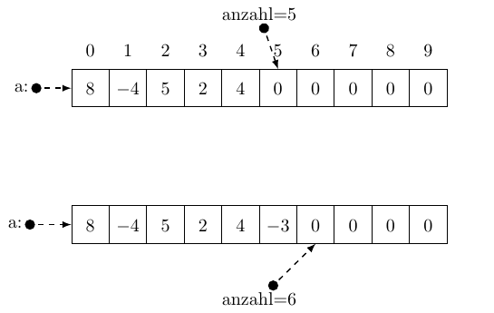

Natürlich ist beim Hinzufügen in ein Array stets zu prüfen, ob überhaupt noch Platz im Array vorhanden ist. Dies ist genau dann der Fall, wenn `anzahl < a.length` (Array mit Bezeichnung `a`). Der Code einer Methode zum Hinzufügen eines Elementes in ein Array kann somit wie folgt aussehen:

[source,java]
----
    public void hinzufuegen(int wert) {
        if (wert > -100 && wert < 100) { // Parameterpruefung
            if (anzahl < a.length) {
                a[anzahl] = wert;
                anzahl++;
                // Anmerkung: kuerzer, in einer Zeile: a[anzahl++] = wert; 
            } else {
                System.out.println("Array voll");
            }
        } else {
            System.out.println("Ungueltiger Wert: " + wert);
        }
    }
----

Wir betrachten nun die Situation, dass ein Wert an einer bestimmten Stelle ins Array eingefügt werden soll. Ein zusäzlicher Parameter `index` gibt diese Stelle an. Hier ist zu beachten, dass alle Werte, die sich nach dieser Stelle befinden, um eine Stelle nach hinten verschoben werden müssen. Die folgende Abbildung zeigt das Einfügen des Wertes 7 an die Stelle mit Index 3 (also die vierte Stelle).

[.center.text-center]
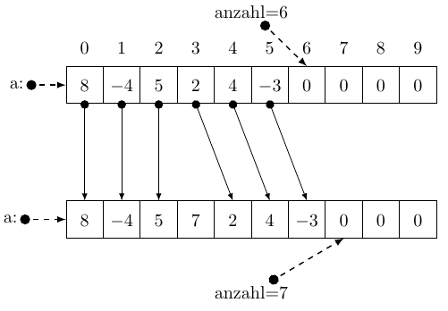

Die Pfeile in der Abbildung deuten das Verschieben der nachfolgenden Werte um eine Stelle an. Diese Logik muss jedoch ausprogrammiert werden. Das Verschieben erfolgt von hinten nach vorne, da man sonst Werte überschreiben würden. Die zugehörige Programmlogik ist schon etwas komplexer:

[source,java]
----
    public void einfuegen(int wert, int index) {
        if (wert > -100 && wert < 100) { // Parameterpruefung
            if (anzahl < a.length) {
                if (index >= 0 && index < anzahl) {
                    
                    for (int i=anzahl; i > index; i--) {
                        a[i] = a[i-1];
                    }
                    anzahl++;
                    a[index] = wert;
                    
                } else {
                    System.out.println("Ungueltiger Index: " + index);
                }
            } else {
                System.out.println("Array voll");
            }
        } else {
            System.out.println("Ungueltiger Wert: " + wert);
        }
    }
----

Da derartige Operationen zum Hinzufügen, Entfernen und Einfügen von Elementen in Arrays häufig auftreten, bietet Java fertige Komponenten, die eine solche Programmlogik bereits beinhalten. Diese Komponenten werden wir jedoch erst zu einem späteren Zeitpunkt verwenden. Zunächst soll anhand derartiger Operationen der Umgang mit Arrays und das damit verbundene Verständnis für die algorithmische Vorgehensweise und die resultierende Anzahl an elementaren Operationen im Array vertieft und gefestigt werden.

=== Codebeispiel

[source,java]
----
public class Array
{
    private int[] werte;
    private int anzahl;

    public Array(int groesse) {
        if (groesse > 0) {
            werte = new int[groesse];
            anzahl = 0;
        } else {
            System.out.println("Fehler, ungueltige Groesse");
        }
    }
    
    public int getAnzahl() {
        return anzahl;
    }
    
    // ACHTUNG! Auf keinen Fall eine derartige Methode implementieren!
    // public int[] getWerte() {  }
    // ... Wuerde interne Logik der Klasse beeintraechtigen,
    // z.B. Wertebereiche verletzen, etc.
    
    public int wert(int index) {
        if (index >= 0 && index <= anzahl) {
            return werte[index];
        } else {
            System.out.println("Fehler, ungueltiger Index: " + index);
            return -1; // unschoen... spaeter machen wir es besser ;-)  (-> Exceptions)
        }
    }

    public void hinzufuegen(int wert) {
        if (wert >= -100 && wert <= 100) {
            if (anzahl < werte.length) {
                werte[anzahl++] = wert;
            } else {
                System.out.println("Fehler: Array voll!");
            }
        } else {
            System.out.println("Fehler: ungueltiger Wert: " + wert);
        }
    }

    public void einfuegen(int index, int wert) {
        if (wert >= -100 && wert <= 100) {
            if (index >= 0 && index <= anzahl) {
                if (anzahl < werte.length) {
                    for (int i=anzahl; i>index; i--) {
                        werte[i] = werte[i-1];           
                    }
                    werte[index] = wert;
                    anzahl++;
                } else {
                    System.out.println("Fehler: Array voll!");
                }
            } else {
                System.out.println("Fehler, ungueltiger Index: " + index);
            }
        } else {
            System.out.println("Fehler: ungueltiger Wert: " + wert);
        }
    }
    
    public void entfernen(int index) {
        // Parameterpruefungen
        if (index >= 0 && index < anzahl) {
            for (int i=index; i < anzahl-1; i++) {
                werte[i] = werte[i+1];
            }
            anzahl--;
        } else {
            System.out.println("Fehler, ungueltiger Index: " + index);
        }
    }

    public void print() {
        // System.out.println(this.toString());
        // oder kuerzer:
        System.out.println(this);
    }

    public String toString() {
        String str = "Werte: ";
        if (anzahl > 0) {
            for (int i=0; i<anzahl; i++) {
                if (i > 0) {
                    str += ", ";
                }
                str += werte[i];
            }
        } else {
            str += " keine Werte vorhanden.";
        }
        return str;
    }
}
----

Die Methode `hinzufügen` fügt den übergebenen Wert nach der erfolgten Parameterprüfung am Ende der gültigen Werte in das Array ein, sofern noch Platz vorhanden ist. Die Zuweisung `werte[anzahl++] = wert;` weist den Wert im Array an der Stelle `anzahl` zu, anschließend (!) wird `anzahl` um eins erhöht (inkrementiert).

Die Methode `einfuegen` fügt den übergebenen `wert` an der Stelle `index` im Array ein. Hier ist es nun notwendig die im vorigen Abschnitt beschriebene Herangehensweise zum Verschieben der nachfolgenden Inhalte (Werte) des Arrays umzusetzen. Nach erfolgreicher Parameterprüfung wird das Array von hinten nach vorne durchlaufen, und die Inhalte um jeweils einen Platz weiter nach hinten "verschoben" (eigentlich kopiert). Dies wird bis zur Stelle `index + 1` durchgeführt, und abschließend `wert` an die Stelle `index` gesetzt und `anzahl` inkrementiert.

==== Methode: toString

Im Zuge dieses Codebeispiels wurde erstmals eine spezielle Methode `String toString()` verwendet. Diese Methode wird verwendet um eine Darstellung des Objektes als reiner Text zu erhalten. Im konkreten Fall werden (nach der Fallunterscheidung ob überhaupt fachlich gültige Werte im Array vorhanden sind) mittels einer Schleife die Werte des Arrays in einen String geschrieben. Dieser String (Variable `str`) wird am Ende der Methode retourniert. Beachten Sie den Unterschied zwischen der print-Methode und der `toString`-Methode. Erstere schreibt eine textuelle Darstellung des Objektes auf die Konsole, während letztere einen String mit dem Inhalt des Objektes erstellt und retourniert. Inhalte die lediglich mittels `System.out.println` auf die Konsole geschrieben werden können innerhalb des Programmes _nicht_ weiterverarbeitet werden. Im Gegensatz dazu kann der Rückgabewert der `toString`-Methode auch in anderen Objekten/Klassen verwendet werden.

Möchte man nun die textuelle Darstellung des Objektes von `toString` auf die Konsole schreiben, kann die entsprechende `print`-Methode eben diese `toString`-Methode verwenden, indem `toString()` in Kombination mit `System.out.println` verwendet wird. Es ist jedoch gar nicht notwendig `toString` _explizit_ aufzurufen. Übergibt man an `System.out.println` lediglich eine Objektreferenz (`this` innerhalb der Klasse), so erkennt die Laufzeitumgebung automatisch, dass hier ein `String` benötigt wird, und ruft selbst die `toString`-Methode auf.

== Sortier-Algorithmen

Das Sortieren von Inhalten in Arrays stellt einen häufigen Anwendungsfall in der Programmierung dar. Nahezu alle Programmiersprachen bieten dafür bereits vorgefertigte Methoden. An dieser Stelle werden einfache Sortier-Algorithmen vorgestellt und verglichen. Dies soll das Verständnis für Algorithmen und den Umgang mit Arrays weiter vertiefen.

Ausgangssituation ist also ein Array, befüllt mit Zahlen in beliebiger Reihenfolge. Ziel ist nun diese Zahlen innerhalb des Arrays aufsteigend zu sortieren.

=== Bubble-Sort

Bubble-Sort ist das konzeptuell einfachste Sortierverfahren. Die Grundidee dabei ist, das Array zu durchlaufen und zwei jeweils benachbarte Elemente zu vertauschen wenn das erste Element größer als das zweite Element ist. Dieser Vorgang muss solange wiederholt werden, bis alle Zahlen sortiert sind.

=== Selection-Sort

Bei Selection-Sort wird das Array in einer äußeren Schleife durchlaufen, wobei in jedem Schritt an die aktuelle Stelle der richtige Wert gesetzt wird. Dieser Wert wird gefunden, indem man das kleinste Element der weiter hinten liegenden Plätze im Array sucht. Dadurch entsteht schrittweise ein schon sortierter Bereich am Anfang des Arrays.

=== Insertion-Sort

Ein weiteres Verfahren namens Insertion-Sort funktioniert ähnlich wie das Sortieren von Spielkarten in der Hand. Links befinden sich dabei die schon sortierten Elemente, danach die verbleibenden noch unsortierten Elemente. In jedem Schritt wird das nächste Element aus dem unsortierten Bereich gewählt, und in den schon sortierten Bereich korrekt eingefügt.

Neben den genannten Sortieralgorithmen existieren weitaus bessere Verfahren, die insbesondere bei großen Datenmengen weitaus schneller sind, da sie weniger Vergleichsoperationen und Vertauschungen durchführen. Diese sind namentlich Quicksort und Merge-Sort. Da sie jedoch konzeptuell schwieriger sind, und auch fortgeschrittenere Progammiertechniken benötigen, werden sie an dieser Stelle nicht weiter behandelt.

Für eine umfassende Darstellung verschiedenster Sortieralgorithmen und deren Analyse sei hier auf https://www.happycoders.eu/de/algorithmen/sortieralgorithmen/ verwiesen.

[source,java]
----

import java.util.Random;

public class Sortieren {
    
    private int[] originalWerte = { 3, 9, 7, 1, 4, -5, 0, 8, 6, 9 };
    private int[] werte;
    
    public Sortieren() {
        reset();
    }
    
    public void randomInit(int n) {
        originalWerte = new int[n];
        Random rnd = new Random();
        for (int i=0; i<originalWerte.length; i++) {
            originalWerte[i] = rnd.nextInt(1000);
        }
    }
    
    public void reset() {
        werte = new int[originalWerte.length];
        for (int i=0; i<werte.length; i++) {
            werte[i] = originalWerte[i];
        }
    }
    
    public void sortieren() {
        randomInit(10000);
        
        reset();
        bubbleSort();

        reset();
        selectionSort();
        
        reset();
        insertionSort();
    }
    
    public void bubbleSort() {
        System.out.print("Bubble Sort... ");
        long startTime = System.currentTimeMillis();
        boolean getauscht = false;
        do {
            getauscht = false;
            // printWerte();
            for (int i=0; i<werte.length-1; i++) {
                if (werte[i] > werte[i+1]) {
                    tauschen(i, i+1);
                    // printWerte();
                    getauscht = true;
                }
            }
            // System.out.println();
        } while (getauscht);
        long endTime = System.currentTimeMillis();
        System.out.println((endTime - startTime) + " ms");
    }
    
    public void selectionSort() {
        System.out.print("Selection Sort... ");
        long startTime = System.currentTimeMillis();
        for (int i=0; i<werte.length; i++) {
            int jMin = i; // wir speichern die Position des kleinsten 
                          // Elementes (der verbleibenden Elemente)
            for (int j=i+1; j<werte.length; j++) {
                if (werte[j] < werte[jMin]) {
                    jMin = j;
                }
            }
            
            tauschen(i, jMin);
        }
        long endTime = System.currentTimeMillis();
        System.out.println((endTime - startTime) + " ms");       
    }

    public void insertionSort() {
        System.out.print("Insertion Sort... ");
        long startTime = System.currentTimeMillis();
        for (int i=1; i<werte.length; i++) {
            for (int j=i; j>0; j--) {
                if (werte[j] < werte[j-1]) {
                    tauschen(j, j-1);
                }
            }
        }
        long endTime = System.currentTimeMillis();
        System.out.println((endTime - startTime) + " ms"); 
    }
    
    public void tauschen(int i, int j) {
        if (i >= 0 && i < werte.length && j >= 0 && j < werte.length /*&& i != j*/) {
            int tmp = werte[i];
            werte[i] = werte[j];
            werte[j] = tmp;
        } else {
            System.out.println("Ungueltige(r) Parameter: " + i + ", " + j);
        }
    }
    
    public void printWerte() {
        // System.out.println(this.toString());
        System.out.println(this);
    }
    
    public String toString() {
        String str = "Werte: ";
        // wir zeigen zur Veranschaulichung den gesamten Inhalt an.
        // eigentlich waere i<anzahl richtiger.
        for (int i=0; i<werte.length; i++) {
            if (i > 0) {
                str += ", ";
            }
            str += werte[i];
        }
        return str;
    }
    
}
----

In dieser Klasse wird zunächst das Array `originalWerte` befüllt. Dessen Inhalt wird dann vor der Ausführung der jeweiligen Algorithmen in `werte` kopiert, damit für alle Verfahren die selbe Datengrundlage vorliegt.

Mit folgendem Code kann die Laufzeit des Programmes gemessen werden:

[source,java]
----
long startTime = System.currentTimeMillis();
// Ausführung des Codes dessen Laufzeit gemessen werden soll
long endTime = System.currentTimeMillis();
long searchTime = endTime - startTime;
----

Im obigen Projekt erhält man für Arrays mit 10000 zufällig generierten Werten folgende Laufzeiten:

....
Bubble Sort... 294 ms
Selection Sort... 120 ms
Insertion Sort... 129 ms
....

Man erkennt, dass Selection Sort und Insertion Sort dem einfacheren Bubble Sort deutlich überlegen sind.

== Objekt-Arrays

Objekt-Arrays enthalten als Werte keine primitiven Datentypen, sondern _Objektreferenzen_. Objekt-Arrays können nahezu gleich wie Arrays von primitiven Datentypen verwendet werden. Der wesentliche Unterschied ist, dass die Werte auch `null` sein können.

=== Code-Beispiel

Dieses Codebeispiel zeigt eine Implementierung eines Marktes mit verschiedenen Marktständen (Klasse: `Stand`). Der Markt selbst hat ein Array an Marktständen als Eigenschaften (`staende`), sowie Name und Stadt. Der Stand hat ebenfalls einen Namen, sowie ein Boole’sches Attribut essen, das angibt, ob es sich um einen Essensstand handelt.

[.center.text-center]
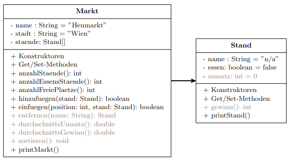

[source,java]
----
public class Stand {

    private String name;
    private boolean essen;
    private int umsatz;

    public Stand() {
        setName("n/a");
        setEssen(false);
        setUmsatz(0);
    }

    public Stand(String name) {
        if (name != null) {
            setName(name);
        } else {
            System.out.println("Fehler: Name ist null");
        }
        setEssen(false);
        setUmsatz(0);
    }

    public Stand(String name, boolean essen) {
        if (name != null) {
            setName(name);
        } else {
            System.out.println("Fehler: Name ist null");
        }
        setEssen(essen);
        setUmsatz(0);
    }

    public void setName(String name) {
        if (name != null) {
            this.name = name;
        } else {
            System.out.println("Name ist null");
        }
    }

    public String getName() {
        return name;
    }

    public void setEssen(boolean essen) {
        this.essen = essen;
    }

    public boolean isEssen() {
        return essen;
    }

    public void setUmsatz(int umsatz) {
        if (umsatz >= 0) {
            this.umsatz = umsatz;
        } else {
            System.out.println("Fehler: Ungueltiger Wert fuer Umsatz: " + umsatz);
        }
    }

    public int getUmsatz() {
        return umsatz;
    }

    public int getGewinn() {
        // hier eine Umsetzung zum fuer dieses Beispiel etwas 
        // willkürlich definierten Gewinn
        int gewinn = this.umsatz;
        if (this.umsatz > 500) {
            gewinn -= 100;
        }
        return gewinn/2;
    }

    public String toString() {
        String str = name;
        if (essen) {
            str += " (Essensstand), ";
        } else {
            str += " (Marktstand), ";
        }
        str += " Umsatz: " + getUmsatz();
        return str;
    }
    
    public void printStand() {
        System.out.println(this); // ruft toString() auf
    }
}
----

Die Methode `hinzufuegen(stand: Stand): boolean` prüft ob ein freier Stellplatz vorhanden ist, und fügt den übergebenen Marktstand am ersten freien Stellplatz ein. Der Rückgabewert gibt an, ob der Stand tatsächlich hinzugefügt werden konnte. Ist das Hinzufügen nicht möglich, so wird zusätzlich eine entsprechende Fehlermeldung auf der Konsole ausgegeben werden. Das Array wird so organisiert, dass keine Lücken entstehen können, d.h. alle `null`-Werte befinden sich am Ende des Arrays. Dies wird analog zum vorangeganenen Beispiel zu `int`-Arrays mittels der Variable `anzahl` in `Markt` erreicht.

[source,java]
----
public class Markt {

    private String name;
    private String stadt;
    private Stand[] staende;

    private int anzahl;

    public Markt() {
        setName("Heumarkt");
        setStadt("Wien");
        staende = new Stand[10];
        anzahl = 0;
    }

    public Markt(String name, String stadt, int anzahl) {
        staende = new Stand[anzahl];
        setName(name);
        setStadt(stadt);
        anzahl = 0;
    }

    public Markt(int anzahl) {
        setName("Heumarkt");
        setStadt("Wien");
        staende = new Stand[anzahl];
        anzahl = 0;
    }

    public void setName(String name) {
        if (name != null) {
            this.name = name;
        } else {
            System.err.println("Ungueltiger Parameter (Name): null");
        }
    }

    public String getName() {
        return name;
    }

    public void setStadt(String stadt) {
        if (stadt != null) {
            this.stadt = stadt;
        } else {
            System.err.println("Ungueltiger Parameter (Stadt): null");
        }
    }

    public String getStadt() {
        return stadt;
    }

    public int anzahlStaende() {
        return anzahl;
    }

    public int anzahlEssensStaende() {
        int cnt = 0;
        for (int i=0; i<anzahl; i++) {
            if (staende[i].isEssen()) {
                cnt++;
            } 
        }
        return cnt;
    }

    public int anzahlFreiePlaetze() {
        return staende.length - anzahl;
    }

    public boolean hinzufuegen(Stand stand) {
        boolean hinzugefuegt = false;
        if (stand != null) {
            if (anzahl < staende.length) { // Platz vorhanden?
                staende[anzahl++] = stand;
                hinzugefuegt = true;
            } else {
                System.out.println("Stand konnte nicht eingefuegt werden, kein Platz vorhanden.");
            }
        } else {
            System.out.println("Fehler: uebergebener Stand ist null.");
        }
        return hinzugefuegt;
    }

    public boolean einfuegen(int position, Stand stand) {
        boolean hinzugefuegt = false;
        if (stand != null) {
            if (position >= 0 && position <= anzahl) {
                if (anzahlFreiePlaetze() > 0) {
                    for (int i=anzahl+1; i>position; i--) {
                        staende[i] = staende[i-1];
                    }
                    staende[position] = stand;
                    anzahl++;
                    hinzugefuegt = true;
                } else {
                    System.out.println("Fehler: kein freier Platz vorhanden.");
                }
            } else {
                System.out.println("Fehler: ungueltige position " + position);
            }
        } else {
            System.out.println("Fehler: stand ist null.");
        }
        return hinzugefuegt;        
    }
    
    // Diese Methode kann zum Entfernen bezueglich Namen verwendet werden
    public Stand entfernen(int pos) {
        Stand s = null;
        if (pos >= 0 && pos < anzahl) {
            s = staende[pos];
            staende[pos] = null;
            
            for (int i=pos; i<anzahl; i++) {
                if (i + 1 < staende.length) {
                    staende[i] = staende[i+1];
                } else {
                    staende[i] = null;
                }
            }
            
            anzahl--;
        } else {
            System.out.println("Fehler: ungueltige Position " + pos);
        }

        return s;
    }

    // ohne Code-Reuse wird die Methode etwas komplizierter...
    public Stand entfernen1(String name) {
        Stand stand = null;
        if (name != null) {            
            int pos = 0;
            boolean gefunden = false;
            do {
                if (staende[pos].getName().equals(name)) {
                    gefunden = true;   
                } else {
                    pos++;
                }
            } while (!gefunden && pos<anzahl);
            
            if (gefunden) {
                stand = staende[pos];
                for (int i=pos; i<anzahl-1; i++) {
                    staende[i] = staende[i+1];
                }
                anzahl--;
            } else {
                System.out.println("Markt nicht gefunden");
            }
        } else {
            System.out.println("Fehler: name ist null.");
        }
        return stand;
    }
    
    // ... mit Code-Reuse (Aufruf von entfernen(i)) ergibt sich eine wesentlich 
    // kuerzere und einfachere Implementierung
    public Stand entfernen2(String name) {
        if (name != null) {
            for (int i=0; i<anzahl; i++) {
                if (name.equals(staende[i].getName())) {
                    return entfernen(i);
                }
            }
            System.out.println("Es wurde kein Stand mit dem uebergebenen Namen gefunden.");
        } else {
            System.out.println("Fehler: name ist null.");
        }
        return null;
    }
    
    // Diese Methode ist zwar nicht im UML-Diagramm gegeben, 
    // erleichtert aber das Testen
    public Stand getStand(int idx) {
        if (idx < anzahl) {
            return staende[idx];
        } else {
            return null;
        }
    }

    
    public boolean hasStand(Stand stand) {
        if (stand != null) {
            for (int i=0; i<anzahl; i++) {
                if (staende[i] == stand) {
                    return true;
                }
            }
        } else {
            System.out.println("Fehler: Stand ist null.");
        }
        return false;
    }
    
    public double durchschnittsUmsatz() {
        double sum = 0;
        for (int i=0; i<anzahl; i++) {
            sum += staende[i].getUmsatz();   
        }
        if (anzahl > 0) {
            return sum/anzahl;
        } else { 
            System.out.println("Fehler: kein Stand vorhanden.");
            return 0;
        }
    }

    public double durchschnittsGewinn() {
        double sum = 0;
        for (int i=0; i<anzahl; i++) {
            sum += staende[i].getGewinn();
        }
        if (anzahl > 0) {
            return sum/anzahl;
        } else { 
            System.out.println("Fehler: kein Stand vorhanden.");
            return 0;
        }
    }

    public void sortierenNamen() { // Bubble-Sort
        boolean getauscht = true;
        while (getauscht) {
            getauscht = false;
            for (int i=0; i<anzahl-1; i++) {
                if (staende[i].getName().compareTo(staende[i+1].getName()) > 0) {
                    vertausche(i, i+1);
                    getauscht = true;
                }
            }
        }
    }
    
    public Stand[] sortierenUmsatz() { // Selection-Sort 
        
        Stand[] sortierteStaende = new Stand[anzahl];
        
        for (int i=0; i<anzahl; i++) {
            sortierteStaende[i] = staende[i];
        }
        
        for (int i=0; i<anzahl-1; i++) {
            int jMin = i;
            for (int j=i+1; j<anzahl; j++) {
                if (sortierteStaende[j].getUmsatz() < sortierteStaende[jMin].getUmsatz()) {
                    jMin = j;
                }
            }
            
            if (i != jMin) {
                Stand tmp = sortierteStaende[i];
                sortierteStaende[i] = sortierteStaende[jMin];
                sortierteStaende[jMin] = tmp;
            }
            
        }
        
        return sortierteStaende;
    }

    // diese Methode ist "private" weil sie nur von sortieren() 
    // aufgerufen werden soll, aber nicht von außerhalb der Klasse!
    private void vertausche(int i, int j) {
        if (i >= 0 && j >= 0 && i < anzahl && j < anzahl) {
            Stand tmp = staende[i];
            staende[i] = staende[j];
            staende[j] = tmp;
        } else {
            System.out.println("Fehler: ungueltige Indizes: i=" + i + ", j=" + j);
        }
    }

    public void printMarkt() {
        System.out.println("Name: " + getName());
        System.out.println("Stadt: "+ getStadt());
        System.out.println("------------------------------------------------------");
        for (int i=0; i<anzahl; i++) {
            System.out.print("Stand " + (i+1) + ": ");
            if (staende[i] != null) {
                staende[i].printStand();
            } else {
                System.out.println("  LEER  ");
            }
        }
        System.out.println("------------------------------------------------------");

    }

}
----

Die Methode `Stand entfernen(String name)` wurde in zwei Varianten umgesetzt. `entfernen1` setzt die Anforderung in einer Methode um, wodurch ein etwas komplizierterer Code entsteht. Besser ist die zweite Variante `entfernen2` bei der die Methode `Stand entfernen(int pos)` verwendet wird.

== Beidseitige Assoziation

Beim Beispiel Markt - Stand wurde eine _einseitige Assoziation_ der beteiligten Objekte umgesetzt. Um UML-Diagramm zeigt der Pfeil von Markt zu Stand an, dass man von einem Objekt des Typs `Markt` zu einem Objekt des Typs `Stand` gelangen kann, jedoch nicht umgekehrt. Hält man im Programm Zugriff auf eine Instanz von `Stand` und möchte feststellen auf welchem Markt dieser steht, so ist das nicht möglich.

Darüber hinaus ergeben sich weitere Probleme. Es wäre beispielsweise möglich ein Stand-Objekt auf mehreren Märkten zu plazieren. Dies ist jedoch nicht das gewünschte Verhalten des Programmes.

Um die angesprochenen Probleme zu beseitigen, kann das Konzept der beidseitigen Assoziation verwendet werden. Der wesentliche Punkt hierbei ist, dass der Stand eine Objekteigenschaft besitzt die auf den Markt verweist, dem er zugeordnet ist (sofern vorhanden). Ist der Stand keinem Markt zugeordnet enthält dieses Attribut den Wert `null`. Der zugehörige Code muss das konsistente Setzen dieses Attributes sicherstellen.

Wir erweitern zunächst die Klasse Stand um die Objekteigenschaft `Markt markt` und die folgenden Methoden:

[source,java]
----
public class Stand {

    // ...
    
    private Markt markt; // enthaelt Markt auf dem der Stand steht

    public Stand() {
        setName("n/a");
        setEssen(false);
        setUmsatz(0);
        markt = null; // <--- Erweiterung fuer die beidseitige Assoziation
    }

    public Stand(String name) {
        if (name != null) {
            setName(name);
        } else {
            System.out.println("Fehler: Name ist null");
        }
        setEssen(false);
        setUmsatz(0);
        markt = null; // <--- Erweiterung fuer die beidseitige Assoziation
    }

    public Stand(String name, boolean essen) {
        if (name != null) {
            setName(name);
        } else {
            System.out.println("Fehler: Name ist null");
        }
        setEssen(essen);
        setUmsatz(0);
        markt = null; // <--- fuer die beidseitige Assoziation
    }
    
    public void setMarkt(Markt markt) {
        if (markt != null) {
            if (markt.hasStand(this)) {
                this.markt = markt;
            } else { 
                System.out.println("Fehler: Markt kann nicht gesetzt werden, da Stand "
                                   + getName() + " nicht vorhanden in " + markt.getName());
            }
        } else {
            if (this.markt == null || !this.markt.hasStand(this)) {
                this.markt = null;
            } else {
                System.out.println("Fehler: Kann Markt nicht null setzten, weil Stand "
                                   + getName() + " noch auf Markt " + this.markt.getName() 
                                   + " steht.");
            }
        }
    }
    
    // ...
    
}
----

Die Methode `setMarkt` stellt sicher, dass der als Parameter übergebene Markt nur dann gesetzt wird, wenn dieser Markt auch tatsächlich diesen Stand enthält. Zum Entfernen eines Marktes wird `null` übergeben. Hierbei wird `this.markt` nur auf `null` gesetzt, wenn der übergebene Markt den Stand (dieses Objektes) nicht enthält.

In der Klasse `Markt` sind Ergänzungen der folgenden Methoden notwendig:

[source,java]
----
public class Markt {

   /// ...
   
    public boolean hinzufuegen(Stand stand) {
        boolean hinzugefuegt = false;
        if (stand != null) {
            if (anzahl < staende.length) { // Platz vorhanden?
                if (stand.getMarkt() == null) { // beidseitige Assoziation
                    staende[anzahl++] = stand;
                    stand.setMarkt(this); // beidseitige Assoziation
                    
                    hinzugefuegt = true;
                } else {
                    System.out.println("Stand steht schon auf Markt " + stand.getMarkt().getName());
                }
            } else {
                System.out.println("Stand konnte nicht eingefuegt werden, kein Platz vorhanden.");
            }
        } else {
            System.out.println("Fehler: uebergebener Stand ist null.");
        }
        return hinzugefuegt;
    }

    public Stand entfernen(String name) {
        if (name != null) {
            for (int i=0; i<anzahl; i++) {
                if (name.equals(staende[i].getName())) {
                    return entfernen(i);
                }
            }
            System.out.println("Es wurde kein Stand mit dem uebergebenen Namen gefunden.");
        } else {
            System.out.println("Fehler: name ist null.");
        }
        
        return null;
    }
    
    public Stand entfernen(int pos) {
        Stand s = null;
        if (pos >= 0 && pos < anzahl) {
            s = staende[pos];
            staende[pos] = null;
            s.setMarkt(null); // beidseitige Assoziation
            
            for (int i=pos; i<anzahl; i++) {
                if (i + 1 < staende.length) {
                    staende[i] = staende[i+1];
                } else {
                    staende[i] = null;
                }
            }
            
            anzahl--;
        } else {
            System.out.println("Fehler: ungueltige Position " + pos);
        }

        return s;
    }

    /// ...
}
----

Vor dem Hinzufügen wird unter anderem geprüft ob `stand.getMarkt() == null` gilt, also der Stand nicht derzeit auf einem anderen Markt steht. Ist dies nicht der Fall, so wird der Markt an der passenden Stelle ins Array eingefügt `staende[anzahl++] = stand;` und im Stand die Referenz auf diesen Markt gesetzt: `stand.setMarkt(this);`

== Objekt-Vergleiche: Inhalts-Gleichheit vs. Referenz-Gleichheit

Bei primitiven Datentypen findet der Test auf Gleichheit ausschließlich mittels des Operators `==` statt. Dieser Operator ist auch für alle Referenzdatentypen definiert, hat dort aber eine speziellere Bedeutung. Mittels `==` wird verglichen ob es sich um dieselbe _Instanz_, bzw. das selbe _Objekt_ handelt. Genauer gesagt überprüft man mit `==` ob zwei Objektreferenzen auf das selbe Objekt verweisen.

Fallweise wird jedoch auch ein Test auf _Inhaltsgleichheit_ benötigt. Dies ist mittels der `equals`-Methode möglich, die schon im Zusammenhang mit `String` vorgestellt wurde. Diese Methode liefert `true` als Ergebnis, wenn das Objekt auf dem sie aufgerufen wird und der Parameter _inhaltlich_ übereinstimmen, auch wenn es sich um unterschiedliche Instanzen handelt. Um eigene Klassen mit dieser Fähigkeit auszustatten, muss die `equals`-Methode implementiert werden. Der Aufbau dieser Methode ist dem folgenden Codebeispiel zu entnehmen.

[source,java]
----
public class Student {
        private String name;
        private int geburtsjahr;

        // Konstruktoren und Getter/Setter hier weggelassen

        public boolean equals(Object other) {
                if (other == null) return false;
                if (this == other) return true;
                if (this.getClass() != other.getClass()) return false;
                
                Student otherStud = (Student) other;

                if (this.name.equals(otherStud.name) && this.geburtsjahr == otherStud.geburtsjahr) {
                        return true;
                }
                return false;
        }
}
----

Ist die übergebene Objektreferenz gleich `null`, so wird `false` zurückgegeben. Wenn die als Parameter übergebene Objektreferenz mit dem aktuellen Objekt (`this`) übereinstimmt, dann liegt auf jeden Fall auch Inhaltsgleichheit vor.

Die dritte if-Bedingung prüft ob beide Objekte von der selben Klasse stammen. Ist dies der Fall wird `other` in einen `Student`en umgewandelt.

In der vierten if-Bedingung werden dann die einzelnen Attribute verglichen. Bei `String`s muss folglich ebenso die `equals`-Methode verwendet werden. Primitive Datentypen können wie gewohnt mit `==` auf Gleichheit getestet werden.

Die `equals`-Methode wird am Besten mit Hilfe der Entwicklungsumgebung erzeugt, wobei die generierte Implementierung eventuell noch geringfügig angepasst werden muss.

Das folgende Codebeispiel demonstriert das Verhalten dieser Methode im Vergleich zum `==`-Operator:

[source,java]
----
Student s1 = new Student("Peter", 2001);
Student s2 = s1;
Student s3 = new Student("Peter", 2001);
Student s4 = new Student("Lisa", 2003);

System.out.println("s1 == s2: " + (s1 == s2));
System.out.println("s1 == s3: " + (s1 == s3));
System.out.println("s1 == s3: " + (s1.equals(s3)));
System.out.println("s1 == s4: " + (s1.equals(s4)));
----

Dies liefert die folgende Ausgabe:

....
s1 == s2: true
s1 == s3: false
s1 == s3: true
s1 == s4: false
....

Bei der Implementierung von `equals` ist darauf zu achten, dass bei `x.equals(y)` auch `y.equals(x)` gegeben ist, und klarerweise `x.equals(x)` als Ergebnis `true` liefern soll.

== Collections

Collections ist ein Überbegriff für diverse in der Java-Bibliothek enthaltenen Klassen die das strukturierte Speichern mehrerer (gleichartiger) Objekte ermöglicht. Collections sind typischerweise einfacher zu verwenden als Arrays, da man sich als Programmierer nicht um die eigentliche Organisation der Daten kümmern muss. Mechanismen wie das Weiterschieben der Datensätze beim Einfügen, oder der Vorrücken beim Löschen sind in den entsprechenden Collections schon umgesetzt.

Collections sind nicht für einen konkreten Datentyp entworfen, sondern können mit verschiedensten Klassen verwendet werden. Bei der Verwendung muss jedoch angegeben werden mit welchem Typ (also Klasse) die Collection verwendet werden soll. Dies geschieht mittels des _Typparameters_, der in spitzen Klammern angegeben wird. So erhält man beispielsweise mittels `ArrayList<Student>` eine ArrayList von `Student`en, oder mittels `LinkedList<Fahrzeug>` eine LinkedList von `Fahrzeug`en.

=== ArrayList

Die `ArrayList` ist eine der am häufigsten verwendeten Collections, da sie die Funktionalität von Objektarrays in der besprochenen Form umsetzt. Das folgende Codebeispiel zeigt eine Verwaltungsklasse `Klasse` (die eine Schulklasse modelliert), die (beliebig viele) `Student`en enthalten kann.

Die Klasse `Student` enthlält nur zwei Attribute. Neben dem Namen gibt es ein Geschlecht, das als Aufzählungstyp `enum` umgesetzt ist. Bei einem `enum` wird vom Programmierer festgelegt, welche Werte dieser Datentyp annehmen kann. In unserem Fall sind dies: männlich, weiblich und divers. Die Methode `setKlasse` ist Bestandteil der Umsetzung der beidseitigen Assoziation, und soll nur von der Klasse `Klasse` verwendet werden. In der `toString`-Methode wird ein neues Sprachkonstrukt, nämlich `switch` – `case` verwendet. Dies vermeidet Kaskaden von `if`-Statements. Bei `switch` wird eine Variable angegeben deren mögliche Werte unterschiedliche Aktionen auslösen sollen. Nach jedem `case`-Statement findet sich der Codeblock der ausgeführt wird wenn die Variable den angegebenen Wert enthält. *Achtung*: der Codeblock muss durch ein `break`-Statement beendet werden! Im Default-Block kann Code angegeben werden, der ausgeführt wird wenn die betrachtete Variable keinen der Werte der Case-Statements enthält. Der Default-Block ist optional, muss also nicht angegeben werden.

[source,java]
----
public class Student {

    public enum Geschlecht { M, W, D }; // maennlich, weiblich, divers
    
    private String name;
    private Geschlecht geschlecht;
    
    private Klasse klasse;
    
    public Student() {
        setName("n/a");
        setGeschlecht(Geschlecht.D);
        this.klasse = null;
    }

    public Student(String name, Geschlecht geschlecht) {
        setName(name);
        setGeschlecht(geschlecht);
        this.klasse = null;
    }
    
    public void setName(String name) {
        if (name != null) {
            this.name = name;
        } else {
            System.out.println("Name ist null");
        }
    }

    public String getName() {
        return name;
    }
    
    public void setGeschlecht(Geschlecht geschlecht) {
        this.geschlecht = geschlecht;
    }
    
    public Geschlecht getGeschlecht() {
        return geschlecht;
    }

    public void setKlasse(Klasse klasse) {
        if (klasse != null) {
            if (klasse.enthaelt(this) == true) {
                this.klasse = klasse;
            } else {
                System.out.println("Fehler: Student ist nicht in Klasse enthalten. Klasse kann also nicht bei Student gesetzt werden.");
            }
        } else {
            if (!this.klasse.enthaelt(this)) {
                this.klasse = null;
            } else {
                System.out.println("Fehler: Klasse kann nicht null gesetzt werden, da der Student noch in dieser Klasse vorhanden ist.");
            }
        }
    }
    
    public Klasse getKlasse() {
        return klasse;
    }
   
    public String toString() {
        String str = "Name: " + name;
        switch (geschlecht) {
            case M: name += " (maennlich)"; break;
            case W: name += " (weiblich)"; break;
            case D: name += " (divers)"; break;
            default: System.out.println("Fehler: ungueltiges Geschlecht");
        }
        name += ", Klasse: ";
        if (klasse != null) {
            name += klasse.getName();
        } else {
            name += " n/a";
        }
        return str;
    }
    
    public void printStudent() {
        System.out.println(this); // ruft toString() auf
    }
}
----

Die Klasse `Klasse` verwaltet die enthaltenen Studenten in einer `ArrayList<Student>`. In den Konstruktoren muss das entsprechende Objekt zunächst erzeugt werden. Beim Aufruf des Konstruktors kann der Typparameter (in den spitzen Klammern) weggelassen werden.

[source,java]
----
import java.util.*;

public class Klasse {

    private String name;
    private ArrayList<Student> studenten;

    public Klasse() {
        setName("4ABIF");
        studenten = new ArrayList<>();
    }
    
    public Klasse(String name) {
        setName(name);
        studenten = new ArrayList<>();
    }

    public void setName(String name) {
        if (name != null) {
            this.name = name;
        } else {
            System.out.println("Ungueltiger Parameter (Name): null");
        }
    }

    public String getName() {
        return name;
    }

    public boolean hinzufuegen(Student stud) {
        return einfuegen(studenten.size(), stud);
    }  
     
    public boolean einfuegen(int position, Student stud) {
        boolean hinzugefuegt = false;
        if (stud != null) {
            if (position >= 0 && position <= studenten.size()) {
                if (stud.getKlasse() == null) {
                    studenten.add(position, stud);
                    stud.setKlasse(this);
                    hinzugefuegt = true;
                } else {
                    System.out.println("Fehler: Student ist schon Teil einer anderen Klasse.");
                }
            
            } else {
                System.out.println("Fehler: ungueltige position " + position);
            }
        } else {
            System.out.println("Fehler: stud ist null.");
        }
        return hinzugefuegt;        
    }

    public boolean entfernen(Student stud) {
        if (stud != null) {
            boolean entfernt = studenten.remove(stud);
            if (entfernt) {
                stud.setKlasse(null);
            }
            return entfernt;
        } else {
            System.out.println("Fehler: stud ist null.");
        }
        return false;
    }
    
  
    public Student getStudent(int idx) {
        if (idx < studenten.size()) {
            return studenten.get(idx);
        } else {
            System.out.println("Fehler: kein Student an Stelle " + idx + " vorhanden");
            return null;
        }
    }

    public boolean enthaelt(Student stud) {
        if (stud != null) {
            return studenten.contains(stud);
        } else {
            System.out.println("Fehler: stud ist null.");
        }
        return false;
    }
    
    public String toString() {
        String str = "Klasse: " + getName() + "\n";
        str += "--------------------------------------\n";
        if (studenten.size() > 0) {
            for (Student s: studenten) {
                str += s + "\n";
            }
        } else {
            str += "Keine Studenten im Kurs vorhanden.\n";
        }
        str += "--------------------------------------\n";
        return str;
    }

    public void printKlasse() {
        System.out.println(this);
    }

}
----

Die Implementierung von `Klasse` ist im Vergleich zur Verwendung von Objektarrays wesentlich kürzer und übersichtlicher. Die Methode `hinzufuegen` ruft die Methode `einfuegen` auf, da sie ein Spezialfall davon ist. In der Methode `einfuegen` werden im Wesentlichen die Parameter geprüft und die beidseitige Assoziation umgesetzt. Den Rest erledigt die Klasse `ArrayList` für uns!

Im Codebeispiel werden zahlreiche Methoden der Klasse `ArrayList<E>` aufgerufen. Die wichtigsten dieser Methoden sind:

* `ArrayList<>()`: Erzeugt `ArrayList` mit Anfangskapazität 10
* `ArrayList<>(int initialCapacity)`: Erzeugt `ArrayList` mit Größe `initialCapacity`
* `add(E e)`: Fügt Objektreferenz `e` am Ende hinzu
* `add(int index, E element)`: Fügt Objektreferenz `element` an Stelle `index` ein.
* `clear()`: Löscht alle Elemente
* `E get(int index)`: Gibt Element an Stelle `index` zurück
* `boolean isEmpty()`: Gibt an, ob `ArrayList` leer ist
* `E remove(int index)`: Entfernt Element an Stelle `index`
* `boolean remove(Object o)`: Entfernt erstes Vorkommen von Objektreferenz `o`
* `int size()`: Gibt Anzahl der Elemente in der `ArrayList` an

Hierbei steht `E` jeweils für den Typ der bei der Deklaration der ArrayList als Typparameter in den spitzen Klammern angegeben wurde.

Bezüglich der Implementierung der `toString`-Methode in `Klasse` sei noch angemerkt, dass hierbei die sogenannte For-Each-Schleife zum Durchlaufen aller in `studenten` enthaltenen Elemente verwendet wurde. Da der Anwendungsfall _alle_ Elemente einer Collection zu durchlaufen relativ häufig ist, bietet Java hierfür eine (im Gegensatz zur konventionellen for-Schleife) einfachere Syntax an. Mittels der Objektreferenz `s` vom Typ `Student` kann im konkreten Beispiel innerhalb der Schleife auf die in der ArrayList `studenten` enthaltenen Objekte zugegriffen werden.

=== LinkedList

Die `LinkedList<E>` unterscheidet sich zur `ArrayList<E>` im Wesentlichen durch die interne Verwaltung der Elemente. Die ArrayList enthält (gemäß ihres Namens) ein Array, während die LinkedList eine sogenannte _verkettete Liste_ verwendet. Bei dieser Liste wird zu jedem Element sein Nachfolger und Vorgänger gespeichert.

[.center.text-center]

Dies bedeutet, dass die einzelnen Elemente (Objektreferenzen) nicht über einen Index direkt angesprochen werden können. Dies ist meist eine erhebliche Einschränkung, bietet jedoch in gewissen Situationen Vorteile. Wenn man eine Objektreferenz an einer bestimmten Stelle (an der man gerade steht) einfügen möchte, so müssen bei der ArrayList alle nachfolgenden Elemente um eine Stelle nach hinten verschoben werden. Dies stellt einen gewissen Aufwand dar, der bei der LinkedList nicht anfällt, da einfach nur die Referenzen auf die jeweiligen Vorgänger und Nachfolger aktualisiert werden müssen.

=== Weitere Collections

Eine weitere häufig verwendete Collection ist das `Set`. Es setzt die Funktionen einer (mathematischen) Menge um. Elemente sollen somit in einem Set nicht mehrfach enthalten sein können, die Reihenfolge der Elemente ist ebenfalls nicht festgelegt. Konkrete Umsetzungen von `Set`s sind `HashSet<E>` und `TreeSet<E>`. Zur Verwendung einer Klasse in diesen Collections müssen jedoch gewisse Vorkehrungen getroffen werden, weshalb wir erst später genauer darauf eingehen.

Selbiges gilt für `Map`s, wobei hier die `HashMap<K, V>` die häufigst verwendete Variante ist. Die Map setzt das Konzept einer mathematischen Abbildung um. Konkret wird dabei den jeweiligen Schlüsselwerten (Keys) genau ein Wert (Value) zugeordnet. Die wichtigste Eigenschaft von Maps ist, dass die Werte anhand ihrer Schlüssel besonders schnell gefunden werden können, ohne dass zum Beispiel ein Array durchsucht werden muss.

=== Iterator

=== Boxing/Unboxing

Collections, bzw. generische Klassen im Allgemeinen, können nicht mit primitiven Datentypen verwendet werden. Möchte man diese dennoch in Collections verwenden, müssen diese in eine Klasse "eingepackt" werden. Eine derartige Klasse hätte dann ein Attribut, das dem gewünschten Datentyp entspricht. Für `int`-Variablen könnte diese Klasse wie folgt aussehen:

[source,java]
----
import java.util.ArrayList;

class IntegerBox {
    private int wert;

    private IntegerBox(int wert) {
        setWert(wert);
    }

    public static IntegerBox wertVon(int wert) {
        return new IntegerBox(wert);
    }

    public int getWert() {
        return wert;
    }

    public void setWert(int wert) {
        this.wert = wert;
    }

    @Override
    public String toString() {
        return String.valueOf(wert);
    }
}
----

Objekte dieser Klasse können mittels der statischen Methode `wertVon` erzeugt werden, der Konstruktor selbst ist nach außen hin versteckt (`private`) und wird unnerhalb dieser Methode aufgerufen. Die Verwendung dieser Klasse kann wie folgt erfolgen:

[source,java]
----
    IntegerBox a = IntegerBox.wertVon(3);
    IntegerBox b = IntegerBox.wertVon(5);

    ArrayList<IntegerBox> liste = new ArrayList<>();

    liste.add(a);
    liste.add(b);

    System.out.println("Liste: " + liste);
----

Man bezeichnet dieses Konzept des "Einpackens" als _Boxing_ (in eine Schachtel packen), das Auslesen des Wertes aus der "Box" als _Unboxing_. Die zugehörigen Klassen sind bereits in der Java-Bibliothek vorhanden (`Integer`, `Double`, …). Der Vorteil dieser Klassen ist, dass das das Boxing und Unboxing _automatisch_ erfolgt. Diesen Mechanismus nennt man _Autoboxing_. Das folgende Codestück veranschaulicht dies:

[source,java]
----
    Integer a = Integer.valueOf(3);
    Integer b = 5;
    Integer nullTest = null;

    ArrayList<Integer> liste = new ArrayList<>();
    liste.add(a);
    liste.add(b);
    liste.add(7); // auto-boxing
    liste.add(nullTest);
    int x = 12; // auto-boxing
    liste.add(x);
    System.out.println("Liste: " + liste);

    int z = liste.get(4); // auto-unboxing
    System.out.println("z: " + z);
----

== Vererbung

Die Vererbung ist ein zentrales Konzept der objektorientierten Programmierung und umfasst im Wesentlichen Mechanismen um Klassen in hierarchische Beziehungen zu stellen. Wenn eine Klasse von einer anderen Klasse _ableitet_, so bezeichnet man die ableitende Klasse als _Unterklasse_ oder _Subklasse_ und die Klasse von der abgeleitet wird als _Basisklasse_. Öffentliche Methoden (und Attribute) der Basisklasse sind in der Unterklasse automatisch vorhanden und können bei Objekten dieser Unterklasse verwendet werden, auch wenn sie nicht direkt dort im Programmcode aufscheinen. Vererbung wird oft eingesetzt um _speziellere_ Varianten von Klassen z erzeugen, ohne den Code das Basisklasse komplett neu implementieren zu müssen. Subklassen können im Programm dann überall dort verwendet werden, wo deren Basisklassen erwartet werden, z.B. bei Parametern oder Collections.

Wir betrachten zunächst eine Anforderung das Personal einer `Firma` zu verwalten, wobei dies ein `Arbeiter` oder `Angestellter` sein kann. Diese haben als gemeinsame Attribute: `name: String`, `geburtsjahr: int`, `stundenlohn: int` und `anzahlWochenStunden: int`. Der Arbeiter kann `facharbeiter: boolean` sein, der Angestellte hingegen eine `ueberstundenPauschale: boolean` haben. `Angestellter` und `Arbeiter` weisen also zahlreiche Gemeinsamkeiten auf, es gibt jedoch auch Unterschiede.

=== Naiver, bzw. falscher Zugang ohne Vererbung

Wir betrachten als Ausgangssituation eine Implementierung ohne Vererbung, primär um deren Nachteile und Unzulänglichkeiten zu veranschaulichen.

[source,java]
----
public class Angestellter {

    private String name;
    private int geburtsjahr;
    private int stundenlohn;
    private int anzahlWochenStunden;
    private boolean ueberstundenPauschale;

    public Angestellter() {
        setName("n/a");
        setGeburtsjahr(1900);
        setStundenlohn(10);
        setAnzahlWochenStunden(40);
        setUeberstundenPauschale(false);
    }

    public Angestellter(String name, int geburtsjahr, int stundenlohn, 
                        int anzahlWochenStunden, boolean ueberstundenPauschale) 
    {
        setName(name);
        setGeburtsjahr(geburtsjahr);
        setStundenlohn(stundenlohn);
        setAnzahlWochenStunden(anzahlWochenStunden);
        setUeberstundenPauschale(ueberstundenPauschale);
    }

    public String getName() {
        return name;
    }

    public void setName(String name) {
        if (name != null && !name.isEmpty()) {
            this.name = name;
        } else {
            System.out.println("Fehler: ungueltiger Name: " + name);
        }
    }

    public int getGeburtsjahr() {
        return geburtsjahr;
    }

    public void setGeburtsjahr(int geburtsjahr) {
        if (geburtsjahr >= 1900 && geburtsjahr <= 2050) {
            this.geburtsjahr = geburtsjahr;
        } else {
            System.out.println("Fehler: ungueltiges Geburtsjahr: " + geburtsjahr);
        }
    }

    public int getStundenlohn() {
        return stundenlohn;
    }

    public void setStundenlohn(int stundenlohn) {
        if (stundenlohn > 7 && stundenlohn < 1000) {
            this.stundenlohn = stundenlohn;
        } else {
            System.out.println("Fehler: ungueltiger Stundenlohn: " + stundenlohn);
        }
    }

    public int getAnzahlWochenStunden() {
        return anzahlWochenStunden;
    }

    public void setAnzahlWochenStunden(int anzahlWochenStunden) {
        if (anzahlWochenStunden > 0 && anzahlWochenStunden <= 50) {
            this.anzahlWochenStunden = anzahlWochenStunden;
        } else {
            System.out.println("Fehler: ungueltige Wochenstundenanzahl: " 
                               + anzahlWochenStunden);
        }
    }

    public boolean hasUeberstundenPauschale() {
        return ueberstundenPauschale;
    }

    public void setUeberstundenPauschale(boolean ueberstundenPauschale) {
        this.ueberstundenPauschale = ueberstundenPauschale;
    }

    public int getKostenProMonat() {
        int kosten = getStundenlohn() * getAnzahlWochenStunden();
        if (!hasUeberstundenPauschale()) {
            // Ueberstunden muessen extra bezahlt werden
            kosten += 5 * getStundenlohn();
        }
        return kosten;
    }

    @Override
    public String toString() {
        String str = getName() + " (Geb.Jahr: " + getGeburtsjahr() + ")";
        str += " Stundenlohn: " + getStundenlohn() + ", " + getAnzahlWochenStunden() + " h/W";

        str += hasUeberstundenPauschale() ? " (Ueberstundenpauschale)" : " (keine Uestd.-Pauschale)";
        return str;
    }

    public void print() {
        System.out.println(this);
    }
}
----

Die Klasse Arbeiter (in der Version ohne Vererbung) sieht wie folgt aus:

[source,java]
----
public class Arbeiter {

    private String name;
    private int geburtsjahr;
    private int stundenlohn;
    private int anzahlWochenStunden;
    private boolean facharbeiter;

    public Arbeiter() {
        setName("n/a");
        setGeburtsjahr(1900);
        setStundenlohn(10);
        setAnzahlWochenStunden(40);
        setFacharbeiter(false);
    }

    public Arbeiter(String name, int geburtsjahr, int stundenlohn, 
                    int anzahlWochenStunden, boolean facharbeiter) 
    {
        setName(name);
        setGeburtsjahr(geburtsjahr);
        setStundenlohn(stundenlohn);
        setAnzahlWochenStunden(anzahlWochenStunden);
        setFacharbeiter(facharbeiter);
    }

    public String getName() {
        return name;
    }

    public void setName(String name) {
        if (name != null && !name.isEmpty()) {
            this.name = name;
        } else {
            System.out.println("Fehler: ungueltiger Name: " + name);
        }
    }

    public int getGeburtsjahr() {
        return geburtsjahr;
    }

    public void setGeburtsjahr(int geburtsjahr) {
        if (geburtsjahr >= 1900 && geburtsjahr <= 2050) {
            this.geburtsjahr = geburtsjahr;
        } else {
            System.out.println("Fehler: ungueltiges Geburtsjahr: " + geburtsjahr);
        }
    }

    public int getStundenlohn() {
        return stundenlohn;
    }

    public void setStundenlohn(int stundenlohn) {
        if (stundenlohn > 7 && stundenlohn < 1000) {
            this.stundenlohn = stundenlohn;
        } else {
            System.out.println("Fehler: ungueltiger Stundenlohn: " + stundenlohn);
        }
    }

    public int getAnzahlWochenStunden() {
        return anzahlWochenStunden;
    }

    public void setAnzahlWochenStunden(int anzahlWochenStunden) {
        if (anzahlWochenStunden > 0 && anzahlWochenStunden <= 50) {
            this.anzahlWochenStunden = anzahlWochenStunden;
        } else {
            System.out.println("Fehler: ungueltige Wochenstundenanzahl: " + anzahlWochenStunden);
        }
    }

    public boolean isFacharbeiter() {
        return facharbeiter;
    }

    public void setFacharbeiter(boolean facharbeiter) {
        this.facharbeiter = facharbeiter;
    }

    public int getKosten() {
        int kosten = getAnzahlWochenStunden() * getStundenlohn();
        if (isFacharbeiter()) {
            kosten += 200; // Facharbeiterzuschlag
        }
        return kosten;
    }

    @Override
    public String toString() {
        String str = getName() + " (Geb.Jahr: " + getGeburtsjahr() + ")";
        str += " Stundenlohn: " + getStundenlohn() + ", " + getAnzahlWochenStunden() + " h/W";
        /*
        if (isFacharbeiter()) {
            str += " Facharbeiter";
        } else {
            str += " Hilfsarbeiter";
        }
        */
        str += isFacharbeiter() ? " Facharbeiter" : " Hilfsarbeiter";
        return str;
    }

    public void print() {
        System.out.println(this);
    }
}
----

Die Implementierung ist weitgehend selbsterklärend, und man sieht, dass der Code in weiten Teilen nahezu ident ist. Dies würde unter Anderem bedeuteten, dass alle etwaigen Änderungen bei beiden Klassen konsistent durchgeführt werden müssten, was aufwändig und fehleranfällig ist. Duplizierter Code ist oftmals ein Anzeichen für schlechtes Design.

Die Methode `getKostenProMonat` soll die zu erwartenden monatlichen Kosten berechnen. Bei Mitarbeitern ohne Überstundenpauschale wollen wir hier fünf zusätzliche zu bezahlende Stunden kalkulieren, bei Facharbeitern einen Zuschlag von 200 Euro. Beide Berechnungen stellen keinen Anspruch auf buchhaltäre Korrektheit, sondern sollen lediglich als Beispiel für eine Unterscheidung beider Klassen dienen (ebenso wie weitere derartige für die Anschaulichkeit getroffene Vereinfachungen).

Als syntaktische Neuerung sei die Verwendung des ternären Operators in `toString` von `Arbeiter` erwähnt; die vorletzte Zeile der Methode verhält sich ident zum sich darüber befindlichen auskommentierten Codestück.

Neben den schon angemerkten Schwächen dieser Implementierung sollen wir nun folgendes Problem aufzeigen. In einer Klasse `Firma` sollen sowohl Arbeiter als auch Angestellte verwaltet werden. Wir müssten diese jedoch in separaten Listen verwalten: `ArrayList<Arbeiter>` und `ArrayList<Angestellter>`. Dies ist jedoch nicht vorteilhaft, da ja die gesamte Programmlogik wie zum Beispiel zum Einstellen oder Kündigen doppelt umgesetzt werden müsste. Tatsächlich sind `Arbeiter` und `Angestellter` jedoch nur verschiedene konkrete Ausprägungen von _Mitarbeitern_. Diese sollten in _einer_ Collection verwaltet werden. Ohne die Verwendung von Vererbung ist dies jedoch unmöglich, da es sich um zwei komplett unabhängige Typen handelt.

Wir betrachten nun die korrekte Umsetzung mittels Vererbung. Dabei definieren wir zunächst eine Klasse `Mitarbeiter` mit allen gemeinsamen Attributen. Von dieser Klasse leiten nun `Angestellter` und `Arbeiter` mittels des Schlüsselwortes `extends` ab.

[source,java]
----
public class Mitarbeiter {

    private String name;
    private int geburtsjahr;
    private int stundenlohn;
    private int anzahlWochenStunden;

    public Mitarbeiter() {
        setName("n/a");
        setGeburtsjahr(1900);
        setStundenlohn(10);
        setAnzahlWochenStunden(40);
    }

    public Mitarbeiter(String name, int geburtsjahr, int stundenlohn, 
                       int anzahlWochenStunden) 
    {
        setName(name);
        setGeburtsjahr(geburtsjahr);
        setStundenlohn(stundenlohn);
        setAnzahlWochenStunden(anzahlWochenStunden);
    }

    public String getName() {
        return name;
    }

    public void setName(String name) {
        if (name != null && !name.isEmpty()) {
            this.name = name;
        } else {
            System.out.println("Fehler: ungueltiger Name: " + name);
        }
    }

    public int getGeburtsjahr() {
        return geburtsjahr;
    }

    public void setGeburtsjahr(int geburtsjahr) {
        if (geburtsjahr >= 1900 && geburtsjahr <= 2050) {
            this.geburtsjahr = geburtsjahr;
        } else {
            System.out.println("Fehler: ungueltiges Geburtsjahr: " + geburtsjahr);
        }
    }

    public int getStundenlohn() {
        return stundenlohn;
    }

    public void setStundenlohn(int stundenlohn) {
        if (stundenlohn > 7 && stundenlohn < 1000) {
            this.stundenlohn = stundenlohn;
        } else {
            System.out.println("Fehler: ungueltiger Stundenlohn: " + stundenlohn);
        }
    }

    public int getAnzahlWochenStunden() {
        return anzahlWochenStunden;
    }

    public void setAnzahlWochenStunden(int anzahlWochenStunden) {
        if (anzahlWochenStunden > 0 && anzahlWochenStunden <= 50) {
            this.anzahlWochenStunden = anzahlWochenStunden;
        } else {
            System.out.println("Fehler: ungueltige Wochenstundenanzahl: " 
                               + anzahlWochenStunden);
        }
    }

    public int getKostenProMonat() {
        // eigentlich 4.35 Wochen pro Monat
        // hier der Einfachkeit halber * 4
        int kosten = 4 * getStundenlohn() * getAnzahlWochenStunden();
        return kosten;
    }

    @Override
    public String toString() {
        String str = getName() + " (Geb.Jahr: " + getGeburtsjahr() + ")";
        str += " Stundenlohn: " + getStundenlohn() + ", " 
               + getAnzahlWochenStunden() + " h/W";
        return str;
    }

    public void print() {
        System.out.println(this);
    }

}
----

Diese Klasse stellt nun die Basis für Angestellter und Arbeiter da. Deren Implementierung fällt mittels der Vererbung wesentlich kompakter aus als in der vorangeganenen Variante.

[source,java]
----
public class Angestellter extends Mitarbeiter {

    private boolean ueberstundenPauschale;

    public Angestellter() {
        super("n/a", 1900, 10, 40);
        setUeberstundenPauschale(false);
    }

    public Angestellter(String name, int geburtsjahr, int stundenlohn, 
                       int anzahlWochenStunden, boolean ueberstundenPauschale) 
    {
        super(name, geburtsjahr, stundenlohn, anzahlWochenStunden);
        setUeberstundenPauschale(ueberstundenPauschale);
    }

    public boolean hasUeberstundenPauschale() {
        return ueberstundenPauschale;
    }

    public void setUeberstundenPauschale(boolean ueberstundenPauschale) {
        this.ueberstundenPauschale = ueberstundenPauschale;
    }

    @Override
    public int getKostenProMonat() {
        int kosten = super.getKostenProMonat();
        if (!hasUeberstundenPauschale()) {
            // Ueberstunden muessen extra bezahlt werden
            kosten += 5 * getStundenlohn();
        }
        return kosten;
    }

    @Override
    public String toString() {
        String str = super.toString();

        str += hasUeberstundenPauschale() ? " (Ueberstundenpauschale)" : " (keine Uestd.-Pauschale)";
        return str;
    }

    public void print() {
        System.out.println(this);
    }

}
----

In der ersten Zeile wird mittels `extends` angegeben, dass die Klasse `Angestellter` von `Mitarbeiter` ableitet. In den Konstruktoren findet man in der ersten Zeile den Aufruf von `super(...)` mit den jeweiligen Parametern. Dies ist der Aufruf des Konstruktors der Basisklasse. Die entsprechenden Parameter oder Defaultwerte werden an diesen Konstruktor übergeben, zusätzliche Attribute müssen wie bisher mittels Set-Methoden initialisiert werden. Der Aufruf des Super-Konstruktors muss in der ersten Zeile erfolgen.

In weiterer Folge finden sich die Getter/Setter zum in dieser Klasse definierten Attribut. Es ist zu beachten, dass aber auch alle öffentlichen (konkret `public` und `protected`) Methoden der Basisklasse durch die Vererbung _automatisch_ in `Angestellter` existieren, wie zum Beispiel `getName()` oder `getGeburtsjahr`.

Bevor wir auf die Methoden mit der Annotation `@Override` genauer eingehen, sei noch der Code von `Arbeiter` angegeben.

[source,java]
----
public class Arbeiter extends Mitarbeiter {

    private boolean facharbeiter;

    public Arbeiter() {
        super("n/a", 1900, 10, 40);
        setFacharbeiter(false);
    }

    public Arbeiter(String name, int geburtsjahr, int stundenlohn, 
                    int anzahlWochenStunden, boolean facharbeiter)
    {
        super(name, geburtsjahr, stundenlohn, anzahlWochenStunden);
        setFacharbeiter(facharbeiter);
    }

    public boolean isFacharbeiter() {
        return facharbeiter;
    }

    public void setFacharbeiter(boolean facharbeiter) {
        this.facharbeiter = facharbeiter;
    }

    @Override
    public int getKostenProMonat() {
        int kosten = super.getKostenProMonat();
        if (isFacharbeiter()) {
            kosten += 200; // Facharbeiterzuschlag
        }
        return kosten;
    }

    @Override
    public String toString() {
        String str = super.toString();
        str += isFacharbeiter() ? " Facharbeiter" : " Hilfsarbeiter";
        return str;
    }

    public void print() {
        System.out.println(this);
    }
}
----

=== Überschreiben von Methoden

Entspricht eine in einer Basisklasse schon definierte Methode nicht dem in der Unterklasse gewünschten Verhalten, so kann diese _überschrieben_ werden. Die Methode wird sozusagen durch eine speziellere Variante ersetzt. Betrachten Sie die Implementierung von `getKostenProMonat` in `Arbeiter`. Wird `getKostenProMonat` auf einem Objekt des Typs `Arbeiter` aufgerufen, so wird nun immer _diese_ Methode verwendet. Die in der Basisklasse existierende Methode gleichen Namens wird somit durch diese Methode überschrieben.

Mittels der _Annotation_ `@Override` wird dem Compiler genau diese Absicht mitgeteilt. Die Annotation ist an sich nicht zwingend erforderlich, allerdings weist der Compiler bei deren Verwendung darauf hin, falls tatsächlich keine Methode überschrieben wurde (also ein Programmierfehler). Deshalb sollte diese Annotation stets verwendet werden wenn die Absicht besteht eine Methode zu überschreiben.

In der ersten Zeile der Methode `int kosten = super.getKostenProMonat()` wird nun die (überschriebene) Methode der Basisklasse aufgerufen. Diese stellt schon die Grundfunktionalität zur Verfügung und kann (soll!) deshalb hier verwendet werden (Prinzip: Code Re-Use). Die folgenden Zeilen beinhalten die Spezialisierung dieser Methode für den Typ `Arbeiter`.

=== Polymorphismus

Der Begriff Polymorphismus (Vielgestaltigkeit) bezeichnet unter Anderem die Eigenschaft, dass Objekte von Unterklassen überall dort verwendet werden können wo deren Basisklasse erwartet wird. Hierzu betrachten wir die Implementierung der `Firma`, die `Arbeiter` und `Angestellte` verwalten soll.

[source,java]
----
import java.util.ArrayList;

public class Firma {

    private String name;

    private ArrayList<Mitarbeiter> personal;

    public Firma() {
        personal = new ArrayList<>();
        setName("Default GmbH");
    }

    public Firma(String name) {
        personal = new ArrayList<>();
        setName(name);
    }
    public String getName() {
        return name;
    }

    public void setName(String name) {
        if (name != null && !name.isEmpty()) {
            this.name = name;
        } else {
            System.out.println("Fehler: ungueltiger Name: " + name);
        }
    }

    public void einstellen(Mitarbeiter m) {
        if (m != null) {
            personal.add(m);
        } else {
            System.out.println("Fehler: ungueltiger Mitarbeiter: " + m);
        }
    }

    public boolean kuendigen(Mitarbeiter m) {
        if (m != null) {
            return personal.remove(m);
        } else {
            System.out.println("Fehler: ungueltiger Mitarbeiter: " + m);
        }
        return false;
    }

    @Override
    public String toString() {
        String str = "Firma: " + getName() 
                     + "\n-----------------------------------------\n";

        for (Mitarbeiter m : personal) {
            str += m + "\n";
        }
        str += "-----------------------------------------\n";
        return str;
    }

    public void print() {
        System.out.println(this);
    }

}
----

Die Verwendung von `private ArrayList<Mitarbeiter> personal` ermöglicht nun sowohl `Arbeiter` als auch `Mitarbeiter` in _einer_ Collection zu verwalten. Dies ist möglich, da `Arbeiter` und `Angestellter` alle Eigenschaften und Fähigkeiten (Methoden) von `Mitarbeiter` aufweisen. Sie können also auch in der Gestalt eines `Mitarbeiter`s erscheinen. Der Typ von Objekten von Klassen in Vererbungsbeziehungen ist also _polymorph_.

Die selbe Eigenschaft ist auch bei Methoden wie beispielsweise `public void einstellen(Mitarbeiter m)` zu sehen. Der Parameter ist vom Typ `Mitarbeiter`, aber es können Objekte aller Unterklassen von `Mitarbeiter` als Parameter übergeben werden.

Bei `toString` fällt auf, dass (wie schon zuvor) die Annotation `@Override` verwendet wurde. Welche Methode wird hier überschrieben? Die überschriebene Methode befindet sich in diesem Fall in der Klasse `Object`, von der _alle_ Klassen _implizit_ ableiten. In dieser Klasse `Object` sind einige wenige Methoden implementiert, die sozusagen die Basisfunktionalität aller Objekte darstellen. Im Zuge der Vererbung werden oftmals einige dieser Methoden überschrieben, also für sie eine spezifischere Implementierung erstellt.

=== Abstrakte Methoden und abstrakte Klassen

Wird eine Klasse als `abstract` deklariert, so kann man keine Instanzen dieser Klasse erzeugen. Sie dient somit nur als mögliche Basisklasse für etwaige ableitende Klassen. Natürlich stehen auch alle öffentlichen Methoden in den von dieser Klasse ableitenden Klassen zur Verfügung. In manchen Fällen möchte man erzwingen, dass bestimmte Methoden von allen Unterklassen implementiert werden müssen. In diesem Fall besteht die Möglichkeit eine _abstrakte Methode_ zu definieren. Die abstrakte Methode zeichnet sich dadurch aus, dass sie _keine_ Implementierung, also keinen Methodenrumpf enthält. Abstrakte Methoden finden vor allem dann Anwendung, wenn man in einer (abstrakten) Klasse zwar festlegen möchte, dass konkrete (ableitende) Klassen eine Implementierung zu dieser Methode anbieten _müssen_, andererseits aber an dieser Stelle keine sinnvolle Implementierung möglich ist.

Beispiel:

[source,java]
----
public abstract class Person {

    // Instanzvariablen
    
    // Konstruktoren
    
    // Get/Set-Methoden 
    
    public abstract int getKostenProMonat();
    
}
----

=== Interfaces

In einigen Fällen möchte man _rein_ abstrakte Klassen definieren, die also ausschließlich abstrakte Methoden (und keine Attribute) besitzen. Derartige Klassen erzwingen ableitende Klassen dazu konkrete Implementierungen zu diesen rein abstrakten Methoden anzubieten. Man kann also sagen, sie zwingen diese ableitenden Klassen eine bestimmte Funktionalität über eine festgelegte _Schnittstelle_ anzubieten. Deshalb werden solche Klassen als `Interface`s bezeichnet.

Als Beispiel sei hier angeführt, eine Klasse mit der Fähigkeit auszustatten, dass Instanzen dieser Klasse _verglichen_ und _sortiert_ werden können. Ein entsprechendes Interface wird in der Java-Bibliothek zur Verfügung gestellt, und sieht in etwa folgendermassen aus:

[source,java]
----
public interface Comparable<T> {
    
    int compareTo(T o);

}
----

Klassen, die dieses Interface implementieren, müssen nun eine konkrete Implementierung dieser Methode anbieten. Dabei wird im Gegensatz zur Vererbung das Schlüsselwort `implements` verwendet. Der Wesentliche Unterschied zur Vererbung ist, dass nur von _einer Klasse abgeleitet werden kann_, aber eine Klasse _mehrere Interfaces implementieren_ kann!

Das folgende Codebeispiel zeigt die Implementierung der `compareTo`-Methode in einer Klasse `Person`:

[source,java]
----
import java.lang.Comparable;

public abstract class Person implements Comparable<Person> {
    private String name;
    private int geburtsjahr;
    
    // Konstruktoren, Getter/Setter, weitere Methoden
    @Override
    public int compareTo(Person c) {
        if (other != null) {
            int c = this.getName().compareTo(other.getName());
            if (c == 0) {
                return this.getGeburtsjahr() - other.getGeburtsjahr();
            } else {
                return c;
            }
        } else {
            return Integer.MIN_VALUE; // spaeter werden wir das besser loesen
        }
    }
    
}
----

Die Methode verwendet die `compareTo`-Methoden von `String`, da die Klasse `String` auch `Comparable<String>` implementiert. Der `int` Rückgabewert ist kleiner als 0 wenn dieses Objekt (`this`) vor `other` zu sortieren ist, größer als 0 wenn es danach kommen soll. Bei Gleichheit ist das Ergebnis 0. In diesem Fall verwendet die Methode das Geburtsjahr für einen genaueren Vergleich der beiden Objekte. Die Subtraktion der beiden `int`-Werte verhält sich analog zum schon zuvor beschriebenen Verhalten.

=== Klassenhierarchien

Angenommen es soll nun auch ein `Freelancer` dem Personal der Firma angehören. Auch hier bestehen gemeisame Attribute (Name, Geburtsjahr), allerdings hat der Freelancer im Gegensatz zu Arbeiter und Angestellter keinen festen Stundenlohn und eine Anstellung mit einer fixen Wochenstundenanzahl, sondern er arbeitet auf Projektbasis und bekommt für Projekte eine Projektpauschale bezahlt. Die Lösung dieser Modellierungsaufgabe besteht nun in einer mehrstufigen Vererbungshierarchie. Als gemeinsamer Basistyp von `Freelancer` und `Mitarbeiter` wird `Person` definiert, welche als Attribute `name` und `geburtsjahr` enthält. Die für `Arbeiter` und `Angestellter` spezifischen gemeinsamen Attribute `stundenlohn` und `anzahlWochenStunden` werden in `Mitarbeiter` definiert, welcher von `Person` ableitet.

Die folgende Darstellung zeigt die Verarbungshierarchie, so wie sie in BlueJ dargestellt wird.

[.center.text-center]
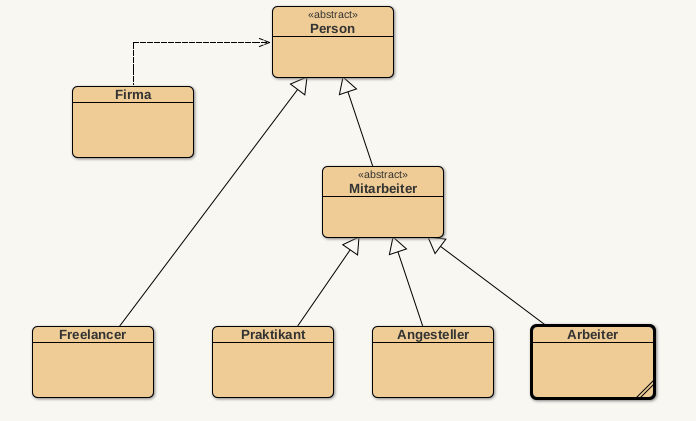

[source,java]
----
public abstract class Person implements Comparable<Person> {

    private String name;
    private int geburtsjahr;

    public Person() {
        setName("n/a");
        setGeburtsjahr(1900);
    }

    public Person(String name, int geburtsjahr) {
        setName(name);
        setGeburtsjahr(geburtsjahr);
    }

    public String getName() {
        return name;
    }

    public void setName(String name) {
        if (name != null && !name.isEmpty()) {
            this.name = name;
        } else {
            System.out.println("Fehler: ungueltiger Name: " + name);
        }
    }

    public int getGeburtsjahr() {
        return geburtsjahr;
    }

    public void setGeburtsjahr(int geburtsjahr) {
        if (geburtsjahr >= 1900 && geburtsjahr <= 2050) {
            this.geburtsjahr = geburtsjahr;
        } else {
            System.out.println("Fehler: ungueltiges Geburtsjahr: " + geburtsjahr);
        }
    }

    public abstract int getKostenProMonat();

    @Override
    public int compareTo(Person o) {
        if (o != null) {
            int c = this.getName().compareTo(o.getName());
            if (c == 0) {
                return this.getGeburtsjahr() - o.getGeburtsjahr();
            } else {
                return c;
            }
        } else {
            return -1; // spaeter werden wir das besser loesen
        }
    }

    @Override
    public String toString() {
        String str = getName() + " (Geb.Jahr: " + getGeburtsjahr() + ")";
        return str;
    }

}
----

Diese Klasse enthält nun eine abstrakte Methode zur Berechnung der monatlichen Kosten. Der Grund hierfür ist, dass wir einerseits erzwingen wollen, dass alle konkreten ableitenden Klassen diese Methode implementieren. Andererseits fehlen an dieser Stelle die nötigen Attribute (Stundenlohn, Projektpauschale) um irgend eine sinnvolle Implementierung angeben zu können.

In dieser Klasse wird ebenso die `compareTo`-Methode des implementierten Interfaces `Comparable<Person>` überschrieben. Diese steht dann in allen ableitenden Klassen zur Verfügung. Das Interface wird mit dem Typparameter `Person` parametriert, da ja mit Personen, oder deren Untertypen verglichen werden soll.

[source,java]
----
public class Freelancer extends Person {

    private int anzahlProjekte;
    private int projektPauschale;

    public Freelancer() {
        super();
        setAnzahlProjekte(1);
        setProjektPauschale(500);
    }

    public Freelancer(String name, int geburtsjahr, int anzahlProjekte, 
                      int projektPauschale) 
    {
        super(name, geburtsjahr);
        setAnzahlProjekte(anzahlProjekte);
        setProjektPauschale(projektPauschale);
    }

    public int getAnzahlProjekte() {
        return anzahlProjekte;
    }

    public void setAnzahlProjekte(int anzahlProjekte) {
        if (anzahlProjekte >= 0) {
            this.anzahlProjekte = anzahlProjekte;
        } else {
            System.out.println("Fehler: ungueltige Anzahl an Projekten: " 
                               + anzahlProjekte);
        }
    }

    public int getProjektPauschale() {
        return projektPauschale;
    }

    public void setProjektPauschale(int projektPauschale) {
        if (projektPauschale > 200) {
            this.projektPauschale = projektPauschale;
        } else {
            System.out.println("Fehler: ungueltige Projektpauschale: " 
                               + projektPauschale);
        }
    }

    // abstrakte Methode getKostenProMonat aus Person muss hier implementiert werden!
    @Override
    public int getKostenProMonat() {
        return getAnzahlProjekte() * getProjektPauschale();
    }

    public String toString() {
        String str = super.toString();
        str += ", " + anzahlProjekte + " Projekte (Projektpauschale: " 
               + projektPauschale + ")";
        return str;
    }
}
----

[source,java]
----
public abstract class Mitarbeiter extends Person {

    private int stundenlohn;
    private int anzahlWochenStunden;

    public Mitarbeiter() {
        super();
        setStundenlohn(10);
        setAnzahlWochenStunden(40);
    }

    public Mitarbeiter(String name, int geburtsjahr, int stundenlohn, 
                       int anzahlWochenStunden) 
    {
        super(name, geburtsjahr);
        setStundenlohn(stundenlohn);
        setAnzahlWochenStunden(anzahlWochenStunden);
    }

    public int getStundenlohn() {
        return stundenlohn;
    }

    public void setStundenlohn(int stundenlohn) {
        if (stundenlohn > 7 && stundenlohn < 1000) {
            this.stundenlohn = stundenlohn;
        } else {
            System.out.println("Fehler: ungueltiger Stundenlohn: "
                               + stundenlohn);
        }
    }

    public int getAnzahlWochenStunden() {
        return anzahlWochenStunden;
    }

    public void setAnzahlWochenStunden(int anzahlWochenStunden) {
        if (anzahlWochenStunden > 0 && anzahlWochenStunden <= 50) {
            this.anzahlWochenStunden = anzahlWochenStunden;
        } else {
            System.out.println("Fehler: ungueltige Wochenstundenanzahl: " 
                               + anzahlWochenStunden);
        }
    }

    public int getKostenProMonat() {
        // eigentlich 4.35 Wochen pro Monat
        // hier der Einfachkeit halber * 4
        int kosten = 4 * getStundenlohn() * getAnzahlWochenStunden();
        return kosten;
    }

    @Override
    public String toString() {
        String str = super.toString();
        str += " Stundenlohn: " + getStundenlohn() + ", " 
               + getAnzahlWochenStunden() + " h/W";
        return str;
    }

    public void print() {
        System.out.println(this);
    }

}
----

[source,java]
----
public class Angestellter extends Mitarbeiter {

    private boolean ueberstundenPauschale;

    public Angestellter() {
        super("n/a", 1900, 10, 40);
        setUeberstundenPauschale(false);
    }

    public Angestellter(String name, int geburtsjahr, int stundenlohn, 
                        int anzahlWochenStunden, boolean ueberstundenPauschale) 
    {
        super(name, geburtsjahr, stundenlohn, anzahlWochenStunden);
        setUeberstundenPauschale(ueberstundenPauschale);
    }

    public boolean hasUeberstundenPauschale() {
        return ueberstundenPauschale;
    }

    public void setUeberstundenPauschale(boolean ueberstundenPauschale) {
        this.ueberstundenPauschale = ueberstundenPauschale;
    }

    @Override
    public int getKostenProMonat() {
        int kosten = super.getKostenProMonat();
        if (!hasUeberstundenPauschale()) {
            // Ueberstunden muessen extra bezahlt werden
            kosten += 5 * getStundenlohn();
        }
        return kosten;
    }

    @Override
    public String toString() {
        String str = super.toString();
        str += " Angestellter ";
        str += hasUeberstundenPauschale() ? " (Ueberstundenpauschale)" 
                                          : " (keine Uestd.-Pauschale)";
        return str;
    }

    public void print() {
        System.out.println(this);
    }

}
----

[source,java]
----
public class Arbeiter extends Mitarbeiter {

    private boolean facharbeiter;

    public Arbeiter() {
        super("n/a", 1900, 10, 40);
        setFacharbeiter(false);
    }

    public Arbeiter(String name, int geburtsjahr, int stundenlohn,
                    int anzahlWochenStunden, boolean facharbeiter) 
    {
        super(name, geburtsjahr, stundenlohn, anzahlWochenStunden);
        setFacharbeiter(facharbeiter);
    }

    public boolean isFacharbeiter() {
        return facharbeiter;
    }

    public void setFacharbeiter(boolean facharbeiter) {
        this.facharbeiter = facharbeiter;
    }

    @Override
    public int getKostenProMonat() {
        int kosten = super.getKostenProMonat();
        if (isFacharbeiter()) {
            kosten += 200; // Facharbeiterzuschlag
        }
        return kosten;
    }

    @Override
    public String toString() {
        String str = super.toString();
        str += isFacharbeiter() ? " Facharbeiter" : " Hilfsarbeiter";
        return str;
    }

    public void print() {
        System.out.println(this);
    }
}
----

[source,java]
----
public class Praktikant extends Mitarbeiter {

    public Praktikant() {
        super();
    }

    public Praktikant(String name, int geburtsjahr, int stundenlohn, 
                      int anzahlWochenStunden) 
    {
        super(name, geburtsjahr, stundenlohn, anzahlWochenStunden);
    }

    @Override
    public String toString() {
        String str = super.toString() + " (Praktikant)";
        return str;
    }
}
----

Die Klasse `Firma` sieht nun wie folgt aus:

[source,java]
----
import java.util.ArrayList;
import java.util.Collections;

public class Firma {

    private String name;
    private ArrayList<Person> personal;

    public Firma() {
        personal = new ArrayList<>();
        setName("Default GmbH");
    }

    public Firma(String name) {
        personal = new ArrayList<>();
        setName(name);
    }
    public String getName() {
        return name;
    }

    public void setName(String name) {
        if (name != null && !name.isEmpty()) {
            this.name = name;
        } else {
            System.out.println("Fehler: ungueltiger Name: " + name);
        }
    }

    public void einstellen(Person m) {
        if (m != null) {
            personal.add(m);
        } else {
            System.out.println("Fehler: ungueltiger Mitarbeiter: " + m);
        }
    }

    public boolean kuendigen(Person m) {
        if (m != null) {
            return personal.remove(m);
        } else {
            System.out.println("Fehler: ungueltiger Mitarbeiter: " + m);
        }
        return false;
    }

    public String toString() {
        String str = "Firma: " + getName()
                     + "\n-----------------------------------------\n";

        for (Person m : personal) {
            str += m + "\n";
        }
        str += "\n";

        int kosten = 0;
        for (Person m : personal) {
            kosten += m.getKostenProMonat();
        }
        str += "Kosten pro Monat: " + kosten + "\n";
        str += "-----------------------------------------\n";

        return str;
    }

    public void print() {
        System.out.println(this);
    }

    public void sortieren() {
        Collections.sort(personal);
    }
}
----

Die Methode `sortieren` verwendet die statische Methode `sort` der Klasse `Collections` um das Personal der Firma zu sortieren. Diese Methode kann nur mit Collections verwendet werden die Klassen enthalten die das `Comparable`-Interface implementieren. Auf diese Art wird dem Sortieralgorithmus die Information zur Verfügung gestellt, wie zwei Objekte dieser Klasse (oder deren Unterklassen) in die richtige Reihenfolge zu bringen sind.

= TEIL 3

Drittes Semester der 6-jährigen Ausbildungsform; erste Hälfte des zweiten Semesters der 4-jährigen Ausbildungsform;

== Ausnahmebehandlung (Exceptions)

_Exceptions_ sind ein Sprachmittel von Java um Fehler- und Ausnahmesituationen geeignet behandeln zu können. Die Ausnahmebehandlung ermöglicht in vielen Fällen, das Programm auch in derartigen Situationen fortzusetzen. Weiters ermöglichen Exceptions andere Programmteile über aufgetretene Fehler oder Ausnahmesituationen zu informieren.

Für das begleitende Beispiel `Firma` definieren wir eine neue Klasse `FirmaException` die von `Exception` ableitet. In allen Fehler- und Ausnahmesituationen sollen künftig Instanzen dieser Klasse verwendet werden.

[source,java]
----
public class FirmaException extends Exception {

    public FirmaException(String message) {
        super(message);
    }

    public FirmaException(String message, Exception e) {
        super(message, e);
    }
}
----

Wir betrachten nun die Methode `setName` in `Person` aus dem begleitenden Beispiel. Bisher gab es im else-Zweig lediglich ein `System.out.println`, das eine Fehlermeldung auf die Konsole geschrieben hat. Dies ist keine vollständige Fehlerbehandlung, da es sich lediglich um eine Ausgabe handelt (die vielleicht von niemandem gesehen wird), und insbesondere auch andere Programmteile (Aufrufer der Methode) nicht vom Fehler informiert werden. Künftig sollen anstatt derartiger Ausgaben Exceptions _geworfen_ werden. Das Schlüsselwort lautet `throw` gefolgt von `new` und Klassenname einer Exception-Klasse. Die Methode wird nach der Ausführung von `throw` verlassen, d.h. die Exception wird an den Aufrufer der Methode _durchgereicht_.

[.center.text-center]
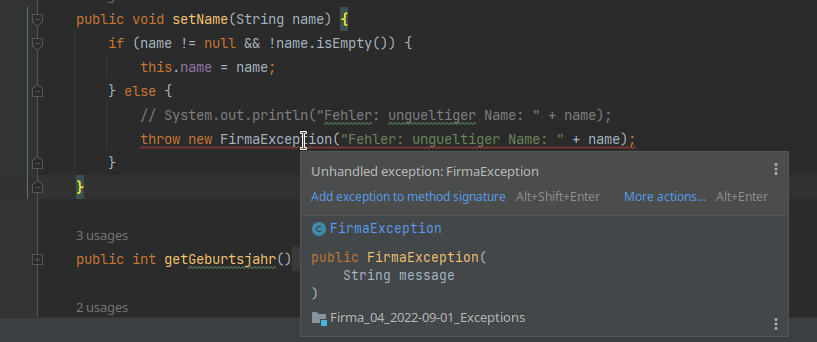

Man sieht in der Abbildung, dass der Compiler nun einen Fehler anzeigt. Die vorgeschlagene Lösung fügt im Methodenkopf `throws FirmaException` hinzu.

[.center.text-center]
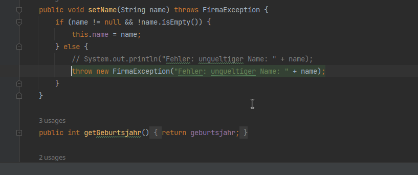

Durch diese Deklaration wird sichergestellt, dass der Aufrufer dieser Methode die potentiell auftretende Exception in irgend einer Form behandeln muss. So wird auch im Konstruktor ein derartiger Fehler angezeigt, da dort die Methode `setName` verwendet wird, die eben potentiell eine `FirmaException` wirft.

[.center.text-center]
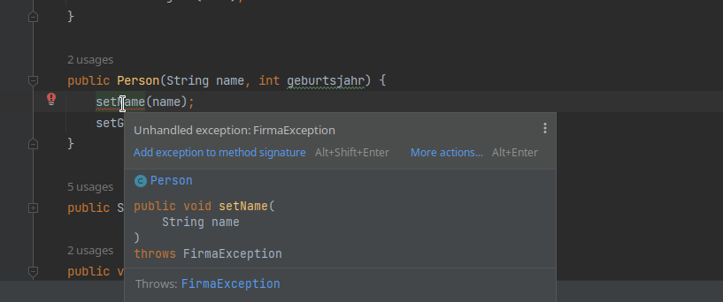

Da der Fehler im Konstruktor nicht weiter behandelt wird (dies ist in diesem Fall kaum sinnvoll möglich), muss auch beim Konstruktor deklariert werden: `throws FirmaException`. Die aktuelle Implementierung der Klasse `Person` sieht also wie folgt aus:

[source,java]
----
import java.lang.Comparable;

public abstract class Person implements Comparable<Person> {
    private String name;
    private int geburtsjahr;

    public Person() throws FirmaException {
        setName("n/a");
        setGeburtsjahr(1900);
    }

    public Person(String name, int geburtsjahr) throws FirmaException {
        setName(name);
        setGeburtsjahr(geburtsjahr);
    }

    public String getName() {
        return name;
    }

    public void setName(String name) throws FirmaException {
        if (name != null && !name.isEmpty()) {
            this.name = name;
        } else {
            throw new FirmaException("Fehler: ungueltiger Name: " + name);
        }
    }

    public int getGeburtsjahr() {
        return geburtsjahr;
    }

    public void setGeburtsjahr(int geburtsjahr) throws FirmaException {
        if (geburtsjahr >= 1900 && geburtsjahr <= 2050) {
            this.geburtsjahr = geburtsjahr;
        } else {
            throw new FirmaException("Fehler: ungueltiges Geburtsjahr: "
                                     + geburtsjahr);
        }
    }

    public abstract int getKostenProMonat();

    @Override
    public int compareTo(Person o) {
        // unveraendert zur vorigen Version
    }

    @Override
    public String toString() {
        String str = getName() + " (Geb.Jahr: " + getGeburtsjahr() + ")";
        return str;
    }

}
----

Analog können wir die `FirmaException` in der Klasse `Firma` verwenden:

[source,java]
----
import java.util.ArrayList;
import java.util.Collections;

public class Firma {

    private String name;
    private ArrayList<Person> personal;

    public Firma() throws FirmaException {
        personal = new ArrayList<>();
        setName("Default GmbH");
    }

    public Firma(String name) throws FirmaException {
        personal = new ArrayList<>();
        setName(name);
    }
    
    public String getName() {
        return name;
    }

    public void setName(String name) throws FirmaException {
        if (name != null && !name.isEmpty()) {
            this.name = name;
        } else {
            throw new FirmaException("Fehler: ungueltiger Name: " + name);
        }
    }

    public void einstellen(Person m) throws FirmaException {
        if (m != null) {
            personal.add(m);
        } else {
            throw new FirmaException("Fehler: ungueltiger Mitarbeiter: " + m);
        }
    }

    public boolean kuendigen(Person m) throws FirmaException {
        if (m != null) {
            return personal.remove(m);
        } else {
            throw new FirmaException("Fehler: ungueltiger Mitarbeiter: " + m);
        }
    }

    public String toString() {
        String str = "Firma: " + getName()
                      + "\n-----------------------------------------\n";

        for (Person m : personal) {
            str += m + "\n";
        }
        str += "\n";

        int kosten = 0;
        for (Person m : personal) {
            kosten += m.getKostenProMonat();
        }
        str += "Kosten pro Monat: " + kosten + "\n";
        str += "-----------------------------------------\n";
        
        return str;
    }

    public void print() {
        System.out.println(this);
    }

    public void sortieren() {
        Collections.sort(personal);
    }
}
----

Wo sollen die geworfenen Exceptions nun _abgefangen_ oder _gefangen_ werden? Eine geeignete Stelle könnte beispielsweise eine Benutzeroberfläche zu einer Personalverwaltungssoftware sein, die derartige Datenklassen (Person, Mitarbeiter, Arbeiter, Angestellter, etc.) im Hintergrund als Modell-Klassen verwendet. Bei einer fehlerhaften Eingabe würde die Benutzeroberfläche dann die entsprechende set-Methode aufrufen, wo eine Exception geworfen würde. Im Code der Benutzeroberfläche würde diese Exception dann abgefangen, und eine entsprechende Fehlermeldung angezeigt werden.

In unserem Fall werden diese Modell-Klassen bisher nur innerhalb der Test-Klassen "verwendet". Also muss auch dort eine entsprechende Fehlerbehandlung stattfinden. Wir betrachten die Methode `testEinstellen` der Klasse `TestFirma`. In dieser Klasse wird ein Arbeiter, ein Angestellter und ein Freelancer erzeugt, und diese der anschließend erzeugten Firma hinzugefügt. Bei all diesen Operationen könnte potentiell eine Exception geworfen werden.

[source,java]
----
   public static void testEinstellen() {
        try {
            Arbeiter arb1 = new Arbeiter("Karl", 1989, 15, 40, false);
            Angestellter ang1 = new Angestellter("Susanne", 1991, 20, 30, false);
            Freelancer fl1 = new Freelancer("Sepp", 1981, 3, 300);

            Firma firma = new Firma("Spengergasse OG");

            firma.einstellen(arb1);
            firma.einstellen(ang1);
            firma.einstellen(fl1);

            firma.print();

            // Hier wird eine Exception geworfen
            Arbeiter arb2 = new Arbeiter("Karl", 1789, 15, 40, false);
            
            firma.print();

        } catch (FirmaException e) {
            System.out.println("EXCEPTION: " + e.getMessage());
        }
    }
----

Um diese potentielle Exceptions zu behandeln, werden die betroffenen Statements innerhalb eines `try`-Blocks gesetzt. Im direkt darauffolgenden `catch`-Block wird angegeben, welche Exceptions behandelt werden sollen. Es kann zu einem `try`-Block durchaus auch mehrere `catch`-Blöcke geben. Im konkreten Fall werden nur Ausnahmen vom Typ `FirmaException` geworfen, welche dann im `catch`-Block gefangen werden. Die eigentliche Fehlerbehandlung findet innerhalb des `catch`-Blockes statt. In den folgenden Kapiteln werden hierzu konkrete Möglichkeiten vorgestellt, aktuell beschränken wir uns auf eine Ausgabe mittels `System.out.println`. Die konkrete Fehlermeldung erhält man durch Aufruf der Methode `getMessage` auf der geworfenen Instanz der `FirmaException`.

Bis auf die vorletzte Zeile des `try`-Blockes werden im konkreten Beispiel keine Exceptions geworfen. In dieser vorletzten Zeile führt jedoch ein fehlerhaftes Geburtsjahr zu einer `FirmaException`. Die darauffolgende Zeile `firma.print()` wird nicht mehr ausgeführt, die Abarbeitung wird nach einer geworfen Exception direkt im `catch`-Block fortgesetzt.

=== Checked vs. unchecked Exceptions

Die bisher vorgestellten Exceptions sind sogenannte _checked_ Exceptions. Dies bedeutet, dass der Compiler deren entsprechende Behandlung sicherstellt. Aus genau diesem Grund musste bei der Verwendung von `throws new FirmaException` jedes Mal im Methodenkopf `throws FirmaException` hinzugefügt werden. Ebenso stellt der Compiler sicher, dass derartige Methoden im Endeffekt innerhalb eines `try`-`catch`-Blockes augerufen werden.

Diese Herangehensweise kann zwar als besonders sicher angesehen werden, bringt jedoch unter Umständen auch Nachteile mit sich. So können beispielsweise die entsprechenden `throws`-Deklarationen, sowie `try`-`catch`-Blöcke an sehr vielen Stellen im Code auftreten, was unter Umständen die Lesbarkeit und Wartbarkeit des Codes verschlechtert. Deshalb gibt es auch sogenannte _unchecked_-Exceptions, deren Behandlung und Deklaration vom Compiler nicht erzwungen wird. Alle Exceptions die von `Error` oder `RuntimeException` ableiten sind unchecked.

Im Zusammenhang mit Frameworks wird oftmals der Ansatz mit unchecked-Exceptions bevorzugt. Dennoch empfehlen wir als grundlegenden Einstieg zunächst den vorgestellten Weg mittels checked-Exceptions, da dadurch die Fehleranfälligkeit etwas reduziert wird.

=== Finally

Nach einem `try`-Block folgen ein oder mehrere `catch`-Blöcke. Zusätzlich kann ein `finally`-Block angegeben werden. Dieser enthält Code, der in jedem Fall ausgeführt wird, unabhängig davon ob eine Exception aufgetreten ist, oder nicht. Dies wird üblicherweise zum Schließen diverser Ressourcen wie Dateien oder Netzwerkverbindungen verwendet.

[source,java]
----
try {
    // Code
} catch (ExceptionA e1) {
    // Fehlerbehandlung 
} catch (ExceptionB e2) {
    // Fehlerbehandlung
} finally {
    // Wird in jedem Fall ausgeführt.
    // Schließen etwaiger Ressourcen
}
----

== Weitere Collections

=== Collections: HashSet und TreeSet

`HashSet` und `TreeSet` implementieren das `Set`-Interface auf jeweils unterschiedliche Art und Weise. In einem `Set` soll sichergestellt sein, dass _(inhalts-)gleiche_ Objekte nicht mehrfach enthalten sind. Damit diese beabsichtigte Funktionalität des `Set`s gewährleistet ist, muss also in jedem Fall die `equals`-Methode implementiert sein. Wir haben die `equals`-Methode schon zum Test auf _Inhaltsgleichheit_ verwendet. An dieser Stelle sei ergänzt, dass die `equals`-Methode in `Object` definiert ist (alle Java-Klassen leiten von `Object` ab). Die dortige Implementierung testet jedoch nur auf _Referenzgleichheit_, also ob es sich bei der Instanz auf der sie aufgerufen wird, und dem Parameter um ein und das selbe Objekt handelt. Um dieses Verhalten abzuändern, muss die Methode überschrieben werden!

==== HashSet

Zur Verwendung in `HashSet` müssen Klassen die Methode `hashCode` überschreiben, die ebenfalls in `Object` definiert ist. Wichtig ist, dass `equals` und `hashCode` immer _konsistent_ implementiert werden. Wir wollen hier jedoch nicht näher auf Details eingehen, sondern präsentieren einfach den mit IntelliJ generierten Code zur Klasse `Person`.

[source,java]
----
    @Override
    public boolean equals(Object o) {
        if (this == o) return true;
        if (o == null || getClass() != o.getClass()) return false;
        Person person = (Person) o;
        return geburtsjahr == person.geburtsjahr && name.equals(person.name);
    }

    @Override
    public int hashCode() {
        return Objects.hash(name, geburtsjahr);
    }
----

Die Methode `getClass` wird hierbei verwendet um die konkrete Klasse eines Objektes abzufragen. Für die Inhaltsgleichheit wird hier vorausgesetzt, dass auch die Klassen gleich sein müssen. Für eine genauere Darstellung der Funktionsweise des `HashSet`s sei auf den Theorie-Teil verwiesen.

==== TreeSet

Das `TreeSet` verhält sich gleich wie das `HashSet`, Unterschiede ergeben sich allerdings in der _Laufzeitperformance_ der darauf ausgeführten Operationen.

== Serialisierung

Der Begriff _Serialisierung_ bedeutet, dass _Objekte_ (die ja als Daten im Hauptspeicher vorliegen) in eine sequentielle Form gebracht werden, die es ermöglicht sie in Dateien zu schreiben, oder über das Netzwerk zu übertragen.

Die erste der beiden folgenden Methoden in Firma ermöglicht nun die Firma samt deren Mitarbeiter in einem binären Format in eine Datei zu speichern.

Nun ist es anhand der zweiten Methode möglich, das Firmen-Objekt mit allen Mitarbeitern wieder aus der Datei herzustellen. Dies kann auch nach dem Neustart des Programmes, oder gar auf einem anderen Rechner erfolgen, da alle notwendigen Daten in der Datei gespeichert wurden.

[source,java]
----
    public void serialize() throws FirmaException {
        ObjectOutputStream oos = null;
        try {
            oos = new ObjectOutputStream(new FileOutputStream("firma.ser"));
            oos.writeObject(this);
        } catch (IOException e) {
            throw new FirmaException("I/O Error: " + e.getMessage());
        } finally {
            try {
                if (oos != null) {
                    oos.flush();
                    oos.close();
                }
            } catch (IOException e) {
                throw new FirmaException("I/O Error: " + e.getMessage());
            }
        }
    }

    public static Firma deserialize() throws FirmaException {
        Firma firma = null; // implements Serializable
        ObjectInputStream ois = null;
        try {
            ois = new ObjectInputStream(new FileInputStream("firma.ser"));
            firma = (Firma)ois.readObject();
        } catch (FileNotFoundException e) {
            throw new FirmaException("Datei nicht gefunden. " + e.getMessage());
        } catch (IOException e) {
            throw new FirmaException("I/O Error: " + e.getMessage());
        } catch (ClassNotFoundException e) {
            throw new FirmaException("Fehler bei der Konvertierung. "
                                     + e.getMessage());
        } finally {
            try {
                if (ois != null) {
                    ois.close();
                }
            } catch (IOException e) {
                throw new FirmaException("I/O Error: " + e.getMessage());
            }
        }
        return firma;
    }
----

Im obigen Code werden die Objekte `ObjectOutputStream` in Kombination mit `FileOutputStream`, sowie `ObjectInputStream` mit `FileInputStream` verwendet. Der wesentliche Code ist einerseits `ostr.writeObject(this)`, also das Schreiben des gegenwärtigen Objektes in den OutputStream, sowie `f = (Firma)in.readObject()` zum Einlesen der Datei. Hierbei muss noch eine explizite Typkonviertierung vorgenommen werden.

Der restliche Code betrifft die Ausnahmebehandlung. So kann es beim Schreiben oder Lesen der Datei zu Ausnahmefällen kommen, wie einer vollen Festplatte, oder einem entfernten USB-Stick, oder fehlenden Schreibrechten, u.v.m. Die entsprechenden Streams müssen jedenfalls wieder geschlossen werden, was im `finally`-Block erfolgt. Hierbei kann es wiederum zu Ausnahmen kommen, weshalb dieser Block wiederum einen `try-catch`-Block enthält. Dies ist zugegeben etwas umständlich, weshalb wir in Kürze eine etwas einfachere Variante vorstellen werden. An sich ist das Codestück jedoch funktionsfähig. Bei der Ausführung erhält man jedoch eine `NotSerializableException`, die angibt, dass nicht sichergestellt ist, dass sich die betroffenen Objekte tatsächlich serialisieren lassen.

Um dieses Problem zu beheben, müssen alle beteiligten Klassen das Interface `Serializable` implementieren. Dieses Interface enthält keine zu implementierenden Methoden. Es handelt sich lediglich um ein _Marker-Interface_, das angibt, dass die implementierenden Klassen tatsächlich sinnvoll serialisiert werden können.

Die obigen Methoden zur Serialisierung und Deserialisierung können mithilfe des "Try-With-Resources"-Statements etwas kompakter und übersichtlicher implementiert werden. Ressourcen sind hierbei Objekte, die nach deren Verwendung wieder geschlossen werden müssen. Diese Ressourcen werden hierbei in runden Klammern direkt nach dem Schlüsselwort `try` angegeben. Der `finally`-Block zur Sicherstellung des Schließens der Ressource kann dadurch entfallen.

[source,java]
----
    public void serialize() throws FirmaException {
        try (FileOutputStream fos = new FileOutputStream("firma.ser");
             ObjectOutputStream oos = new ObjectOutputStream(fos))
        {
            oos.writeObject(this);
        }  catch (IOException e) {
            throw new FirmaException("I/O Error: " + e.getMessage());
        }
    }

    public static Firma deserialize() throws FirmaException {
        Firma firma = null;
        try (FileInputStream fis = new FileInputStream("firma.ser");
             ObjectInputStream ois = new ObjectInputStream(fis))
        {
            firma = (Firma)ois.readObject();
        } catch (FileNotFoundException e) {
            throw new FirmaException("Datei nicht gefunden. " + e.getMessage());
        } catch (IOException e) {
            throw new FirmaException("I/O Error: " + e.getMessage());
        } catch (ClassNotFoundException e) {
            throw new FirmaException("Fehler bei der Konvertierung. "
                                     + e.getMessage());
        }
        return firma;
    }
----

Mittels des Schlüsselwortes `transient` können Attribute markiert werden die _nicht_ (de-)serialisiert werden sollen. Anhand des Attributs `static final long serialVersionUID = 42L;` kann eine "Versionsnummer" zur Klasse vergeben werden um die Kompatibilität mit bestimmten Softwareversionen sicherzustellen.

== Lesen und Schreiben von Dateien

Die durch die Serialisierung entstandene Datei ist für Menschen nicht (oder nur teilweise) lesbar, da es sich um ein Binärformat handelt. In vielen Fällen möchte man jedoch Textdateien schreiben die _human-readable_ sind. Beispiele für solche Formate sind: `xml`, `json`, oder `csv`. Letzteres steht für "Comma-Separated-Values", d.h. Dateien deren Elemente durch das Strichpunkt-Zeichen ";" getrennt sind (oft auch ","). Derartige Dateien können einerseits mit reinen Texteditoren gelesen und bearbeitet werden, jedoch auch mit Tabellenkalkulationen wie Excel. Diese interpretieren die Strichpunkte dann als Trennzeichen für Spalten.

....
Spengergasse OG
Arbeiter;Karl;1989;15;40;Hilfsarbeiter
Angestellter;Susanne;1991;20;30;keine Ueberstundenpauschale
Freelancer;Sepp;1981;3;300
....

Zum Lesen und Schreiben von Textdateien erweitern wir zunächst die Klasse Firma um die folgenden Methoden.

[source,java]
----
    public void writeToFile(String filename) throws FirmaException {
        try (FileWriter fw = new FileWriter(filename);
             BufferedWriter bw = new BufferedWriter(fw))
        {
            bw.write(this.toCSVString());
        } catch (IOException e) {
            throw new FirmaException("I/O Error: " + e.getMessage());
        }
    }

    public static Firma readFromFile(String filename) throws FirmaException {
        Firma firma = null;
        try (FileReader fr = new FileReader(filename);
             BufferedReader br = new BufferedReader(fr))
        {
            String line = br.readLine();
            if (line != null && !line.isEmpty() && !line.isBlank()) {
                firma = new Firma(line);
            } else {
                throw new FirmaException("Ungueltige Eingabedatei: "
                             + " ungueltiger Firmenname in erster Zeile");
            }
            line = br.readLine();
            while (line != null) {

                Person p = null;
                if (line.startsWith("Arbeiter")) {
                    p = new Arbeiter(line);
                } else if (line.startsWith("Angestellter")) {
                    p = new Angestellter(line);
                } else if (line.startsWith("Freelancer")) {
                    p = new Freelancer(line);
                } else {
                    throw new FirmaException("Ungueltiger Mitarbeitertyp in Zeile " 
                                             + line);
                }
                firma.einstellen(p);
                line = br.readLine();
            }
        } catch (FileNotFoundException e) {
            throw new FirmaException("File " + filename + " not found. "
                                     + e.getMessage());
        } catch (IOException e) {
            throw new FirmaException("I/O Error: " + e.getMessage());
        }
        return firma;
    }
----

Diese Methoden setzen voraus, dass die beteiligten Klassen (`Firma`, `Arbeiter`, `Angestellter`, `Freelancer`) jeweils die Methode `toCSVString()` enthalten, als auch entsprechende Konstruktoren implementieren, die Objekte aufgrund eines einzelnen Parameters (csv-String) erzeugen.

Wir betrachten zunächst das Schreiben in die csv-Datei näher. Die Implementierung von `toCSVString` in `Firma` sieht wie folgt aus:

[source,java]
----
    public String toCSVString() {
        String s = getName() + "\n";
        for (Person p : personal) {
            s += p.toCSVString() + "\n";
        }
        return s;
    }
----

Dabei wird von allen `Person`en ebenfalls die Methode `toCSVString()` aufgerufen. Die Implementierung in beispielsweise `Arbeiter` sieht wie folgt aus:

[source,java]
----
    @Override
    public String toCSVString() {
        return super.toCSVString() + ";" 
               + (isFacharbeiter() ? "Facharbeiter" : "Hilfsarbeiter");
    }
----

Hier wird die entsprechende Methode der Basisklasse aufgerufen, danach folgt durch einen Strichpunkt getrennt die Information ob Fach- oder Hilfsarbeiter. In der direkten Basisklasse (`Mitarbeiter`) sieht die Methode wie folgt aus:

[source,java]
----
    @Override
    public String toCSVString() {
        return super.toCSVString() + ";" + getStundenlohn() + ";" + getAnzahlWochenStunden();
    }
----

Diese bezieht sich wiederum auf die entsprechende Methode der Basisklasse, nämlich `Person`:

[source,java]
----
    public String toCSVString() {
        return this.getClass().getName() + ";" + getName() + ";" + getGeburtsjahr();
    }
----

Hier wird als erstes `this.getClass().getName()` aufgerufen, um den Namen der Klasse in die erste Spalte zu schreiben.

Beim Lesen der Datei (`readFromFile`) wird zunächst die erste Zeile geprüft, und damit (falls nicht null und nicht leer) eine Instanz von `Firma` erzeugt. In der while-Schleife werden dann die weiteren Zeilen gelesen. Anhand der if-Bedingungen wird unterschieden, um welchen Typ von Mitarbeiter es sich tatsächlich handelt, und mittels des Konstruktors mit einem String-Parameter das entsprechende Objekt erzeugt. Der entsprechende Konstruktor sieht bei `Angestellter` wie folgt aus:

[source,java]
----
  public Angestellter(String csv) throws FirmaException {
        String[] tokens = csv.split(";");
        if (tokens.length != 6) {
            throw new FirmaException("Ungueltige Zeile: " + csv 
                                     + ". 6 Spalten erwartet.");
        }

        String name = tokens[1];
        setName(name);

        int geburtsjahr = 0;
        try {
            geburtsjahr = Integer.parseInt(tokens[2]);
        } catch (NumberFormatException e) {
            throw new FirmaException("Ungueltige Zeile: " + csv 
                        + ". Geburtsjahr in der 3. Spalte erwartet.");
        }
        setGeburtsjahr(geburtsjahr);

        int stundenlohn;
        try {
            stundenlohn = Integer.parseInt(tokens[3]);
        } catch (NumberFormatException e) {
            throw new FirmaException("Ungueltige Zeile: " + csv 
                        + ". Stundenlohn in der 4. Spalte erwartet.");
        }
        setStundenlohn(stundenlohn);

        int anzahlWochenstunden;
        try {
            anzahlWochenstunden = Integer.parseInt(tokens[4]);
        } catch (NumberFormatException e) {
            throw new FirmaException("Ungueltige Zeile: " + csv 
                         + ". Anzahl Wochenstunden in der 5. Spalte erwartet.");
        }
        setAnzahlWochenStunden(anzahlWochenstunden);

        boolean ueberstundenpauschale = true;
        if (tokens[5] != null && tokens[5].equals("keine Ueberstundenpauschale")) {
            ueberstundenpauschale = false;
        } else if (tokens[5] != null && tokens[5].equals("Ueberstundenpauschale")) {
            ueberstundenpauschale = true;
        } else {
            throw new FirmaException("Ungueltige Zeile: " + csv 
                        + ". Info zu Ueberstundenpauschale in 6. Spalte erwartet.");
        }
        setUeberstundenPauschale(ueberstundenpauschale);

    }
----

In der ersten Zeile wird der übergebene csv-String zunächst anhand des Trennzeichens ";" in einzelne Tokens gesplitted. Jedes Element des Arrays enthält danach den Eintrag einer Spalte der Zeile. Anschließend werden die einzelnen Elemente geprüft, und im Fehlerfall entsprechende Exceptions geworfen. `Integer.parseInt` wirft eine `NumberFormatException` falls der übergebene String nicht in eine ganze Zahl umgewandelt werden kann. Im Code wird diese Exception gefangen und in eine `FirmaException` "umgewandelt".

Zusammenfassend eine Übersicht über die notwendigen Schritte beim Filehandling und der Serialisierung:

.De-/Serialisierung
. Interface Serializable implementieren
. Methode serialize ausprogrammieren
. Testfall zu Serialisierung
. Methode deserialze ausprogrammieren
. -/-
. Testfall zu Serialisierung vervollständigen
    
    
.Filehandling
. Methoden toCsvString in allen beteiligten Klassen ausprogrammieren
. Methode writeToFile ausprogrammieren
. Testfall zu Filehandling anlegen
. Methode readFromFile (ETWAS AUFWÄNDIGER) ausprogrammieren
. Konstruktoren mit csvString als Parameter in allen beteiligten Klassen (AUFWÄNDIG)
. Testfall zu Filehandling vervollständigen

== Weiterführende Themen

=== Versionsverwaltung (Git)

Ein Versionskontrollsystem (version control system - VCS) unterstützt Entwickler bei der Zusammenarbeit an einem Softwareprojekt und steigert die Effizienz der Entwickler. Versionskontrollsysteme verfolgen jede Änderungen am Code und speichern Sie in speziellen Datenbanken. Damit ist es möglich, beispielsweise bei einem Fehler, den aktuellen Code mit einer älteren Version zu vergleichen, aber auch auf einen älteren Stand der Software zurückzuwechseln. Weiters hat jeder Entwickler immer Zugriff auf den aktuellen Softwarestand, unabhängig davon, wo er sich gerade befindet.

Der Nutzen von VCS ist:

* Historische Aufzeichnungen über alle Aktionen zu jeder Datei des Projekts.
* Gleichzeitiges Arbeiten an einem Softwareprojekt von mehreren Teammitgliedern.
* Nachverfolgbarkeit der vorgenommenen Änderungen durch den Entwickler.

_Git_ ist das, aktuell, meist verbreitetste VCS. Das Open-Source-Projekt wurde, 2005, ürsprünglich von Linus Torvalds (Linux-Kernel Entwickler) ins Leben gerufen.

==== Installation

* Download: `git-scm.com`
* Die Installation erfolgt mit den Standardeinstellungen

Auf der Konsole kann nun ein Benutzer angelegt werden

....
$ git config --global user.name "Hansi Hintermaeher"
$ git config --global user.email hansi.hintermaeher@spengergasse.at
....

und mittels

....
$ git config --global user.name
$ git config --global user.email
....

überprüft werden. Achtung: das $-Zeichen wird nicht eingegeben, es ist Teil der Eingabeaufforderung der Konsole!

==== Grundlegende Konzepte von Git

Bei der Verwendung von Git befindet sich ein Teil auf dem lokalen Computer _"LOCAL"_, und ein anderer Teil auf einem Server _"REMOTE"_. Mittels `git push` werden lokale Änderungen auf den Server übertragen, mittels `git pull` wird der aktuelle Stand von _remote_ in das lokale Repository übertragen. Möchte man das erste Mal den Inhalt eines _remote_ Repositorys erhalten, so erfolgt dies mit `git clone`.

[.center.text-center]
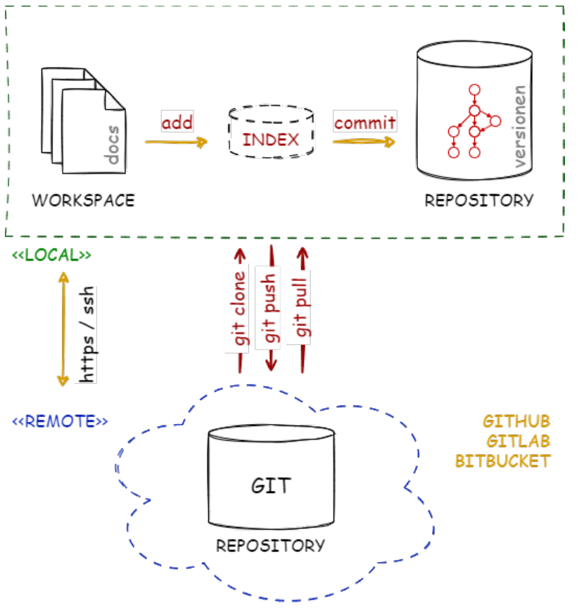

Derzeit gängige Anbieter von `Git` sind _Github_, _Bitbucket_ und _Gitlab_. Diese können (mit Einschränkungen) kostenlos verwendet werden. Alternativ kann man `Git` auf beliebien Servern installieren und selbst betreiben. Die Cloud-Anbieter stellen jedoch komfortable Web-Interfaces mit diversen Dashboards und Tools zur Verfügung.

Wir betrachten nun den oberen Teil der Grafik (_local_) genauer. Der Workspace ist ein Verzeichnis, dass alle gewünschten Dateien enthält. Etwaige Änderungen oder Ergänzungen werden jedoch nicht unmittelbar versioniert. Erst mittels `git add` werden Dateien zum _Index_ hinzugefügt. Mittels `git commit` werden die Änderungen dann ins lokale Repository übernommen. Dieses Repository speichert nun jeden Zwischenstand des Projektes der mittels `git commit` "gespeichert" wurde. Dies ermöglicht nun auf jeden früheren Zwischenstand des Codes zurückzuschalten.

Die mit `git commit` gespeicherten Änderungen sind zunächst nur auf dem lokalen Rechner verfügbar. Mittels `git push` werden sie nun in das _remote_ Repositoy gespeichert. Hierbei muss allerdings zunächst sichergestellt werden, dass _lokal_ der aktuelle Stand vorliegt (`git pull`). Hierbei können sogenannte _Konflikte_ entstehen, d.h. verschiedene Entwickler haben unterschiedliche Änderungen vorgenommen, die nicht automatisch zusammengefügt werden können.

....
<<<<<<< HEAD
public void foo() {
    for (int i=0; i<20; i++) {
        System.out.println("Foo: " + i);
    }
}
=======
public void foo() {
    int i=0;
    while (i < 40) {
        System.out.println("f o o: " + i);
        i += 2;
    }
}
>>>>>>> df1806bd8ed8f89fbcc2ddd6d9ff1c5c92518e60
....

Die Entwickler müssen nun entscheiden _wie_ diese Konflikte behoben werden sollen (z.B. durch Absprache untereinander, oder Entscheidung des Teamleiters). Nach Behebung des Konfliktes muss erneut commited und gepushed werden.

Vor dem _push_ ist zu beachten, dass der Code funktionsfähig ist! D.h. er muss auf jeden Fall übersetzbar sein, und sollte auch schon vorhandene Funktionalitäten nicht beeinträchtigen. Dies unterstreicht die Wichtigkeit von Testfällen, um sicherzustellen, dass keine neuen Fehler eingeführt wurden.

Eine weitere wichtige Funktionalität von Git ist Erstellung von _branches_. Dies sind Abzweigungen vom Haupt-Stamm der Software. Meist werden sie eingeführt um neue Features zu entwickeln. Dies soll nicht in der Hauptversion (main branch) geschehen, da dort möglicherweise Bug-Fixes für eine lauffähige Version der Software gemacht werden müssen. Das neue Feature wird zunächst in einem eigenen Branch entwickelt. Bei Fertigstellung kann dieser Branch dann wieder mit dem main branch zusammengeführt werden.

=== Lambda-Ausdrücke

Der Lambda-Kalkül ist ein Konzept aus der theoretischen Informatik, das das Binden von Parametern an Funktionen beschreibt. In Anlehnung an diesen Namen existieren in vielen Programmiersprachen _Lambda-Ausdrücke_, die an bestimmten Stellen vereinfachte Funktionsaufrufe ermöglichen. Der entsprechende Operator in Java ist ein Pfeil 
(bestehend aus einem Bindestrich und einem Größer-Zeichen), links davon werden Parameter, rechts davon ein Methodenrumpf (oder Methodenaufruf) angegeben.

Das folgende Beispiel motiviert die Verwendung von Lambda-Ausdrücken in Java indem zunächst die Umsetzung ohne Lambda-Ausdrücken gezeigt wird, und in weiterer Folge die kürzere Version mittels Lambda-Ausdrücken vorgestellt wird.

Wir betrachten zunächst ein Interface, das eine binäre Operation auf ganzen Zahlen definiert. Unter einer binären Operation versteht man Operation wie zum Beispiel die Addition, also eine Operation die zwei Elementen (Zahlen) ein Ergebnis (wieder eine Zahl) zuordnet.

[source,java]
----
public interface BinaryOperation {
    public int operation(int a, int b);
}
----

Weiters betrachten wir eine Klasse `Calculator`, die derartige Berechnungen durchführt.

[source,java]
----
public class Calculator {

    public int calculate(BinaryOperation op, int a, int b) {
        int result = op.operation(a, b);
        System.out.println("Result of op(" + a + ", " + b + ") = " + result);
        return result;
    }

}
----

Diese Klasse verwendet in der Methode `calculate` eine konkrete Variante von `BinaryOperation` und wendet diese zur Berechnung auf die Parameter `a` und `b` an. Das Interface `BinaryOperation` kann natürlich nicht selbst instanziiert werden, für konkrete Operationen wie zum Beispiel der Addition oder Subtraktion müssen konkrete Klassen erstellt werden, die dieses Interface implementieren.

Eine einfache Klasse zur Veranschaulichung kann wie folgt aussehen:

[source,java]
----
public class LambdaDemo {
   
    public static void main(String[] args) {
        variantClassImplementsInterface();
        // variantAnonymousClassImplementsInterface();
        // variantWithLambdas();
    }

    public static void variantClassImplementsInterface() {
        System.out.println("Variant with Classes implementing the Interface: ");
        Calculator calc = new Calculator();
        calc.calculate(new BinaryOperationAddition(), 3, 5);
        calc.calculate(new BinaryOperationSubtraction(), 10, 4);
        calc.calculate(new BinaryOperationMultiplikation(), 2, 6);
    }

}
----

Hierbei wird der Methode `calculate` eine neue Instanz der Klassen `BinaryOperationAddition`, `BinaryOperationSubtraction` und `BinaryOperationMultiplikation` übergeben. Exemplarisch sei hierfür die folgende Implementierung angegeben (die anderen Klassen sehen bis auf die konkrete Operation gleich aus):

[source,java]
----
public class BinaryOperationAddition implements BinaryOperation {
    @Override
    public int operation(int a, int b) {
        return a+b;
    }
}
----

Nachteilig ist hierbei, dass obwohl die Operationen nur ein einziges Mal benötigt wurden, eine eigene Klasse dafür angelegt werden musste. Diese Klasse enthält als wesentliche Information nur die tatsächliche mathematische Operation, sonst jedoch recht viel Code ohne tatsächliche Aussagekraft.

Um zu vermeiden, tatsächlich eine eigene Klasse, in einer eigenen Datei erstellen zu müssen, kann man alternativ wie folgt vorgehen:

[source,java]
----
 public static void variantAnonymousClassImplementsInterface() {
    Calculator calc = new Calculator();
    calc.calculate(new BinaryOperation() {
                        @Override
                        public int operation(int a, int b) {
                            return a+b;
                        }
                    }, 3, 5);

    calc.calculate(new BinaryOperation() {
                        @Override
                        public int operation(int a, int b) {
                            return a-b;
                        }
                    }, 10, 4);

    calc.calculate(new BinaryOperation() {
                        @Override
                        public int operation(int a, int b) {
                            return a*b;
                        }
                    }, 2, 6);
}
----

Hier wird dem Parameter eine Instanz einer _anonymen_ Klasse übergeben. Es wird also implizit eine neue Klasse erstellt die vom Interface `BinaryOperation` ableitet (bzw. dieses implementiert), und nach der geschwungenen Klammer dann die Methode `operation` entsprechend überschrieben. Möchte man also nur ad-hoc an einigen wenigen Stellen im Code eine derartige mathematische Operation verwenden, entfällt hierbei die Notwendigkeit eine eigene Klasse zu erstellen. Dennoch ist der Code unübersichtlich, und enthält einiges an Redundanzen. Jedes Mal wird der Name des Interfaces (`BinaryOperation`) angegeben, obwohl in der Methode `calculate` schon festgelegt ist, dass dieses Interface verlangt wird. Ebenso wird jedes Mal angeschrieben, dass die Methode `operation` überschrieben wird. Jedoch ist auch dies klar, da das Interface nur genau diese eine Methode definiert, und genau diese Methode somit überschrieben werden muss.

Die Motivation für Lambda-Ausdrücke ist nun, in derartigen Situationen die ohnehin klaren Informationen nicht extra anschreiben zu müssen. Die relevante Information ist hier eigentlich nur, was mit den beiden Parametern `a` und `b` konkret geschehen soll.

Die folgende Methode verwendet innerhalb des Methodenaufrufes von `calculate` einen Lambda-Ausdruck.

[source,java]
----
public static void variantWithLambdas() {
    Calculator calc = new Calculator();
    calc.calculate( (int a, int b) -> { return a+b; }, 3, 5 );
    calc.calculate( (a, b) -> (a-b), 10, 4);
    calc.calculate( (a, b) -> (a*b), 2, 6);
}
----

Bei der Addition von 3 und 5 sieht man links von `->` die beiden `int`-Parameter angegeben, rechts von `->` ist innerhalb der geschwungenen Klammern der Methoden-Rumpf (mit dem return-Statement) angegeben. Da klar ist, welche Methode, aus welchem Interface überschrieben werden soll, findet sich im Lambda-Ausdruck nur die Information _wie_ die Parameter in der überschriebenen Methode verarbeitet werden.

Die folgenden beiden Zeilen (Subtraktion und Multiplikation) zeigen die noch kürzeren Varianten, bei denen die Parameter-Typen weggelassen wurden. Weiters wurden rechts vom Pfeil die geschwungenen Klammern weggelassen, da nur ein Statement vorhanden ist. Da dieses Statement ein return-Statement sein muss, wurde das Schlüsselwort `return` ebenfalls weggelassen.

Alternativ kann rechts von `->` auch ein Methodenaufruf stehen. Dieser Fall tritt sehr häufig bei der Programmierung von Benutzeroberflächen auf. Lambda-Ausdrücke werden hierbei oft für die Behandlung von Ereignissen (wie zum Beispiel der Klick auf einen Button) eingesetzt. Der sogenannte _Event-Handler_ wird hierbei auch durch ein Interface spezifiziert, die konkrete Event-Behandlung durch das Implementieren einer vom Interface vorgegebenen Methode. Hier wird der Nutzen von Lambdas besonders deutlich. Man möchte nicht für jedes Element der Benutzeroberfläche eine eigene Klasse zur Event-Behandlung erstellen, sondern nur die entsprechende Methode angeben.

Als weiterer Anwendungsfall für Lambdas sei das Sortieren genannt. Um Objekte nach verschiedenen Kriterien sortieren zu können, muss der Sortier-Methode eine Instanz einer von `Comparator<T>` abgeleiteten Klasse übergeben werden. Dieses Interface erzwingt die Implementierung von `int compareTo(T t1, T t2)`. Das Codestück zeigt nun die Sortierung mittels Lambda-Ausdrücken:

[source,java]
----
    ArrayList<Integer> values = new ArrayList<>(
                Arrays.asList(3, 1, 5, 6, 12, 3, 5, -3, 44, 0, 1, 5));
    Collections.sort(values, (a, b) -> (a-b)); // sort ascending
    System.out.println("Values: " + values);
  
    values.clear();
    values.addAll(Arrays.asList(3, 1, 5, 6, 12, 3, 5, -3, 44, 0, 1, 5));
    Collections.sort(values, (a, b) -> (b-a)); // sort descending
    System.out.println("Values: " + values);
----

Im ersten Fall wird die ArrayList aufsteigend sortiert, danach absteigend. Bei der Verwendung von Objekten mit mehreren Attributen kann im Lambda-Ausdruck auf eine einfache Art derfiniert werden, wonach und wie sortiert werden soll.

Weitere Anwendungen von Lambda-Ausdrücken ergeben sich im Zusammenhang mit der Verwendung der Streams API (Folgekapitel).

=== Design-Patterns

_Design-Patterns_ sind in der Softwareentwicklung bewährte Entwurfsmuster für häufig auftretende Anforderungen. Im Standardwerk "Design Patterns. Elements of Reusable Object-Oriented Software" stellen die Autoren Erich Gamma, Richard Helm, Ralph Johnson und John Vlissides (oft als Gang of Four (GoF) bezeichnet) 23 Entwurfsmuster vor. Diese werden in drei Kategorien: Erzeugungsmuster, Strukturmuster und Verhaltensmuster eingeteilt. Einigen Patterns werden wir künftig begegnen.

Das _Singleton_-Pattern stellt sicher, dass nur eine einzige Instanz einer bestimmten Klasse existiert. Dies geschieht indem die Konstruktoren `private` gesetzt werden, und über eine statische Methode auf eine statische Objektreferenz zugegriffen wird. Ist diese ungleich `null` so wird eine neue Instanz erzeugt, anderenfalls einfach die bestehende Instanz zurückgegeben.

Das _Factory_-Pattern beschreibt eine Methode Objekte zu erzeugen, ohne direkt den Konstruktor aufzurufen. Ähnlich wie beim Singleton wird eine statische Methode aufgerufen, die eine Objektreferenz retourniert. Innerhalb der Methode wird gesteuert, welches Objekt (also möglicherweise auch ein Untertyp vom deklarierten Rückgabewert) erzeugt wird.

Das _Strategy_-Pattern ist eine Möglichkeit gewisse Funktionen austauschbar zu gestalten. Das _Composite_-Pattern ermöglicht eine Menge an Objekten auf die gleiche Weise wie einzelne Instanzen zu behandeln. Das _Iterator_-Pattern legt eine Möglichkeit fest, über Collections unabhängig von deren interner Struktur und auf verschiedene Weise zu iterieren.

Design-Patterns hier ausführlicher vorzustellen, würde den Rahmen dieses Skriptums weit übersteigen. Deshalb sei an dieser Stelle auf das Buch (GoF) oder Internet verwiesen.

=== Streams API

Die Streams API bietet die Möglichkeit viele häufig auftretende Operationen (oft in Kombination mit Lambda-Ausdrücken) sehr kurz und prägnant anzuschreiben. Dies erspart oft zahlreiche Schleifen und Methodenaufrufe. Der resultierende Programmierstil ist von der _funktionalen Programmierung_ geprägt, und wurde deshalb in der _objektorientierten_ Programmiersprache Java erst in Version 8 eingeführt. Typisch bei der Verwendung von Streams ist der _fluent_-Stil, bei dem mehrere Methoden verkettet aufgerufen werden (Method chaining). Dabei liefert jeder Methodenaufruf wiederrum einen Stream zurück, auf dem direkt weitere Methoden aufgerufen werden können.

Der Stream ist ein "Datenstrom" der die Objekte einer Collection entält, und ermöglicht diese nacheinander abzuarbeiten. Betrachten wir beispielsweise die Situation, nur bestimmte `Employee` s einer `ArrayList` verarbeiten zu wollen, z.B. jene deren Name mit "A" beginnt. Der Code sieht mittels Verwendung eines Lambda-Ausdruckes wie folgt aus:

[source,java]
----
ArrayList<Employee> list ... // Erzeugung und Befuellung der Liste

List<Employee> filteredList = list.stream()
                                  .filter(e -> e.getName().startsWith("A"))
                                  .collect(Collectors.toList());
----

In diesem Beispiel wird zunächst ein Stream erzeugt, dieser dann gefiltert, und wieder mittels `collect` zu einer Liste zusammengefügt.

Häufig wird die Operation `forEach` verwendet, die betimmte Aktionen auf dem Stream durchführt. Beispiel:

[source,java]
----
list.stream().forEach(e -> e.increaseSalaryByPercent(10));
----

Die Operation `map` erzeugt nach Anwendung einer Methode einen neuen Stream (möglicherweise mit anderem Typ).

Schließlich können auch Exceptions direkt geworfen werden:
 ******************************

[source,java]
----
    Integer latestEmployeeId = list.stream()
                                   .mapToInt(Employee::getId)
                                   .max()
                                   .orElseThrow(NoSuchElementException::new);
----

Wesentliches Merkmal von Streams ist die _Lazy Evaluation_. Das bedeutet, dass die vorangehenden Berechnungen nur dann tatsächlich durchgeführt werden, wenn das Endergebnis benötigt wird.

In diesem Kapitel wurden Streams nur oberflächlich behandelt. Sie stellen für sich genommen ein umfangreiches Kapitel der modernen Java-Programmierung dar, sollten aber mit den vorangehenden Kenntnissen leicht intuitiv verstanden und verwendet werden können.

=== Model-Klassen als Basis für die Benutzeroberflächenentwicklung

In diesem Kapitel sind die Modellklassen für die folgenden Abschnitte der Benutzeroberflächenentwicklung dargestellt.

[source,java]
----
public class Company implements Serializable {

    public static final String CSV_DELIMITER = ";";

    private String companyName;
    private String companyAddress;

    private ArrayList<Employee> staff;

    private Company() {
        staff = new ArrayList<>();
        companyName = "n/a";
        companyAddress = "n/a";
    }

    private Company(String name, String address) throws CompanyException {
        setCompanyName(name);
        setCompanyAddress(address);
        staff = new ArrayList<>();
    }

    private static Company companyInstance = null;
    public static Company getInstance() {
        if (companyInstance == null) {
            companyInstance = new Company();
        }
        return companyInstance;
    }

    public static void loadFromFile(String filename) throws CompanyException {
        companyInstance = Company.readFromFile(filename);
    }

    public static void clearInstance() {
        companyInstance = null;
    }

    public String getCompanyName() {
        return companyName;
    }

    public void setCompanyName(String companyName) throws CompanyException {
        if (companyName != null) {
            this.companyName = companyName;
        } else {
            throw new CompanyException("Invalid name: null. ");
        }
    }

    public String getCompanyAddress() {
        return companyAddress;
    }

    public void setCompanyAddress(String companyAddress) throws CompanyException {
        if (companyAddress != null) {
            this.companyAddress = companyAddress;
        } else {
            throw new CompanyException("Error:invalid address: null. ");
        }
    }

    public void hire(Employee emp) throws CompanyException {
        if (emp != null) {
            if (!staff.contains(emp)) {
                staff.add(emp);
            } else {
                throw new CompanyException("Error: employee already exists in company. ");
            }
        } else {
            throw new CompanyException("Error: invalid employee: null. ");
        }
    }

    public boolean fire(Employee emp) throws CompanyException {
        if (emp != null) {
            if (staff.contains(emp)) {
                staff.remove(emp);
                return true;
            } else {
                // this is not necessarily an exception
                return false;
            }
        } else {
            throw new CompanyException("Error: employee is null. ");
        }

    }

    /**
     * All (!) employees that match the criterion are removed from the company!
     */
    public boolean fire(String firstName, String lastName) throws CompanyException {
        boolean removed;
        if (firstName != null && lastName != null) {
            removed = false;

            Iterator<Employee> it = staff.iterator();
            while (it.hasNext()) {
                Employee e = it.next();
                if (e.getLastName().equals(lastName) && e.getFirstName().equals(firstName)) {
                    it.remove();
                    removed = true;
                }
            }

        } else {
            throw new CompanyException("Error: invalid parameters (null "
                                       + "values are not allowed). ");
        }
        return removed;
    }

    public boolean fire(Long id) throws CompanyException {
        if (id != null) {
            Iterator<Employee> it = staff.iterator();
            while (it.hasNext()) {
                Employee employee = it.next();
                if (id.equals( employee.getId())) {
                    it.remove();
                    return true;
                }
            }
            return false;
        } else {
            throw new CompanyException("Error: provided id is null. ");
        }
    }

    public int numberOfEmployees() {
        return staff.size();
    }

    public List<Employee> getStaff() {
        return new ArrayList<>(staff);
    }

    public int numberOfManagers() {
        return (int)(staff.stream()
                          .filter(e->e.getRole().equals(Employee.Role.MANAGER))
                          .count());
    }

    public List<Employee> employeesSortedLastName() {
        ArrayList<Employee> sorted = new ArrayList<>(staff);
        // sorted.sort((Employee a, Employee b) -> { a.getLastName().compareTo(b.getLastName()); });
        sorted.sort(Comparator.comparing(Employee::getLastName));
        return sorted;
    }

    public List<Employee> employeesSortedSalaryDecreasing() {
        ArrayList<Employee> sorted = new ArrayList<>(staff);
        sorted.sort((Employee a, Employee b) -> (b.getSalary()-a.getSalary()) );
        return sorted;
    }

    public List<Employee> employeesSortedSalaryDecreasing(int minSalary) {
        return staff.stream()
                    .filter(e -> (e.getSalary() > minSalary))
                    .sorted((Employee a, Employee b) -> (b.getSalary()-a.getSalary()))
                    .collect(Collectors.toList());
    }

    public void increaseSalaryByPercent(int percent) throws CompanyException {
        if (percent > 0 && percent <= 100) {
            staff.stream().forEach(e -> {
                try {
                    e.setSalary((int) (e.getSalary() * (100 + percent) / 100.));
                } catch (CompanyException ex) {
                    throw new RuntimeException(ex);
                }
            });
        } else {
            throw new CompanyException("Error: invalid percentage provided. ");
        }
    }

    public void serialize(String filename) throws CompanyException {
        // Code omitted here
    }

    public static Company deserialize(String filename) throws CompanyException {
        // Code omitted here
    }

    public void writeToFile(String filename) throws CompanyException {
        // Code omitted here
    }

    public static Company readFromFile(String filename) throws CompanyException {
        // Code omitted here
    }

    public String toCsvString() {
        String csv = companyName + "\n" + companyAddress + "\n";
        for (Employee e : staff) {
            csv += e.toCsvString() + "\n";
        }
        return csv;
    }

    @Override
    public String toString() {
        final String line = "------------------------------------------------";
        String str = "Company Name: " + companyName + "\n";
        str += "Address: " + companyAddress + "\n";
        str += line + "\n";
        str += "Staff: " + "\n";
        for (Employee emp : staff) {
            str += emp + "\n";
        }
        str += line + "\n";
        return str;
    }

    public void print() {
        System.out.println(this);
    }

    public void fillDebugData() throws CompanyException {
        // Code omitted here
    }

}
----

Gleich zu Beginn ist zu sehen, dass die Konstruktoren `private` gesetzt wurden. Instanzen der `Company` können nur mittels `public static Company getInstance()` erhalten werden. Diese stellt intern sicher, dass nur eine einzige Instanz von `Company` existieren kann (_Singleton_-Pattern).

Die Methode `fire` verwendet einen Iterator (_Iterator_-Pattern als Teil der Java-Bibliothek) um alle `Employee` s zu durchlaufen, und bei Namensgleichheit (Parameter) zu löschen. Möchte man mehrere Elemente aus einer Collection löschen, darf keinesfalls eine For-Each-Schleife verwendet werden, da man hierbei eine `ConcurrentModificationException` erhält.

Die Methoden nach `getStuff` verwenden die Streams-API zur Sortierung, Filterung oder Modifikation der Mitarbeiter.

Die verwendet Exception-Klasse sieht wie folgt aus:

[source,java]
----
public class CompanyException extends Exception {

    public CompanyException(String message) {
        super(message);
    }

    public CompanyException(String message, Throwable cause) {
        super(message, cause);
    }
}
----

Der Mitarbeiter selbst ist so implementiert:

[source,java]
----
public class Employee implements Serializable {

    private static final int MAX_SALARY = 100000;
    private static Long idCounter = 1000L;

    // keep konsistent with csv-ctor
    public enum Role { ADMIN, ASSISTANT, DEVELOPER, ANALYST, MANAGER};

    private Long id;
    private String firstName;
    private String lastName;
    @Email
    private String email;
    private String phone;
    private LocalDate dateOfBirth;
    private Role role;
    private int salary; // gross salary (per month)
    private boolean subcontractor;

    public Employee() {
        id = null;
        firstName = "[first name not set]";
        lastName = "[last name not set]";
        email = "office@spengergasse.at";
        phone = "+43 1 54615 0";
        dateOfBirth = LocalDate.of(1970, 01, 01);
        role = Role.ADMIN;
        salary = 1400;
        subcontractor = false;
    }

    public Employee(String firstName, String lastName, String email,
                    String phone, LocalDate dateOfBirth,
                    Role role, int salary, boolean subcontractor)
            throws CompanyException
    {
        setId(Employee.idCounter++);
        setFirstName(firstName);
        setLastName(lastName);
        setEmail(email);
        setPhone(phone);
        setDateOfBirth(dateOfBirth);
        setRole(role);
        setSalary(salary);
        setSubcontractor(subcontractor);
    }

    public Employee(Long id, String firstName, String lastName, String email,
                    String phone, LocalDate dateOfBirth,
                    Role role, int salary, boolean subcontractor)
            throws CompanyException
    {
        setId(id);
        setFirstName(firstName);
        setLastName(lastName);
        setEmail(email);
        setPhone(phone);
        setDateOfBirth(dateOfBirth);
        setRole(role);
        setSalary(salary);
        setSubcontractor(subcontractor);
    }

    public Employee(String csvString) throws CompanyException {
        if (csvString != null) {
            String[] tokens = csvString.split(";");
            if (tokens.length >= 9) {
                try {
                    Long id = Long.parseLong(tokens[0]);
                    setId(id);
                } catch (NumberFormatException e) {
                    throw new CompanyException("Error: invalid id in line " + csvString + ". ", e);
                }
                setFirstName(tokens[1]);
                setLastName(tokens[2]);
                setEmail(tokens[3]);
                setPhone(tokens[4]);
                try {
                    DateTimeFormatter formatter = DateTimeFormatter.ofPattern("yyyy-MM-dd");
                    LocalDate dob = LocalDate.parse(tokens[5], formatter);
                    setDateOfBirth(dob);
                } catch (DateTimeParseException e) {
                    System.out.println("Date String: " + tokens[5]);
                    throw new CompanyException("Error: could not read date in line " 
                                               + csvString + ". ", e);
                }
                switch (tokens[6]) {
                    case "ADMIN": setRole(Role.ADMIN); break;
                    case "ASSISTANT": setRole(Role.ASSISTANT); break;
                    case "DEVELOPER": setRole(Role.DEVELOPER); break;
                    case "ANALYST": setRole(Role.ANALYST); break;
                    case "MANAGER": setRole(Role.MANAGER); break;
                    default: throw new CompanyException("Error: invalid role value in line "
                                                        + csvString + ". ");
                }
                try {
                    int salary = Integer.parseInt(tokens[7]);
                    setSalary(salary);
                } catch (NumberFormatException e) {
                    throw new CompanyException("Error: invalid salary in line "
                                               + csvString + ". ", e);
                }

                if ("Employee".equals(tokens[8])) {
                    setSubcontractor(false);
                } else if ("Subcontractor".equals(tokens[8])) {
                    setSubcontractor(true);
                } else {
                    throw new CompanyException("Error: invalid employment status in line " 
                                               + csvString 
                                               + ". Expected: 'Employee' or 'Subcontractor'.");
                }
            } else {
                throw new CompanyException("Error: invalid csv line: " + csvString 
                                           + ". Not enough values (columns). ");
            }
        } else {
            throw new CompanyException("Error: csvString is null. ");
        }
    }

    public void setId(Long id) throws CompanyException {
        if (id >= 0) {
            if (id >= Employee.idCounter) {
                Employee.idCounter = id + 1;
            }
            this.id = id;
        } else {
            throw new CompanyException("Error: invalid id: " + id);
        }
    }

    public Long getId() {
        return id;
    }

    public String getFirstName() {
        return firstName;
    }
    public void setFirstName(String firstName) throws CompanyException {

        if (firstName != null && firstName.length() > 2 && !firstName.isBlank()) {
            this.firstName = firstName;
        } else {
            throw new CompanyException("Error: invalid first name: " + firstName);
        }
    }

    public String getLastName() {
        return lastName;
    }

    public void setLastName(String lastName) throws CompanyException {
        if (lastName != null && lastName.length() > 2 && !lastName.isBlank()) {
            this.lastName = lastName;
        } else {
            throw new CompanyException("Error: invalid last name: " + lastName);
        }
    }

    public String getEmail() {
        return email;
    }

    public void setEmail(String email) throws CompanyException {
        if (email != null && email.length() > 5 && email.contains("@") 
            && email.contains(".")) 
        {
            this.email = email;
        } else {
            throw new CompanyException("Error: invalid email address: " + email);
        }
    }

    public String getPhone() {
        return phone;
    }

    public void setPhone(String phone) throws CompanyException {
        if (phone != null) {
            this.phone = phone;
        } else {
            throw new CompanyException("Error: invalid phone (null). ");
        }
    }

    public LocalDate getDateOfBirth() {
        return dateOfBirth;
    }

    public void setDateOfBirth(LocalDate dateOfBirth) {
        this.dateOfBirth = dateOfBirth;
    }

    public Role getRole() {
        return role;
    }

    public void setRole(Role role) throws CompanyException {
        if (role != null) {
            this.role = role;
        } else {
            throw new CompanyException("Error: invalid role " + role);
        }
    }

    public int getSalary() {
        return salary;
    }

    public void setSalary(int salary) throws CompanyException {
        if (salary > 0 && salary < MAX_SALARY) {
            this.salary = salary;
        } else {
            throw new CompanyException("Error: invalid salary: " + salary);
        }
    }

    public boolean isSubcontractor() {
        return subcontractor;
    }

    public void setSubcontractor(boolean subcontractor) {
        this.subcontractor = subcontractor;
    }

    @Override
    public boolean equals(Object o) {
        if (this == o) return true;
        if (o == null || getClass() != o.getClass()) return false;
        if (!super.equals(o)) return false;

        Employee employee = (Employee) o;
        if (this.id != employee.getId()) return false;
        return true;
    }

    public String toCsvString() {
        String str = id + Company.CSV_DELIMITER;
        str += firstName + Company.CSV_DELIMITER + lastName + Company.CSV_DELIMITER;
        str += email + Company.CSV_DELIMITER + phone + Company.CSV_DELIMITER;
        DateTimeFormatter formatter = DateTimeFormatter.ofPattern("yyyy-MM-dd");
        str += formatter.format(dateOfBirth) + Company.CSV_DELIMITER;
        str += role + Company.CSV_DELIMITER;
        str += salary + Company.CSV_DELIMITER;
        str += subcontractor ? "Subcontractor" : "Employee";
        return str;
    }

    @Override
    public String toString() {
        return firstName + " " + lastName +
                " (E: " + email + ", P:" + phone + "), " +
                "date of birth: " + dateOfBirth +
                ", role: " + role +
                ", gross salary: " + salary + " per month, " +
                (subcontractor ? "Subcontractor" : "E
                mployee") +
                ", id=" + id;
    }

}

----

= TEIL 4

Viertes Semester der 6-jährigen Ausbildungsform; zweite Hälfte des zweiten Semesters der 4-jährigen Ausbildungsform;

== Grundprinzipien der Webprogrammierung

Die technische Grundlage moderner Webanwendungen ist die einfach statische Webseite. Eine Webseite ist ein reines Text-Dokument das `html`-Code enthält. Über einen http-Request wird ein konkretes solches Dokument über eine URL angefordert, der Webserver prüft ob im Dokumenten-Verzeichnis ein ensprechendes Dokument vorhanden ist, und schickt dieses mittels http-Response an den Client (also z.B. einen Webbrowser auf einem Notebook) zurück. Im Browser wird dieses html-Dokument dann interpretiert, d.h. die Tags und Inhalte werden _gerendered_ und schließlich als formatiertes Dokument dargestellt.

[.center.text-center]
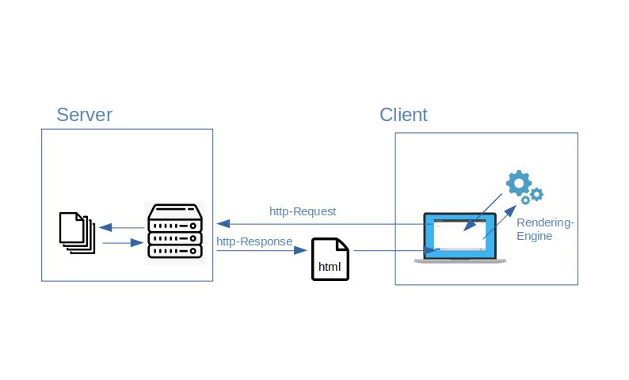

Derartige html-Seiten sind rein _statisch_, d.h. es ist keinerlei Interaktion seitens des Anwenders möglich. Jegliche Form von nicht-statischem Inhalt (Verarbeitung von Benutzereingaben, Animationen, etc.) erfordert die Ausführung eines _Programmes_. Konkret bedeutet dies, dass Programmcode *im* Webbrowser ausgeführt werden muss. Für diesen Zweck hat sich *JavaScript* als vorherrschende Programmiersprache etabliert. Diese ist eine *interpretierte* Sprache; der Code wird von der Javascript-Engine des Browsers eingelesen, und Zeile für Zeile abgearbeitet.

[.center.text-center]
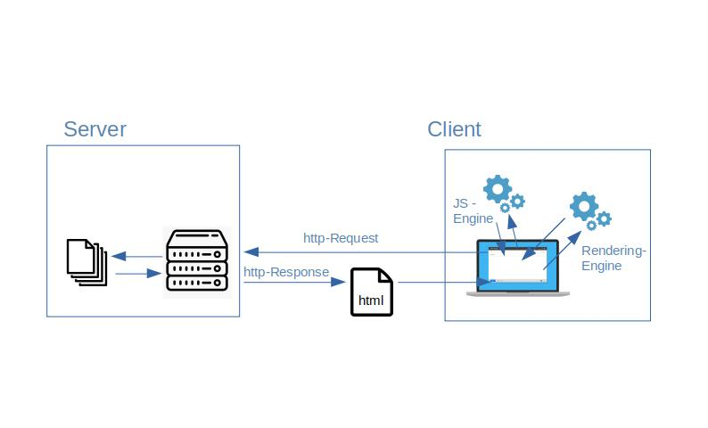

Eine typische Anwendung ist Änderungen im DOM-Tree (Domain Object Model) vorzunehmen. Der DOM ermöglicht alle Elemente (Eingabefelder, Textbereiche, Tags, Buttons) über Javascript anzusprechen. So können zum Beispiel Werte berechnet werden und die Ergebnisse in geeigneten Elementen dargestellt werden, oder Inhalte zu Tabellen hinzugefügt werden, u.v.m.

Bibliotheken wir *jQuery* ermöglichen u.A. einen vereinfachten Zugriff auf den DOM-Tree, vereinfachte Ereignisbehandlung, etc. In den letzten Jahren hat diese Bibliothek jedoch an Bedeutung verloren.

Bisher haben wir serverseitig rein statische Seiten (html-Dokumente) betrachtet. Bei Webanwendungen ist dies jedoch nicht ausreichend, es ist notwendig auch _serverseitig_ html-Seiten _dynamisch_ aufzubauen. Früher wurde hierfür oft `php` verwendet, dies ist auch heute noch oft in Verwendung, aber es gibt zahlreiche Alternativen. Der http-Request enthält dabei den Namen eines _Skriptes_ (also Programmes). Dieses wird nicht direkt an den aufrufenden Client weitergegeben, sondern zunächst _ausgeführt_. Die Ausgabe dieses Skriptes ist dann üblicherweise eine http-Seite (mit enthaltenem Javascript), die dann wieder an den Client zurückgeschickt wird.

[.center.text-center]
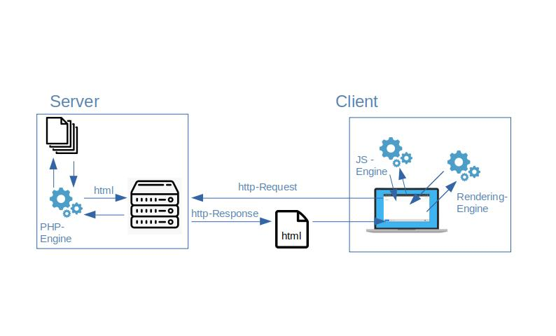

Wesentliche Motivation zur Ausführung von Skripten (Programmen) ist oftmals die Notwendigkeit auf _Datenbanken_ zuzugreifen. Ein Datenbankzugriff kann nicht direkt ausgehend von einer html-Seite erfolgen, es ist ein ausführbares Programm notwendig. In früheren Zeiten wurde das Ergebnis einer Datenbankabfrage dann oftmals in diesem Skript direkt in eine html-Tabelle eingetragen.

[.center.text-center]
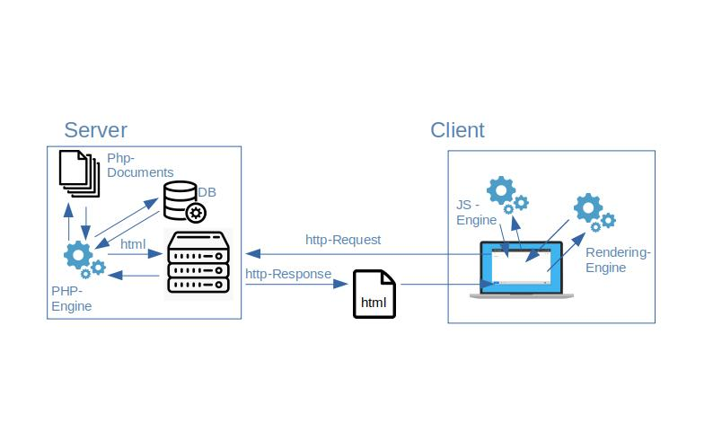

Mit diesen Techniken können grundsätzlich beliebige Webanwendungen erstellt werden. Im Frontend im Webbrowser können neue http-Aufrufe abgesetzt werden, der Server retourniert dann das nächste aufgerufene Formular, Tabelle o.Ä.; Jede Interaktion (die neue Daten beinhaltet) erfordert jedoch das komplette Neu-Laden der Webseite. Währenddessen ist zumindest bei langsamen Internetverbindungen kurz eine weisse Seite zu sehen. Diese flackert kurz zwischen der vorigen und nächsten Seite der Webanwendung auf. Dieses oft als "Flickering-Effekt" bezeichnete Verhalten erzeugt das tyische Look and Feel der 2000er Jahre, und wird manchmal als störend wahrgenommen.

Moderne Webanwendungen sind meist sogenannte *Single Page Applications*. Diese Laden nach entsprechender Benutzerinteraktion nur die Daten vom Server, nicht jedoch das Layout und die Struktur der Seite selbst. Dies geschieht mittels AJAX, also einem asynchronen Javascript-Aufruf. Dieser Aufruf wird vom Client abgesetzt, ohne dass der Programmfluss im Client unterbrochen wird. Sobald die Daten vom Server bereitgestellt sind, werden Sie wieder mit einer Javascript-Methode übernommen und in die bestehende Seite eingefügt. 

Das Format für den Transfer der Daten ist meist `json` (Java Object Script Notation). Dieses Format stellt eine einfache Variante dar, Daten von Objekten zu _serialisieren_, nämlich in einer rein textuellen Form. 

[.center.text-center]
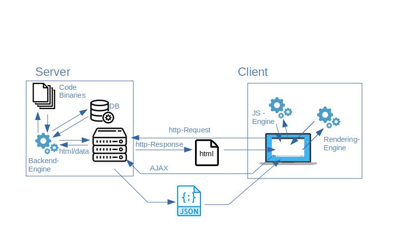

Als Schnittstellen zum Abrufen von Daten haben sich REST-Schnittstellen etabliert. REST steht für Representational State Transfer, und ist im wesentlichen eine *zustandslose* Schnittstelle, d.h. jede Anfrage ist unabhänig von etwaigen vorangeganenen Anfragen. Dies sind die optimalen Voraussetzungen dafür, dass viele Clients mit einem Backend am Server kommunizieren.

Man sieht, dass Webapplikationen im Vergleich zu Desktop-Anwendungen eine höhere Komplexität aufweisen. Dies resultiert einerseits aus der expliziten Client-Server-Architektur, und andererseits aus der höheren Anzahl der beteiligten Technologien: html, CSS, Javascript, evtl. jQuery, sowie Java (oder C#, oder node.js, oder PHP o.Ä.), REST, json, http etc. 

Sowohl im Backend als auch im Frontend ergeben sich zahlreiche immer wiederkehrende Aufgaben. Moderne Webanwendungen werden deshalb nahezu immer mittels *Frameworks* erstellt. Im Gegensatz zu Klassenbibliotheken geben Frameworks viel der Struktur der Programme vor. Während Bibliotheken üblicherweise dadurch verwendet werden, dass Objekte der enthaltenen Klassen erzeugt und verwendet werden, ist es bei Frameworks oft umgekehrt. Es werden Klassen gemäß bestimmter Vorgaben erstellt. Bei der Ausführung des Programmes übernimmt das Framework dann das Starten bzw. die Verwendung der selbst definierten Klassen.

Im *Backend-Bereich* hat sich *Spring* als Framework im Java-Bereich etabliert. Im Umfeld von C# kommt das Framework .NET zur Anwendung. Beide Frameworks bieten Unterstützung für wesentliche Aspekte wie: REST-Schnittstellen, Routing, Datenbankanbindung, Security etc. Beide Frameworks folgen dem _Inversion of Control_-Prinzip. Dieses besagt, dass Klassen nicht für die Erzeugung ihrer Abhängigkeiten selbst verantwortlich sein sollen. Derartige Abhängigkeiten werden stattdessen der jeweiligen Klasse (im Konstruktor) übergeben (Dependency Injection). Der eigentliche Programmablauf wird bei der Verwendung der Frameworks nur teilweise explizit ausprogrammiert. Bestimmte Klassen werden automatisch gefunden und entsprechend der Konfiguration miteinander verdrahtet. So wird beispielsweise innerhalb des Frameworks "automatisch" ein Webserver gestartet; als Programmierer erzeugt man nun spezielle Klassen welchen ein URL Pfad hinterlegt wird, mit entsprechenden Methoden zum Zugriff und/oder Modifikation der Daten. Das Framework sorgt beim Programmablauf dafür, dass beim Aufruf der entsprechenden URL dann Instanzen genau jener Klassen verwendet werden.

Im Bereich Java gibt es Java EE (Enterprise Edition) als Alternative zu Spring, bei Python haben sich Flusk und Django etabliert. Viele grundlegende Prinzipien und Funktionsweisen sind bei vielen Frameworks ähnlich gestaltet.

Auf der Frontendseite haben sich Frameworks wie Angular, React oder Vue etabliert. Diese Frameworks setzen auf Javascript auf (bzw. Typescript, eine typisierte Version von Javascript), und befassen sich primär mit dem Aspekt des Bindens der Daten an die Benutzeroberfläche (Template). 

Während diese Frameworks den Entwickler-Alltag bei der Umsetzung zahlreicher immer wiederkehrender Aufgaben erheblich erleichtern, entsteht jedoch eine relativ steile Lernkurve um moderne Webapplikationen (i.S.v. Single Page Applications) entwickeln zu können. 

Das im folgenden Abschnitt vorgestellte Vaadin-Flow Framework umgeht weite Teile dieser Komplexität, und ermöglicht es Webanwendungen nahezu ausschließlich mittels reinen Java-Objekten zu erstellen. Der Client-Server-Aspekt der Webanwendungen wird dabei für den Entwickler weitgehend transparent. Dennoch sind in Vaadin-Flow Anwendungen zahlreiche allgemeine Design-Prinzipien so umgesetzt, dass diese dann einfach auf andere Frameworks übertragen werden können. 

== Vaadin-Flow Framework

_"Vaadin is a web app development platform for Java. It helps you build reliable web apps with great UX faster than before"_  <<vad>>

_"Vaadin Flow is a unique full-stack framework that lets you build web apps without writing HTML or JavaScript."_ <<vad>>

[.center.text-center]

Auf dieser Seite ist auch unter `https://vaadin.com/docs/latest/tutorial` ein Tutorial zu finden. Ebenso befinden sich dort Anleitungen zu den entsprechenden Komponenten, zum "Styling", Routing, Datenanbindung, Security, Testen etc. Ebenso ist dort (im Menü links unten) die komplette API-Dokumentation (wie üblich als Javadoc) verlinkt: `https://vaadin.com/api/platform/23.3.6/index.html`.

Die vorliegende Version des Skriptums verwendet Version 23, wenngleich zu diesem Zeitpunkt schon ein Pre-Release der Version 24 existiert. Ein kleines Dropdown-Menü links oben ermöglicht ein einfaches Umschalten zwischen den jeweiligen Versionen.

// === Grundlagen

Wie schon in den vorangeganenen Zitaten erwähnt, ermöglicht Vaadin die Erstellung von Webanwendungen ohne die Verwendung von html, Javascript und zugehörigen Frameworks. Dies reduziert die Komplexität der Enwicklung erheblich, da nur eine Programmiersprache mit deren Werkzeugen und Bibliotheken beherrscht werden muss. Basierend auf den Java-Klassen des Vaadin-Projektes werden dann schließlich entsprechende html- und Javascript-Komponenten generiert. Natürlich bringt diese Vorgehensweise auch diverse Nachteile, wie beispielsweise reduzierte Flexibilität und Einschränkung auf diverse durch das Framework vorgegebene Funktionalitäten mit sich. 

Vaadin baut auf dem Spring-Framework <<spring>> auf. Das Spring Framework bietet Möglichkeiten zur Entwicklung von Backends für Webanwendungen. Es beinhaltet _Inversion of Control_ Mechanismen (Dependency Injection), unterstützt die Enwicklung von Schnittstellen (REST), Datenbankanbindung (JPA), Security u.v.m. 

=== Vaadin Start-Paket
Mittels der folgenden Webseite "https://start.vaadin.com/app" kann ein Startpaket für die Entwicklung eines Vaadin-Projektes erstellt werden. Nach einem Login auf die Seite können diverse Menüeinträge und vor-formatierte Seiten hinzugefügt werden. 

Für die folgenden Beispiele dieses Skriptums wird ein derartiges Paket `vaadin-step-1-template_v1.zip` zur Verfügung gestellt. Dieses "leichtgewichtige" Paket dient als Ausgangspunkt für alle weiteren Entwicklungen. Insbesondere enthält dieses Startpaket schon die Modell-Klassen zu unserem begleitenden Beispiel einer Mitarbeiterverwaltung einer Firma.

Die Datei `Application.java` ist der Startpunkt der Anwendung. 

[source, java]
----
@SpringBootApplication
@Theme(value = "company010")
@NpmPackage(value = "line-awesome", version = "1.3.0")
@NpmPackage(value = "@vaadin-component-factory/vcf-nav", version = "1.0.6")
public class Application implements AppShellConfigurator {

    public static void main(String[] args) {
        SpringApplication.run(Application.class, args);
    }

}
----

Die weiteren wichtigen Dateien sind die _Views_ `MainLayout.java` und `AboutView.java`. Erstere sieht wie folgt aus (und entspricht der mittels `https://start.vaadin.com/app` erstellten Variante:

[source, java]
----
public class MainLayout extends AppLayout {

    private H2 viewTitle;

    public MainLayout() {
        setPrimarySection(Section.DRAWER);
        addDrawerContent();
        addHeaderContent();
    }

    private void addHeaderContent() {
        DrawerToggle toggle = new DrawerToggle();
        toggle.getElement().setAttribute("aria-label", "Menu toggle");

        viewTitle = new H2();
        viewTitle.addClassNames(LumoUtility.FontSize.LARGE, LumoUtility.Margin.NONE);

        addToNavbar(true, toggle, viewTitle);
    }

    private void addDrawerContent() {
        H1 appName = new H1("Company - Step 1");
        appName.addClassNames(LumoUtility.FontSize.LARGE, LumoUtility.Margin.NONE);
        Header header = new Header(appName);

        Scroller scroller = new Scroller(createNavigation());

        addToDrawer(header, scroller, createFooter());
    }

    private AppNav createNavigation() {
        VerticalLayout nav = new VerticalLayout();
        nav.setSpacing(false); 
        nav.add(createNavItem("About", AboutView.class, VaadinIcon.FILE)); <.>
        return nav;
    }
    
    private RouterLink createNavItem(String label, Class<? extends Component> view, 
                                     VaadinIcon icon) 
    {
        RouterLink link = new RouterLink(view); <.>
        link.addClassName("nav-item");
        link.setHighlightCondition( HighlightConditions.locationPrefix()  );
        link.add( new Icon( icon ), new Text(" " + label));
        return link;
    }

    private Footer createFooter() {
        Footer layout = new Footer();
        return layout;
    }

    @Override
    protected void afterNavigation() {
        super.afterNavigation();
        viewTitle.setText(getCurrentPageTitle());
    }

    private String getCurrentPageTitle() {
        PageTitle title = getContent().getClass().getAnnotation(PageTitle.class);
        return title == null ? "" : title.value();
    }
}
----

<.> In dieser Zeile werden die Einträge im Navigations-Menü auf der linken Seite hinzugefügt. 
<.> Die Navigations-Links werden mittels der Klasse `RouterLink` erzeugt (dies ist eine Abweichung zum Template von `start.vaadin.com`).

Auch die Klasse `AboutView.java` entspricht weitgehend der generierten Version:

[source, java]
----
@PageTitle("About")
@Route(value = "about", layout = MainLayout.class)
@RouteAlias(value = "", layout = MainLayout.class)
public class AboutView extends VerticalLayout {

    public AboutView() {
        setSpacing(false);

        Image img = new Image("images/empty-plant.png", "placeholder plant");
        img.setWidth("200px");
        add(img);

        add(new H2("This place intentionally left empty"));
        add(new Paragraph("It’s a place where you can grow your own UI 🤗"));

        setSizeFull();
        setJustifyContentMode(JustifyContentMode.CENTER);
        setDefaultHorizontalComponentAlignment(Alignment.CENTER);
        getStyle().set("text-align", "center");

        TextField tf1 = new TextField(); <1>
        Button b1 = new Button("Press Button"); <2>
        b1.addClickListener(e -> showInfo(tf1.getValue())); <3>
        
        FormLayout formLayout = new FormLayout();
        formLayout.add(tf1, b1); <4>

        add(formLayout); <5>
    }

    private void showInfo(String text) { <6>
        Notification.show("Hello, " + text); <7> 

        Dialog dialog = new Dialog(); <8>
        dialog.setHeaderTitle("Hello");

        TextField tf = new TextField();
        tf.setValue(text);
        tf.setEnabled(false);
        dialog.add(tf);

        dialog.open(); <9>
    }

}
----

<1> Hier wird ein Eingabefeld (Textfeld) erzeugt
<2> Erzeugen eines Buttons
<3> Event-Behandlung mittels Lambda-Funktionalität
<4> Hinzufügen der Kontrollelemente Textfeld und Button zum Layout
<5> Hinzufügen des Layouts zur Seite
<6> Methode zur Behandlung des Ereignisses (Klick auf Button)
<7> Anzeige einer Benachrichtigung ("Notification")
<8> Ein Dialogfenster wird erzeugt
<9> Anzeigen des Dialoges

Diese Erklärungen sollen an dieser Stelle nur einen groben Überblick geben. Beim Starten der Anwendung sieht man in der Konsole zunächst das Hochstarten des Spring-Frameworks, und nach kurzer Zeit wird dann ein Webbrowser mit `localhost:8080` geöffnet, in dem die `AboutView` der Anwendung zu sehen ist.

[.center.text-center]
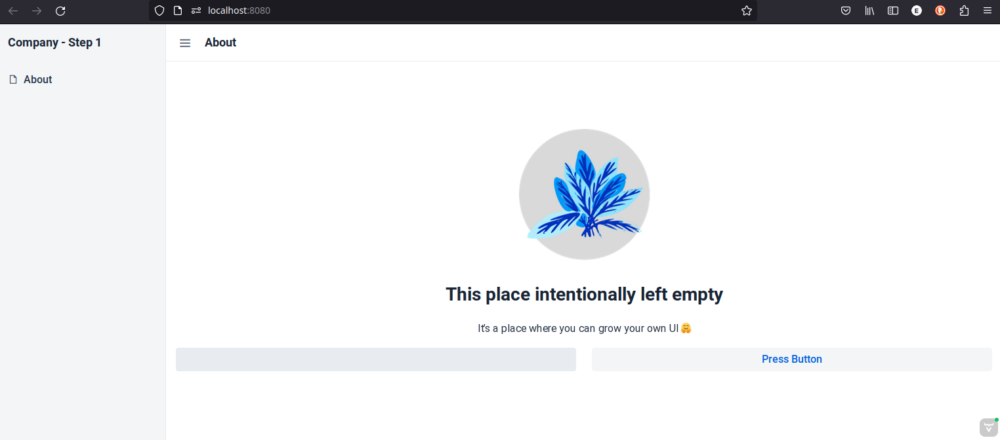

Bei Betätigung des Buttons "Press Button" wird der Inhalt des Textfeldes links davon in einer Benachrichtigung (Notification) links unten angezeigt, als auch in einem Dialogfenster.

[.center.text-center]
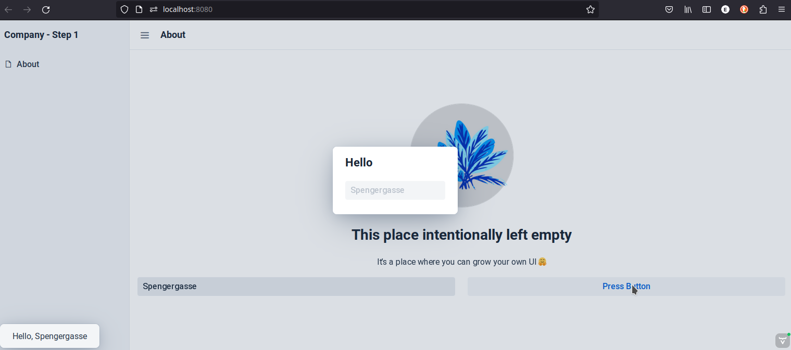

== Komponenten

Die wichtigsten Komponenten in Formularen von Benutzeroberflächen sind in der folgenden Tabelle (Quelle: `https://vaadin.com/docs/latest/components/input-fields#input-field-components`) aufgelistet.

[cols="1,1"]
|===
|*Component*
|*Usage recommendations*

|Text Field
|Basic single-line text input.

|Text Area
|Multi-line text input, for values that aren’t expected to fit on a single line, or when manual line breaks need to be supported.

|Email Field
|For email addresses.

|Number Field
|Numeric-only input, such as counts, measures, or monetary values.

|Password Field
|Optionally masked password entry.

|Date Picker
|Date entry with keyboard or a calendar picker.

|Time Picker
|Selecting a time of day; resolution range from hours to milliseconds.

|Date Time Picker
|Combined date and time entry.

|Radio Button
Select a single option from a list. Optimal accessibility, as all options are visible without any user action.

|Select
Select a value from an overlay. More compact than Radio Buttons.

|Combo Box
|Select a value from a filterable overlay. Appropriate for large sets of options. Supports lazy loading and entry of custom values.

|Checkbox
|For selecting multiple options from a list, or a single binary toggle.

|===

Die folgenden Bilder sind ebenso von `https://vaadin.com/docs/latest/components` übernommen, und stellen die Komponenten dar, so wie sie auch im Formular der Anwendung erscheinen. 

[.center.text-center]
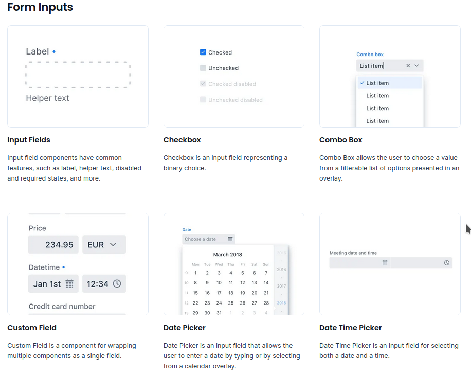

[.center.text-center]
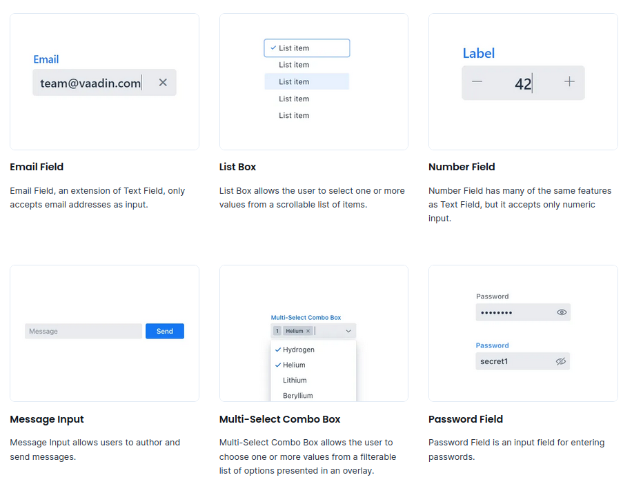

[.center.text-center]
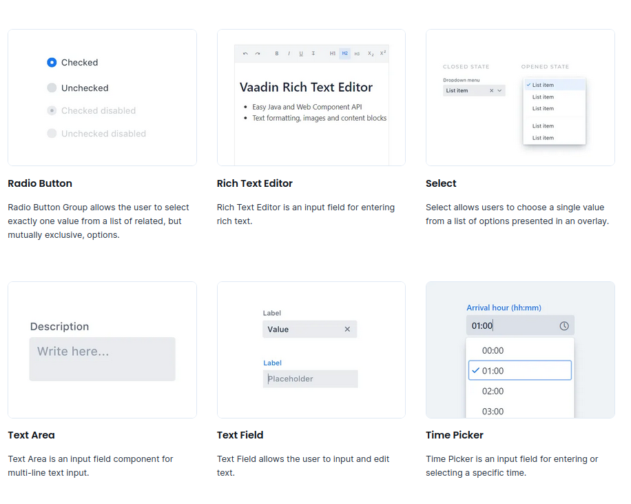

Die bisher vorgestellten Komponenten fallen in die Kategorie der Eingabeelemente (Input Components). Es gibt zahlreiche weitere Komponenten, wie zum Beispiel Tabellen/Baumdarstellungen, Karteikarten, oder Fortschrittsbalken:

[.center.text-center]
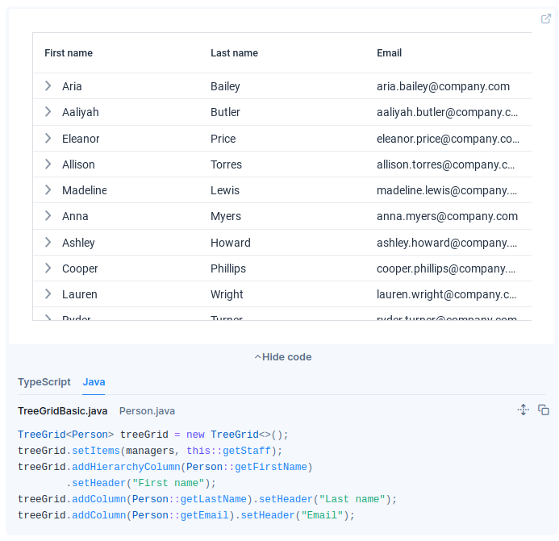

[.center.text-center]
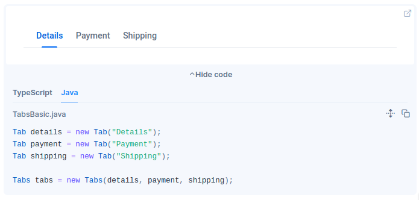

[.center.text-center]
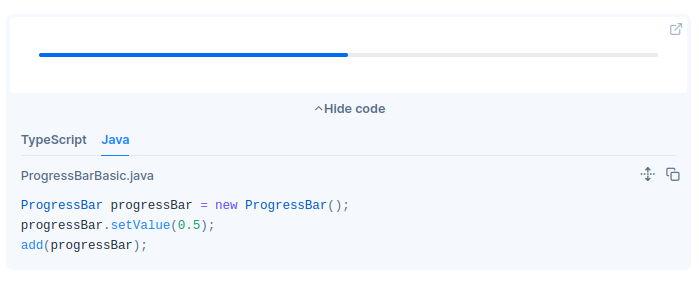

Bevor wir Formulare und Tabellen näher betrachten, wenden wir uns zunächst den *Layout*-Komponenten zu.

== Layouts

Layouts bieten die Möglichkeit die Eingabeelemente in der Webanwendung geeignet zu positionieren. Die Herausforderung hierbei ist, Layouts zu gestalten, die auf unterschiedlich großen Bildschirmen sinnvoll skalierend dargestellt werden. Beim Vergrößern und Verkleinern sollen die Kontrollelemente sinnvoll mit verschoben bzw. neu angeordnet werden. 

Die Gestaltung von Benutzeroberflächen (insbesondere Formularen) erfolgt dadurch, dass Kontrollelemente in Layouts verankert werden, verschiedene Layouts können wiederum ineinander geschachtelt werden. Die Darstellung der wesentlichen Layouts folgt jener in `https://vaadin.com/docs/latest/components/basic-layouts`.

Das *Vertical Layout* ordnet seine Elemente in einer Spalte von oben nach unten an. Die Breite ist stets 100%, die Höhe richtet sich nach der Anzahl der enthaltenen Elemente sowie Einschränkungen etwaiger übergeordneter Layouts.

[source, java]
----
VerticalLayout layout = new VerticalLayout();
layout.add(new Button("Button 1"));
layout.add(new Button("Button 2"));
layout.add(new Button("Button 3"));
layout.add(new Button("Button 4"));
----

[.center.text-center]
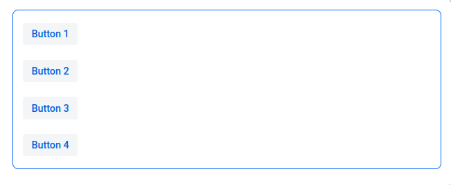

Ebenso können Elemente horizontal angeordnet werden:

[source, java]
----
HorizontalLayout layout = new HorizontalLayout();
layout.setPadding(true);
layout.add(new Button("Button 1"));
layout.add(new Button("Button 2"));
layout.add(new Button("Button 3"));
layout.add(new Button("Button 4"));
----

[.center.text-center]
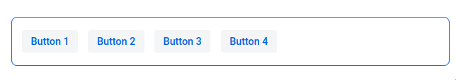

Die Ausrichtung innerhalb des Layout-Containers kann mittels der Methode

[source, java]
----
layout.setAlignItems(alignment);
----

festgelegt werden, die Werte des Parameters sind: `STRETCH` (default), `START`, `CENTER`, `END`, `BASELINE`. 

// Die Abstände der Elemente zueinander können mittels `layout.setSpacing`, der Abstand zum Rand mittels `layout.setPadding`. 
// Der Abstand des Layout-Containers selbst zu den übergeordneten Layouts wird mittels `layout.setMargin` festgelegt.

Das *Form-Layout* ermöglicht die Erstellung von _responsive Designs_ für Formulare. Dies bedeutet, dass Eingabefelder beispielsweise auf großen Bildschirmen nebeneinander angeordnet werden sollen, während sie auf kleinen Bildschirmen eher untereinander dargestellt werden sollen. 

[source, java]
----
TextField firstName = new TextField("First name");
TextField lastName = new TextField("Last name");
TextField username = new TextField("Username");
PasswordField password = new PasswordField("Password");
PasswordField confirmPassword = new PasswordField("Confirm password");

FormLayout formLayout = new FormLayout();
formLayout.add(firstName, lastName, username, password,
        confirmPassword);
formLayout.setResponsiveSteps(
        // Use one column by default
        new ResponsiveStep("0", 1),
        // Use two columns, if layout's width exceeds 500px
        new ResponsiveStep("500px", 2));
// Stretch the username field over 2 columns
formLayout.setColspan(username, 2);
----

Auf einem normalen Bildschirm wird dieses Formular wie folgt dargestellt:

[.center.text-center]
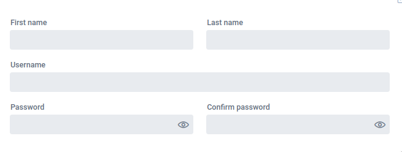

Beim Verkleinern des Fensters ändert sich die Anordnung zu:

[.center.text-center]
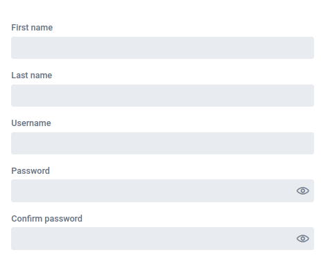

== Tabellen

Die Darstellung von Daten in Tabellen erfolgt mittels des `Grid` s.

[source, java]
----
Grid<Person> grid = new Grid<>(Person.class, false);
grid.addColumn(Person::getFirstName).setHeader("First name");
grid.addColumn(Person::getLastName).setHeader("Last name");
grid.addColumn(Person::getEmail).setHeader("Email");
grid.addColumn(Person::getProfession).setHeader("Profession");

List<Person> people = DataService.getPeople(); <1>
grid.setItems(people);
----

<1> Die Klasse `DataService` ist hier eine fiktive Klasse die die eine Liste an `Person` en liefert.

[.center.text-center]
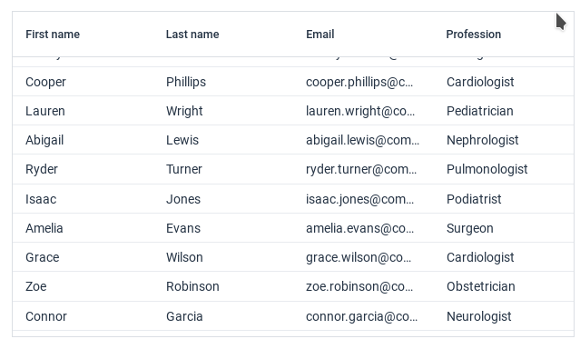

== Navigation und Routing

Dieser Abschnitt befasst sich mit der Navigation zwischen einzelnen Views der Anwendung. Hierzu existieren mehrere Varianten. Möchte man direkt zu der View einer bestimmten Klass navigieren, so ist dies mittels

[source, java]
----
    UI.getCurrent().navigate(MyView.class, 18));
----

möglich. Mittels `MyView.class` wird eine Referenz auf die entsprechende Klasse (die von `Div` ableitet) angegeben. Danach können weitere Parameter angegeben werden, in diesem Fall eine Id (18). Diese Id wird dann von der Methode 

[source, java]
----
@Override
public void setParameter(BeforeEvent event,
                         @OptionalParameter Long id) 
{
    // ...
}
----

in der Klasse `MyClass` übernommen. Diese muss das Interface `HasUrlParameter<T>` implementieren, wobei `T` dem Typ des Parameters entspricht (in diesem Fall `Long`).

Oftmals soll eine View mittels URL verfügbar gemacht werden. Mittels der `@Route`-Annotation kann die URL zu einer Komponente angegeben werden. Diese ist nun über `some/path` (angehängt an die URL der Anwendung, in unserem Fall `http://localhost:8080/`) erreichbar.

[source, java]
----
@Route("some/path")
public class SomePathComponent extends Div {
    public SomePathComponent() {
        setText("Hello @Route!");
    }
}
----

Aus der Anwendung heraus können solche Views mittels

[source, java]
----
getUI().ifPresent(ui -> ui.getPage().setLocation("some/path?id=" + something.getId()));
----

aufgerufen werden. Die entsprechenden Parameter müssen dann in der `setParameter`-Methode ausgelesen werden. 

[source, java]
----
@Override
public void setParameter(BeforeEvent event,
                         @OptionalParameter String parameter) 
{
    // TODO: Exception handling
   
    QueryParameters queryParameters = event.getLocation()
                                            .getQueryParameters();
    List<String> paramList = queryParameters.getParameters().get("id");
    if (paramList != null && !paramList.isEmpty()) {
        int id = paramList.get(0);
        // do something to prepare data with id 
    }
}
----

== Data Binding

In Views sollen meist bereits bestimmte Datensätze angezeigt werden (sofern nicht ein neuer Datensatz angelegt werden soll). Betrachten wir den Fall, dass Daten aus einem `Employee`-Objekt in ein entsprechendes Formular eingetragen werden sollen. Man *könnte* hierzu wie folgt vorgehen (diese Variante hat jedoch erhebliche Nachteile): 

[source, java]
----
public class EmployeeFormView // ... 
{

    private TextField firstName = new TextField("First name");
    private TextField lastName = new TextField("Last name");

    // ...
    
    private void readData(Employee emp) {
        firstName.setValue(emp.getFirstName());
        lastName.setValue(emp.getLastName());
    }
    
    // ...
    
    private void storeData(Employee emp) {
        emp.setFirstName(firstName.getValue());
        emp.setLastName(lastName.getValue());
    }
    
}
----

Die Methoden `readData` und `storeData` würden zu Beginn die Daten der Instanz in das Formular eintragen, die Methode `storeData` würde nach Veranlassen des Speicherns der Daten durch den Benutzer die Daten aus dem Formular in die Instanz zurückspeichern. Hier entsteht jedoch (bei vielen Attributen) jede Menge Code. Alle Änderungen müssten an vielen Stellen konsistent nachgezogen werden. Die zugrundeliegende Logik ist aber oftmals gleich. Die besser Umsetzung ist deshalb die Verwendung von *Bindings*. 

Die Klasse `Binder` kann für `Employee` s wie folgt instanziiert werden:

[source, java]
----
Binder<Employee> binder = new Binder<>(Employee.class);
----

Mittels `Binder` können die Daten attributweise an die entsprechenden Elemente gebunden werden. Mittels `binder.readBean(employee)` werden die Daten aus aus der Employee-Instanz eingelesen und in die Formularelemente eingetragen, mittels `binder.writeBean(employee)` wird umgekehrt der Formularinhalt wieder in die Instanz eingetragen. Alternativ zum attributweisen binden der Daten, kann die Instanz mittels `binder.bindInstanceFields(this)` gesamt an alle Felder der Komponente gebunden werden, sofern deren Namen und Datentypen eine ausreichende Übereinstimmung aufweisen.

== Code-Beispiel: Mitarbeiterverwaltung

In diesem Codebeispiel wird eine vollständige Webanwendung unter Verwendung der Modell-Klassen `Company` und `Employee` vorgestellt. Im _Company-Form_ können der Firmenname, sowie die Adresse geändert werden. Ebenso können alle Daten in eine Textdatei gespeichert werden, oder diese aus der Datei gelesen werden.

[.center.text-center]
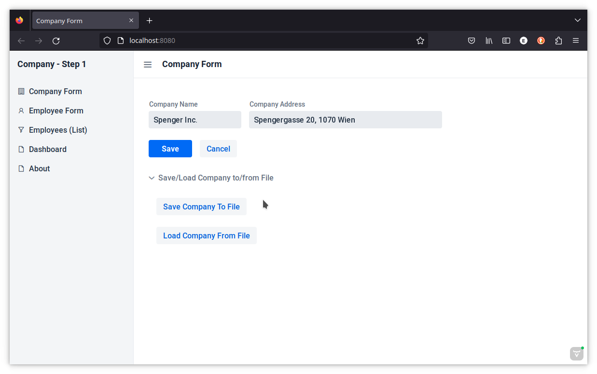

In _Employees_ wird eine Tabelle aller Mitarbeiter angezeigt. Klick auf den roten Mistkübel löscht den entsprechenden Mitarbeiter, Klick auf den grünen Stift navigiert zur Detail-Ansicht des Mitarbeiters.

[.center.text-center]
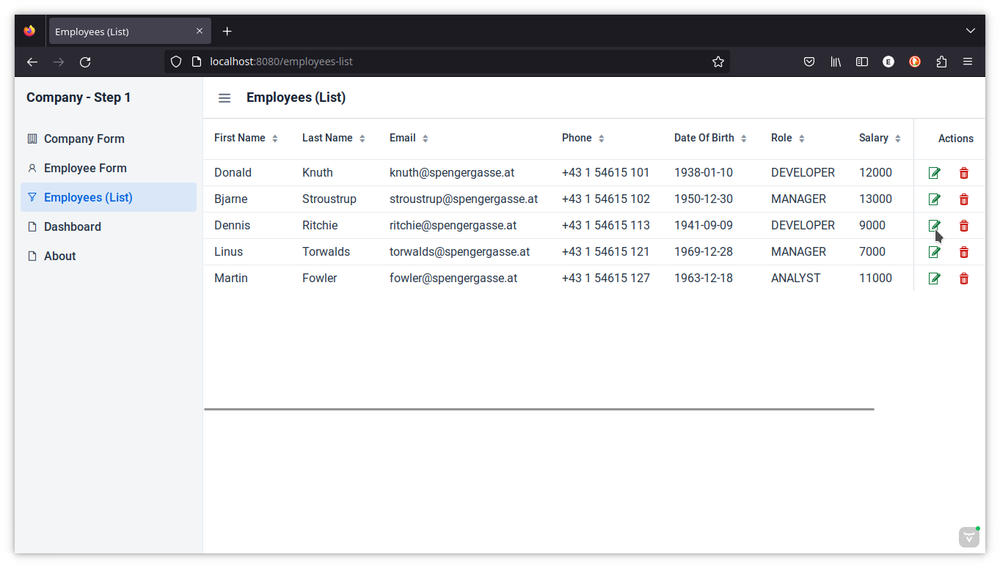

In dieser Detail-Ansicht (Employee-Form) können die einzelnen Attribute des Mitarbeiters komfortabel editiert werden. Die Buttons ermöglichen das Speichern oder Verwerfen dieser Änderungen

[.center.text-center]
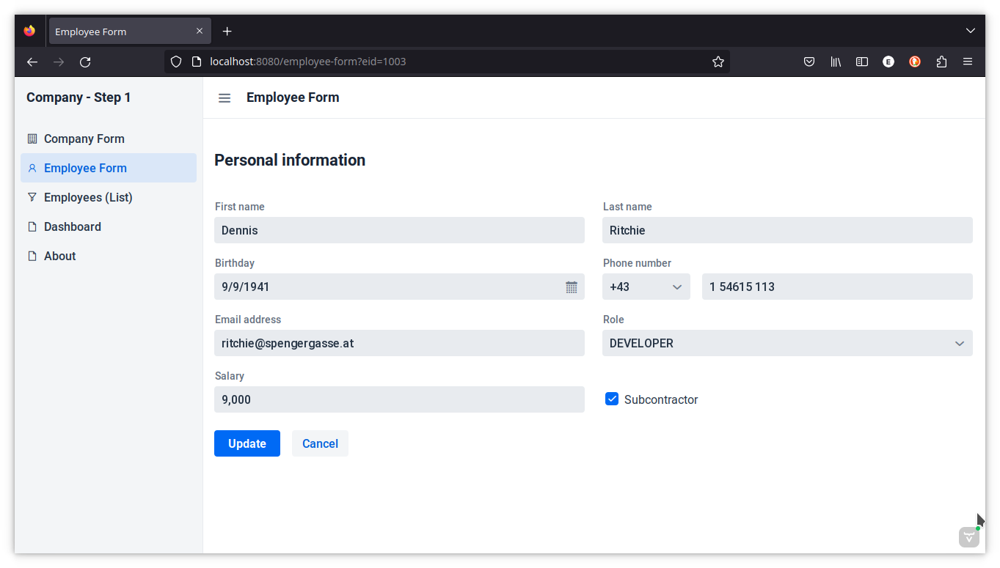

Um diese Views zum Template hinzuzufügen, müssen (geringe) Änderungen in `MainLayout` vorgenommen werden.

[source, java]
----
public class MainLayout extends AppLayout {

    private H2 viewTitle;

    public MainLayout() {
        setPrimarySection(Section.DRAWER);
        addDrawerContent();
        addHeaderContent();
    }

    private void addHeaderContent() {
        DrawerToggle toggle = new DrawerToggle();
        toggle.getElement().setAttribute("aria-label", "Menu toggle");

        viewTitle = new H2();
        viewTitle.addClassNames(LumoUtility.FontSize.LARGE, LumoUtility.Margin.NONE);

        addToNavbar(true, toggle, viewTitle);
    }

    private void addDrawerContent() {
        H1 appName = new H1("Company - Step 1");
        appName.addClassNames(LumoUtility.FontSize.LARGE, LumoUtility.Margin.NONE);
        Header header = new Header(appName);

        Scroller scroller = new Scroller(createNavigation());

        addToDrawer(header, scroller, createFooter());
    }

    private Component createNavigation() {
        VerticalLayout nav = new VerticalLayout();
        nav.setSpacing(false);
        nav.add( <1>
                createNavItem("Company Form", CompanyForm.class, VaadinIcon.BUILDING),
                createNavItem("Employee Form", EmployeeFormView.class, VaadinIcon.USER),
                createNavItem("Employees (List)", EmployeeList.class, VaadinIcon.FILTER),
                createNavItem("About", AboutView.class, VaadinIcon.FILE)
        );
        return nav;
    }

    private RouterLink createNavItem(String label, Class<? extends Component> view, 
                                     VaadinIcon icon) 
    {
        RouterLink link = new RouterLink(view);
        link.addClassName("nav-item");
        link.setHighlightCondition(HighlightConditions.locationPrefix());
        link.add(new Icon( icon ), new Text(" " + label));
        return link;
    }

    private Footer createFooter() {
        Footer layout = new Footer();
        return layout;
    }

    @Override
    protected void afterNavigation() {
        super.afterNavigation();
        viewTitle.setText(getCurrentPageTitle());
    }

    private String getCurrentPageTitle() {
        PageTitle title = getContent().getClass().getAnnotation(PageTitle.class);
        return title == null ? "" : title.value();
    }
}

----

<1> Hinzufügen der Views

[source, java]
----
@PageTitle("Company Form")
@Route(value = "company", layout = MainLayout.class)
@RouteAlias(value = "", layout = MainLayout.class)
public class CompanyForm extends VerticalLayout {

    private TextField companyName;
    private TextField companyAddress;

    private Binder<Company> binder = new Binder<>(Company.class); <.>

    private Details fileHandling; <.>
    private Button saveCompanyToFile;
    private Upload loadCompanyFromFile; <.> 

    MultiFileMemoryBuffer buffer = new MultiFileMemoryBuffer(); <.>

    private Button save = new Button("Save");
    private Button cancel = new Button("Cancel");

    public CompanyForm() {
        createLayout();
        addHandlers();

        binder.bindInstanceFields(this);
        binder.readBean(Company.getInstance());
    }

    public void createLayout() {
        companyName = new TextField("Company Name");
        companyAddress = new TextField("Company Address");
        companyAddress.setWidth(300, Unit.POINTS);

        HorizontalLayout buttons = new HorizontalLayout();
        buttons.add(save, cancel);

        HorizontalLayout companyDetails = new HorizontalLayout();
        companyDetails.add(companyName, companyAddress);

        save.addThemeVariants(ButtonVariant.LUMO_PRIMARY);

        saveCompanyToFile = new Button("Save Company To File");
        // loadCompanyFromFile = new Button("Load Company From File");

        loadCompanyFromFile = new Upload(buffer);

        VerticalLayout fileHandlingLayout = new VerticalLayout();
        fileHandlingLayout.add(saveCompanyToFile,
                               new Paragraph("Load company from file"),
                               loadCompanyFromFile);
        fileHandling = new Details("Save/Load Company to/from File", fileHandlingLayout);
        fileHandling.setOpened(false);

        setMargin(true);
        //setVerticalComponentAlignment(Alignment.END);

        add(companyDetails, buttons, fileHandling);
    }

    public void addHandlers() {
        save.addClickListener(e -> saveCompanyFields());
        save.addClickShortcut(Key.ENTER);

        cancel.addClickListener(e -> cancelCompanyFieldsEdit());
        cancel.addClickShortcut(Key.ESCAPE);

        saveCompanyToFile.addClickListener(e -> saveCompanyToFile());
       //  loadCompanyFromFile.addClickListener(e -> loadCompanyFromFile());
        loadCompanyFromFile.addSucceededListener(e -> loadCompanyFromFile(e)); <.>
    }

    private void cancelCompanyFieldsEdit() {
        System.out.println("company instance: " + Company.getInstance());
        binder.readBean(Company.getInstance());
    }

    private void saveCompanyFields() {
        UIFactory.showNotification("Saving company name and address ... ");
        boolean error = false;
        try {
            Company.getInstance().setCompanyName(companyName.getValue());
        } catch (CompanyException e) {
            error = true;
            UIFactory.showNotification(e.getMessage());
        }

        try {
            Company.getInstance().setCompanyAddress(companyAddress.getValue());
        } catch (CompanyException e) {
            error = true;
            UIFactory.showNotification(e.getMessage());
        }

        if (!error) {
            binder.readBean(Company.getInstance());
            UIFactory.showNotification("Company name and address saved. ");
        }
    }

    private void loadCompanyFromFile(SucceededEvent event) {
        UIFactory.showNotification("Loading company from csv...");
        String fileName = event.getFileName();
        UIFactory.showNotification("Uploaded file: " + fileName);
        InputStream inputStream = buffer.getInputStream(fileName);
        try {
            Company.loadFromFile(inputStream);
            binder.setBean(Company.getInstance());
            UIFactory.showNotification("Company successfully loaded from "
                    + fileName);
        } catch (CompanyException e) {
            UIFactory.showNotification(e.getMessage());
        }
    }

    private void loadCompanyFromLocalFile() {
        final String filename = "company.csv";
        try {
            Company.loadFromFile(filename);
            binder.setBean(Company.getInstance());
            UIFactory.showNotification("Company successfully loaded from " + filename);
        } catch (CompanyException e) {
            UIFactory.showNotification(e.getMessage());
        }
    }

    private void saveCompanyToFile() {
        // TODO make filename selectable
        final String filename = "company.csv";
        try {
            UIFactory.showNotification("Saving company to csv...");

            Company.getInstance().writeToFile(filename);
            UIFactory.showNotification("Company saved to " + filename);
        } catch (CompanyException e) {
            UIFactory.showNotification(e.getMessage());
        }
    }

}
----

<.> Der Binder bindet die Company-Felder an die GUI-Elemente.
<.> Details ist ein ein- und ausklappbares Layout.
<.> Die Klasse `Upload` bietet die Funktionaliät für den File-Upload an.
<.> Der `MultiFileMemoryBuffer` wird für den Upload benötigt.
<.> Event-Handling für den erfolgreichen Datei-Upload. 

Im Folgenden betrachten wir die Implementierung von  `EmployeeFormView`. Die Klasse wird zum Editieren und Neu-Anlegen von Employees verwendet. Somit soll es möglich sein, von der Liste der Mitarbeiter zu einem konkreten Mitarbeiter zu navigieren. Dies erfolgt über die URL (Annotation `@Route(value = "employee-form", layout = MainLayout.class)`) mittels der ID als Parameter.

Die Implementierung des Interfaces `HasUrlParameter<Long>` erzwingt das Vorhandensein der Methode `public void setParameter(BeforeEvent event, @OptionalParameter Long eId)`. Der Parameter `@OptionalParameter` muss in diesem Fall auf optional gesetzt werden, da das Formular auch ohne Vorhandensein einer ID sinnvoll verwendet werden kann (Neu-Anlegen eines Employees).

[source, java]
----

@PageTitle("Employee Form")
@Route(value = "employee-form", layout = MainLayout.class) <.>
@Uses(Icon.class)
public class EmployeeFormView extends VerticalLayout implements HasUrlParameter<Long> { <.>

    // -- UI-Components ------------------------------------------------------------
    private TextField firstName = new TextField("First name");
    private TextField lastName = new TextField("Last name");
    private EmailField email = new EmailField("Email address");
    private PhoneNumberField phone = new PhoneNumberField("Phone number"); <.>
    private DatePicker dateOfBirth = new DatePicker("Birthday");
    private ComboBox<Employee.Role> role = new ComboBox<>("Role");
    private TextField salary = new TextField("Salary");
    private Checkbox subcontractor = new Checkbox("Subcontractor");

    private Button cancel = new Button("Cancel");
    private Button save = new Button("Save");

    // -- Model-Class ------------------------------------------------------------
    private Employee employee;

    // -- Binder -----------------------------------------------------------------
    private Binder<Employee> binder = new Binder<>(Employee.class);

    // -- CONSTRUCTOR -------------------------------------------------------------

    public EmployeeFormView() {
        init();
    }

    // -- AUSLESEN PARAMETER ------------------------------------------------------
    @Override
    public void setParameter(BeforeEvent event, @OptionalParameter Long eId) { <.>
        if (eId != null) { <.>
            readBean(loadOrCreateEmployee(eId));
        } else {
            readBean(new Employee());
        }
    }

    private Employee loadOrCreateEmployee(Long eId) { <.>
        try {
            return Company.getInstance().getEmployee(eId);
        } catch (CompanyException e) {
            UIFactory.error("Error on loading employee.", e);
        }
        return new Employee();
    }

    private void init() {
        initUI();
        initActions();
        readBean(new Employee());
    }

    // -- BOOTSTRAP -------------------------------------------------------
    private void readBean(Employee employee) { <.>
        if (employee.getId() == null) {
            save.setText("Hire Employee");
        } else {
            save.setText("Update");
        }

        this.employee = employee;
        binder.bindInstanceFields(this);

        // read from employee
        binder.readBean(this.employee);
    }

    private void initUI() {
        addClassName("employee-form-view");
        setSizeFull();
        add(createTitle());
        add(createFormLayout());
        add(createButtonLayout());

        role.setItems(Employee.Role.values());
    }

    private void initActions() {
        cancel.addClickListener(e -> onCancel());
        save.addClickListener(e -> onSave());
    }

    private Component createTitle() {
        return new H3("Personal information");
    }

    private Component createFormLayout() {
        FormLayout formLayout = new FormLayout();
        email.setErrorMessage("Please enter a valid email address");
        formLayout.add(firstName, lastName, dateOfBirth, phone, email,
                        role, salary, subcontractor);
        return formLayout;
    }

    private Component createButtonLayout() {
        HorizontalLayout buttonLayout = new HorizontalLayout();
        buttonLayout.addClassName("button-layout");
        save.addThemeVariants(ButtonVariant.LUMO_PRIMARY);
        buttonLayout.add(save);
        buttonLayout.add(cancel);
        return buttonLayout;
    }

    // -----------------------------------------------------------------------------

    // -- ACTIONS ------------------------------------------------------------------
    private void onCancel() {
        UIFactory.showConfirm(
                "Discard changes?",
                "Are you sure you want to discard potential changes in this object?",
                e -> getUI().ifPresent(ui -> ui.navigate(EmployeeList.class))
        );
    }

    private void onSave() {
        try {
            // write to employee
            binder.writeBean(employee);
            if (employee.getId() == null) { // insert
                Company.getInstance().hire(employee);
                UIFactory.showNotification("Employee " + employee.getLastName()
                                           + " successfully hired.");
                readBean(new Employee());
            } else { // update
                UIFactory.showNotification("Employee " + employee.getLastName()
                                            + " saved successfully.");
                getUI().ifPresent(ui -> ui.navigate(EmployeeList.class));
            }
        } catch (ValidationException e) {
            UIFactory.error("Validation error", e);
        } catch (Exception e) {
            UIFactory.error("Unexpected error", e);
        }
    }

}

----

<.> Definition des URL-Pfades, über den dieses Formular erreichbar ist.
<.> Implementierung des Interface `HasUrlParameter<Long>` zur Behandlung der URL-Parameter
<.> Hier wird mittels Vererbung eine eigene Komponente für Telefonnummern und deren Vorwahlen erstellt.

<.> Implementierung der Methode `setParameter` des Interfaces `HasUrlParameter<Long>` zur Behandlung der URL-Parameter
<.> Hier wird entschieden ob es einen zu editierenden Employee gibt (ID vorhanden), oder ein neuer Employee angelegt werden soll. 
<.> `loadOrCreateEmployee` stellt sicher, dass auch im Fehlerfall (Mitarbeiter mit dieser ID nicht vorhanden) eine gültige Instanz vorhanden ist.
<.> Die Methode `readBean` verwendet im Wesentlichen den `Binder` um die Daten aus der Modell-Klasse auszulesen. Vorher muss eine Fallunterscheidung für den Button-Namen getroffen werden. 

Die Klasse `PhoneNumberField` ist hier als Beispiel für die Möglichkeit maßgeschneiderte Komponenten zu erstellen angeführt, wir jedoch nicht weiter erläutert.

[source, java]
----
public class PhoneNumberField extends CustomField<String> {
    private ComboBox<String> countryCode = new ComboBox<>();
    private TextField number = new TextField();

    public PhoneNumberField(String label) {
        setLabel(label);
        countryCode.setWidth("120px");
        countryCode.setPlaceholder("Country");
        countryCode.setAllowedCharPattern("[\\+\\d]");
        countryCode.setItems("+43", "+91", "+62", "+98", "+964", 
                             "+353", "+44", "+972", "+39", "+225");
        countryCode.addCustomValueSetListener(
                        e -> countryCode.setValue(e.getDetail()));
        number.setAllowedCharPattern("\\d");
        HorizontalLayout layout = new HorizontalLayout(countryCode, number);
        layout.setFlexGrow(1.0, number);
        add(layout);
    }

    @Override
    protected String generateModelValue() {
        if (countryCode.getValue() != null && number.getValue() != null) {
            String s = countryCode.getValue() + " " + number.getValue();
            return s;
        }
        return "";
    }

    @Override
    protected void setPresentationValue(String phoneNumber) {
        String[] parts = phoneNumber != null 
                         ? phoneNumber.split(" ", 2) : new String[0];
        if (parts.length == 1) {
            countryCode.clear();
            number.setValue(parts[0]);
        } else if (parts.length == 2) {
            countryCode.setValue(parts[0]);
            number.setValue(parts[1]);
        } else {
            countryCode.clear();
            number.clear();
        }
    }
}
----

Die Klasse `EmployeeList` erzeugt eine Tabelle mit allen Mitarbeitern.   

[source, java]
----
@PageTitle("Employees (List)")
@Route(value = "employees-list", layout = MainLayout.class)
@Uses(Icon.class)
public class EmployeeList extends Div {

    private Grid<Employee> grid;

    public EmployeeList() {
        setSizeFull();
        addClassNames("employees-list-view");
        add(createGrid());
    }

    private Component createGrid() {
        grid = new Grid<>(Employee.class, false); <.>
        grid.addColumn("firstName").setAutoWidth(true);
        grid.addColumn("lastName").setAutoWidth(true);
        grid.addColumn("email").setAutoWidth(true);
        grid.addColumn("phone").setAutoWidth(true);
        grid.addColumn("dateOfBirth").setAutoWidth(true);
        grid.addColumn("role").setAutoWidth(true);
        grid.addColumn("salary").setAutoWidth(true);
        grid.addColumn("subcontractor").setAutoWidth(true);
        
        grid.addComponentColumn((ValueProvider<Employee, Component>) employee -> { <.>
                    HorizontalLayout actionLayout = new HorizontalLayout();
                    Button editButton = new Button(new Icon(VaadinIcon.EDIT));
                    editButton.addClickListener(e -> edit(employee));
                    editButton.addThemeVariants(ButtonVariant.LUMO_SMALL, 
                                                ButtonVariant.LUMO_TERTIARY_INLINE,
                                                ButtonVariant.LUMO_SUCCESS);
                    Button deleteButton = new Button(new Icon(VaadinIcon.TRASH));
                    deleteButton.addThemeVariants(ButtonVariant.LUMO_SMALL, 
                                                ButtonVariant.LUMO_TERTIARY_INLINE,
                                                ButtonVariant.LUMO_ERROR);
                    deleteButton.addClickListener(e -> delete(employee));
                    actionLayout.add(editButton, deleteButton);
                    return actionLayout;
                }).setHeader("Actions")
                .setWidth("100px")
                .setTextAlign(ColumnTextAlign.END)
                .setFrozenToEnd(true)
                .setAutoWidth(true).setFlexGrow(0);

        grid.setItems(Company.getInstance().getStaff()); <.>

        grid.addThemeVariants(GridVariant.LUMO_NO_BORDER);
        grid.addClassNames(LumoUtility.Border.TOP, LumoUtility.BorderColor.CONTRAST_10);

        return grid;
    }

    private void delete(Employee employee) {
        try {
            Company.getInstance().fire(employee); <.>
            refreshGrid();
            Notification.show("Employee" + employee + " removed from the company!");

        } catch (CompanyException e) {
            Notification.show("Error: " + e.getMessage());
        }
    }

    private void edit(Employee employee) {
        getUI().ifPresent(ui -> ui.navigate(EmployeeFormView.class, employee.getId())); <.>
    }

    private void refreshGrid() { <.>
        grid.setItems(Company.getInstance().getStaff());
    }

}

----

<.> Die gewünschten anzuzeigenden Spalten werden in den folgenden Codezeilen hinzugefügt.
<.> Eine Component-Column ist eine Spalte, die Komponenten enthält. In diesem Fall sind das der Button zum Detail-Editieren des Mitarbeiters, bzw. zum Löschen. 
<.> Hinzufügen der Mitarbeiter der Firma zum Grid.
<.> Beim Löschen wird zunächst der Mitarbeiter aufgrund der Referenz aus der Firma gelöscht. Anschließend muss `refreshGrid` aufgerufen werden, dass die Änderung sofort sichtbar wird.
<.> Der Event-Handler zum Editieren navigiert zum `EmployeeFormView`, wobei die ID als Parameter übergeben wird.
<.> In der `refreshGrid`-Methode werden die Mitarbeiter neu ins Grid gesetzt um das neue Rendern der Seite anzustossen.

Die Klasse `UIFactory` bietet einige wiederkehrende Aspekte, wie die Darstellung von Dialogen und Notifications an.

[source, java]
----
public class UIFactory {

    private UIFactory() {

    }

    public static void showNotification(String msg) {
        Notification.show(msg);
    }

    public static void showError(Throwable throwable) {
        ConfirmDialog dialog = new ConfirmDialog();
        dialog.setHeader("Error!");
        dialog.setText(throwable.getMessage());
        dialog.setCancelable(false);
        dialog.setConfirmText("OK");
        dialog.open();
    }

    public static void showConfirm(String header, String text,
                                   ComponentEventListener<ConfirmDialog.ConfirmEvent> listener)
    {
        ConfirmDialog dialog = new ConfirmDialog();
        dialog.setHeader(header);
        dialog.setText(text);
        dialog.setCancelable(true);
        dialog.setConfirmText("Confirm");
        dialog.setConfirmButtonTheme("error primary");
        dialog.addConfirmListener(listener);
        dialog.open();
    }

    public static void error(String header, Throwable e) {
        Notification notification = new Notification();
        notification.addThemeVariants( NotificationVariant.LUMO_ERROR );
        Div text = new Div(
                new Text(header),
                new Paragraph(readCause(e))
        );

        Button closeButton = new Button(new Icon("lumo", "cross"));
        closeButton.addThemeVariants( ButtonVariant.LUMO_TERTIARY_INLINE );
        closeButton.getElement().setAttribute("aria-label", "Close");
        closeButton.addClickListener(event -> notification.close());
        HorizontalLayout layout = new HorizontalLayout(text, closeButton);
        layout.setAlignItems(FlexComponent.Alignment.CENTER);

        notification.add(layout);
        notification.open();
    }

    private static String readCause(Throwable e) {
        Throwable rootCause = e.getCause();
        if (rootCause == null) {
            return e.getMessage();
        }

        while (rootCause.getCause() != null && rootCause.getCause() != rootCause) { <1>
            rootCause = rootCause.getCause();
        }

        
        return rootCause != null ? rootCause.getMessage()
                                 : "Unknown Error! " + e.getMessage();
    }
}

----

<1> Hier wird innerhalb der Schleife die initiale Ursache ermittelt.

// == Fortgeschrittenes Vaadin

// === Service-Klassen

// === Datenbankanbindung

:imagesdir: assets/images/
= TEIL 5

Zweiter Teil des vierten Semesters des 6-semestrigen Kollegs und Aufbaulehrganges für Informatik

[CAUTION]
====
Es wird dringend empfohlen, die Entwicklung mit der https://www.jetbrains.com/idea/download/#section=windows[Ultimate] Version der IDE IntelliJ vorzunehmen! Die Community Version bietet absolut *keinen* Web- und Datenbank-Support.
====

== Architektur

.Applikationsarchitektur
image::big-picture-app-architecture.png[pdfwidth=220]

Frontend::
Vaddin Flow

Backend::
Spring-Boot

Datenbank::
H2 im File-Modus

[#_boot_backend_config]
== Spring-Boot Backend

Im Backend wird das Framework Spring-Boot verwendet. Das Framework eignet sich hervorragend für die schnelle und einfache Erstellung von komplexen Business-Applikationen und folgt dem Design-Paradigma *"Konvention vor Konfiguration (convention over configuration)"*. Der Entwickler kann sich ganz auf die Entwicklung der Applikation konzentrieren, da Spring-Boot ein vorkonfiguriertes Set an Tools, Module und Frameworks bereitstellt:

* <<_spring_data,Spring Data JPA>> für Datenbankzugriffe
* <<_h2_konfiguration,H2 Integration>>
* <<_inverstion_of_control,Inversion of Control>> - <<_dependency_injection,Dependency Injection>>
* Eingebetteter Servlet Container (Tomcat)
* https://spring.io/[und vieles mehr]

== Jakarta Persistence API, Hibernate und Spring Data

=== Jakarta Persistence API (JPA)

Die Datenpersistenz ist ein Mittel um Informationen einer Anwendung in einem nicht flüchtigen Speichersystem persistent zu speichern und aus diesem wieder abzurufen. Die Jakarta Persistence API (JPA) (früher Java Persistence API) spezifiziert den Mechanismus für die Verwaltung von Persistenz und objektrelationaler Zuordnung und setzt keine herstellerspezifische Implementierung voraus. Es handelt sich lediglich um eine Schnittstelle.

[#_jpa_glossar]
.Überblick Begriffe
[options=header, cols="1,4"]
|===
| Begriff | Beschreibung
| Entity | Wird mit JPA gearbeitet, so werden die Model-Klassen als Entities bezeichnet. Entities müssen immer ein `Id`-Attribut implementieren und werden mit speziellen <<_jpa_annotations_,Annotations>> markiert.
| EntityManager | Ein JPA Objekt, das von der `EntityManagerFactory` Klasse erzeugt wird und mit dem Entities (Java Model Objekte) persistiert bzw. aus der Datenbank wieder geladen werden können.
|===

=== Hibernate

Das Open Source (LGPL) Framework Hibernate ist eine Implementierung der JPA Spezifikation und wird verwendet, um Java Objekte in einer Datenbank zu persistieren. Es kann sowohl in Standalone Java Applikationen, als auch in Web Applikationen eingesetzt werden.

=== Spring Data
Das Framework https://docs.spring.io/spring-data/jpa/docs/current/reference/html/[Spring Data JPA] erleichtert das Arbeiten mit JPA und Hibernate und bietet sogenannte https://docs.spring.io/spring-data/data-commons/docs/1.6.1.RELEASE/reference/html/repositories.html[Repositories] für den Zugriff auf Datenbanken an. Repositories sind Schnittstellen, die dem Entwickler  vorgefertigte Methoden für Datenabfragen bieten. Das Framework arbeitet intern mit dem <<_jpa_glossar, `EntityManager`>> sodass es für den Entwickler nur noch selten notwendig ist, selbst mit dem EntityManager zu interagieren.

Beispielsweise:

* `findById(...)`
* `findAll()`
* `save(...)`
* `delete(...)`
* und noch vieles mehr

https://docs.spring.io/spring-data/jpa/docs/current/reference/html/[Weiterführende Information]

== H2 Konfiguration

Die Konfiguration der H2 Datenbank wird in der `application.properties` Datei durchgeführt.

// https://www.baeldung.com/spring-boot-data-sql-and-schema-sql

Spring Boot makes it really easy to manage our database changes. If we leave the default configuration, it'll search for entities in our packages and create the respective tables automatically.
But we'll sometimes need more fine-grained control over the database alterations. And that's when we can use the data.sql and schema.sql files in Spring.

.Auszug `application.properties`
[source, properties]
----

# Initialisierung der DB via Entities
spring.jpa.defer-datasource-initialization = true 	<.>
spring.sql.init.mode = always						<.>
spring.jpa.hibernate.ddl-auto=create-drop			<.>
#spring.jpa.hibernate.ddl-auto=none

spring.jpa.database= H2								<.>
spring.jpa.show-sql= true							<.>
spring.jpa.hibernate.dialect = org.hibernate.dialect.H2Dialect	<.>
spring.jpa.hibernate.naming_strategy = org.hibernate.cfg.ImprovedNamingStrategy <.>

## DB Connection
spring.datasource.url=jdbc:h2:file:~/h2-db/company-db;DB_CLOSE_ON_EXIT=FALSE;FILE_LOCK=NO	<.>
spring.datasource.driverClassName=org.h2.Driver	<.>
spring.datasource.username=sa					<.>
spring.datasource.password=						<.>

## H2 Web-Console
spring.h2.console.enabled=true					<.>
spring.h2.console.path=/h2-console				<.>
----
<.> Initialisierung der Datenbank beim Start der Applikation. If we run our application, Spring Boot will create an empty table for us but won't populate it with anything. An easy way to do this is to create a file named `data.sql`.
<.> Also, script-based initialization is performed by default only for embedded databases. Wenn wir die Initialisierung jedoch bei jeder DB ausführen möchten, setzen wir den Wert des Property `mode` auf `always`.
<.> Im Beispiel wird keine `schema.sql` Datei verwendet, um die Tabellen in der Datenbank automatisch zu erzeugen. Dieser Eintrag sorgt dafür, dass beim Start der Applikation bestehende Tabellen gelöscht und auf Basis der definierten Entiteis neu erzeugt werden.
<.> Es wird die H2 Datenbank verwendet.
<.> Sorgt für die Ausgabe der ausgeführten SQL-Statements auf die Konsole.
<.> Definiert den Datenbank-Dialekt: H2.
<.> Hiermit wird definiert, welche Startegie Hibernate bei der Benennung von Tabellen und Attributen verfolgen soll. (siehe https://thorben-janssen.com/naming-strategies-in-hibernate-5/)
<.> Spezifizieren der Datenbank-Url. In der Applikation wird eine dateibasierte H2-Datenbank verwendet, automatisch im Verzeichnis `USER-HOME/h2-db/` mit dem Namen `company-db` angelegt wird.
<.> Angabe des Datenbank-Treibers
<.> Benutzername für den Zugriff auf die Datenbank
<.> Passwort für den Zugriff auf die Datenbank
<.> Aktivieren der H2 Konsole
<.> Die Konsole kann über den Browser über `localhost:8080/h2-console` aufgerufen werden.

.H2 Web-Konsole
image::h2-console.png[align=center]

Neben der Konfiguration  muss die Applikation auch sicherstellen, dass der H2-Datenbanktreiber zur Verfügung steht. Dazu wird in der Maven Konfigurationsdatei `pom.xml` im Tag `<dependencies>` ein Eintrag hinzugefügt:

.Auszug `pom.xml`
[source, xml]
----
	<dependencies>
		...
		<dependency>
            <groupId>com.h2database</groupId>
            <artifactId>h2</artifactId>
        </dependency>
		...
	</dependencies>
----

[TIP]
====
Reload Maven Project::
Nach jeder Änderung in der Maven Konfigurationsdatei `pom.xml` sollte das Maven-Projekt in der IDE IntelliJ neu geladen werden: +

image::maven-project-reload.png[]
====

[#_jpa_entities]
== JPA Entity

Ein JPA Entity ist nichts anderes als eine Java Model-Klasse bzw. ein Plain Old Java Object (POJO). Ein Entity repräsentiert genau eine Tabelle in der Datenbank. D.h. eine Instanz eines Entities ist genau eine Zeile (Eintrag) einer Datenbanktabelle.

=== Vorbereitung

Bevor ein Entity erstellt werden kann, müssen die entsprechenden Abhängigkeiten in der Maven Konfigurationsdatei `pom.xml` für das Java Persistence API Framework vorbereitet werden. Es erfolgt ein weiterer Eintrag innerhalb des Tags `<dependencies>`:

.Auszug `pom.xml`
[source,xml]
----
	<dependencies>
		...
        <dependency>
            <groupId>org.springframework.boot</groupId>
            <artifactId>spring-boot-starter-data-jpa</artifactId>
        </dependency>
		...
	</dependencies>
----

=== AbstractEntity

Die abstracte Klasse `AbstractEntity` dient als Superklasse für alle Entities im Beispielprogramm und übernimmt Aufgaben, die ein jedes Entity implementieren müsste, wie beispielsweise die Bereitstellung einer Id.

==== Transformation der Model-Klassen zu Entities

Das Package `model` wird zu `entity` umbenannt. Jedes JPA-Entity muss einen Primärschlüssel (Attribut `id`) haben, der sie eindeutig von anderen Instanzen unterscheidet. Das Attribut wird mit der Annotation `@Id` markiert. Als Datentyp für die Id wird die Klasse `Long` gewählt, da eine neue Entity-Instanz für die Id den Wert `null` haben soll. Die Id ist vor allem für den Speichervorgang relevant, denn ist der Wert `null`, so wird ein `Insert` durchgeführt, in jedem anderen Fall wir ein `Update` abgesetzt. Weiters sollte sichergestellt werden, dass sich die `equals` und die `hashCode` Methodenimplementierung an der Id der Entity orientieren. Die Implementierung ist für jedes Entity ident, daher kann dieser Code in die abstrakte Superklasse, `AbstractEntity`, ausgelagert werden. Die natürliche Ordnung innerhalb einer Collection kann mit dem `Comparable<T>` Interface bestimmt werden und im Beispiel richtet sich die Sortierung nach dem Wert der Id der Entity.

[CAUTION]
====
Entities müssen serialisierbar sein. Die Superklasse `AbstractEntity` gewährleistet diese Forderung mit dem Marker-Interface `Serializable`.
====

.Entity `AbstractEntity`
[source, java]
----
@MappedSuperclass <.>
public abstract class AbstractEntity implements Serializable, Comparable<AbstractEntity> {

    @Id	<.>
    @GeneratedValue(strategy = GenerationType.SEQUENCE, generator="idgenerator") <.>
    @SequenceGenerator(name = "idgenerator", initialValue = 1000)  <.>
    private Long id;  <.>

    // -- GETTER/SETTER --------------------------------------------------------------------------

    public Long getId() {
        return id;
    }

    // -- EQUALS, COMPARE-TO, HASH-CODE ----------------------------------------------------------

    @Override
    public boolean equals(Object o) {
        if (this == o) return true;
        if (!(o instanceof AbstractEntity that)) return false;
        if(id == null && ((AbstractEntity) o).getId() == null)
            return false;
        return Objects.equals(id, that.id);
    }

    @Override
    public int hashCode() {
        return id == null ? Objects.hash(43) : Objects.hash(id);
    }

    // -- TO-STRING ------------------------------------------------------------------------------

    @Override
    public String toString() {
        return String.valueOf( id );
    }
}
----
<.> @MappedSuperclass: In der Datenbank gibt es keine Vererbung so wie in Java. Eine mit @MappedSuperclass definierte Klasse ist selbst kein Entity, sondern eine Superklasse für Entities. In der DB werden die geerbten Felder in der Entity-Tabelle ergänzt.
<.> `@Id` annotiert den Primary-Key für ein Entity
<.> Steht immer in Verbindung mit der `@Id` Annotation und bestimmt die Strategie, wie ein Primary-Schlüssel für die Entity generiert werden soll.
<.> Die `@SequenceGenerator` Annotation definiert den Namen der Sequenz in der Datenbank und den Wert, mit dem begonnen werden soll.
<.> Primary-Key `id`

=== Transformation Model - Entity

Folgende Schritte sind notwendig, um eine Model-Klasse zu einem JPA Entity zu transformieren:

* Hinzufügen der Annotation `@Entity`.
* In den meisten Fällen weicht der Tabellenname in der Datenbank vom Entitynamen ab. In diesen Fällen kann die Annotation @Table verwendet werden, um den Namen der Datenbanktabelle zu spezifizieren.
* Implementierung eines Primärschlüssels, der mit der Annotation @Id versehen wird.
* Definieren der Tabellenspalten mit der Annotation @Column.

=== Entity Employee

Die innerhalb der Klasse `Employee` definierte Enumeration `Role` wird als eigenständige Enumeration Klasse
implementiert.

.Entity `Employee`
[source, java]
----
@Entity
@Table(name = "EMPLOYEE")
public class Employee extends AbstractEntity {

    @Column(name = "first_name")
    private String firstName;

    @Column(name = "last_name")
    private String lastName;

    @Column(name = "email")
    private String email;

    @Column(name = "phone")
    private String phone;

    @Column(name = "date_of_birth")
    private LocalDate dateOfBirth;

    @Column(name = "role")
    @Enumerated(EnumType.STRING)	<.>
    private Role role;

    @Column(name = "salary")
    private Integer salary;

    @Column(name = "subcontractor")
    private Boolean subcontractor;

    @ManyToOne(fetch = FetchType.LAZY)	<.>
    @JoinColumn(name = "fk_company")	<.>
    private Company company;

    // -- GETTER/SETTER --------------------------------------------------------------------------

    public String getFirstName() {
        return firstName;
    }

    public void setFirstName(String firstName) {
        this.firstName = firstName;
    }

    public String getLastName() {
        return lastName;
    }

    public void setLastName(String lastName) {
        this.lastName = lastName;
    }

    public String getEmail() {
        return email;
    }

    public void setEmail(String email) {
        this.email = email;
    }

    public LocalDate getDateOfBirth() {
        return dateOfBirth;
    }

    public void setDateOfBirth(LocalDate dateOfBirth) {
        this.dateOfBirth = dateOfBirth;
    }

    public Role getRole() {
        return role;
    }

    public void setRole(Role role) {
        this.role = role;
    }

    public Company getCompany() {
        return company;
    }

    public void setCompany(Company company) {
        this.company = company;
    }

    public String getPhone() {
        return phone;
    }

    public void setPhone(String phone) {
        this.phone = phone;
    }

    public Integer getSalary() {
        return salary;
    }

    public void setSalary(Integer salary) {
        this.salary = salary;
    }

    public Boolean getSubcontractor() {
        return subcontractor;
    }

    public void setSubcontractor(Boolean subcontractor) {
        this.subcontractor = subcontractor;
    }

    // -- COMPARE TO -----------------------------------------------------------------------------

    @Override
    public int compareTo(AbstractEntity entity) {
        if(entity == null)
            return 1;

        if(!(entity instanceof Employee employee))
            return 1;

        return lastName.compareTo( employee.getLastName() );
    }

    // -- TO STRING ------------------------------------------------------------------------------

    @Override
    public String toString() {
        return super.toString() +
                ", " + firstName +
                ", " + lastName +
                ", " + role;
    }
}
----
<.> `@Enumerated(EnumType.STRING)` definiert welcher Datentyp den Wert der `enum Role` in der DB repräsentieren soll. Der Wert wird als `String` gespeichert.
<.> Spezifiziert, dass es sich bei der Relation zwischen deb Tabellen `Employee` und `Company` um eine `Many to One` Beziehung handelt. Um eine unnötige Speicherauslastung der Applikation zu verhindern, sollte der `FetchType` auf `LAZY` gesetzt werden. Das bedeutet, das beim Select der Employee-Daten *keine* Company Daten mitgeladen werden.
<.> Die Fremdschlüsselspalte für die Relation heißt `fk_company`.

=== Entity Company

Sämtliche für die Klasse Company nicht relevanten Funktionen werden aus der Klasse entfernt. Es bleiben nur noch die Attribute über.

.Entity `Company`
[source, java]
----
@Entity
@Table(name = "company")
public class Company extends AbstractEntity {

    @Column(name = "name")
    private String name;

    @Column(name = "address")
    private String address;

    @OneToMany( mappedBy = "company", cascade = CascadeType.ALL, orphanRemoval = false ) <.>
    private Set<Employee> employees = new HashSet<>();

    // -- GETTER/SETTER --------------------------------------------------------------------------

    public String getName() {
        return name;
    }

    public void setName(String name) {
        this.name = name;
    }

    public String getAddress() {
        return address;
    }

    public void setAddress(String address) {
        this.address = address;
    }

    // -- ADD EMPLOYEE ---------------------------------------------------------------------------

    public void addEmployee(Employee employee) {	<.>
        if(employee == null)
            return;

        employees.add( employee );
        employee.setCompany(this);
    }

    public void removeEmployee(Employee employee) {		<.>
        if(employee == null)
            return;

        employees.remove(employee);
        employee.setCompany(null);
    }

    // -- COMPARE TO -----------------------------------------------------------------------------

    @Override
    public int compareTo(AbstractEntity entity) {
        if(entity == null)
            return 1;

        if(!(entity instanceof Company company))
            return 1;

        return name.compareTo( company.getName() );
    }
}
----
<.> Definition der Relation zur `Employee` Table.
<.> Methode zum Hinzufügen eines Employees.
<.> Methode zum Entfernen eines Employees.

=== Enum Role

.Enum Role
[source, java]
----
public enum Role {
	ADMIN,
	ASSISTANT,
	DEVELOPER,
	ANALYST,
	MANAGER,
	PILOT
}
----

== Datenbank

=== Datenbank Datei

Mit der beschriebenen Konfiguration legt die Applikation beim Start automatisch eine H2 Datenbankdatei im User-Home Verzeichnis an.

.H2-Datenbankdatei
[slm-tree]
----
USER-HOME[icon-color=#FFE894,icon-border=#F0CE4C]
> h2-db[icon-color=#FFE894,icon-border=#F0CE4C]
>> [F]company-db.mv.db[color:#]
----

.Datenbankinhalt via Web-Console
image::h2-console-data.png[]

=== Befüllen der Datenbank

Die Datenbank kann beim Start automatisch mit Daten befüllt werden. Dafür muss im Verzeichnis `/src/main/resources` die Datei `data.sql` erstellt und darin die entsprechenden Insert-Statements implementiert werden.

.Auszug `data.sql`
[source,sql]
----
-- COMPANIES -------------------------------------------------------------------------------------
insert into company (id, name, address)
	values (1, 'spg-enterprises', '1050 Wien, Spengergasse 20');
insert into company (id, name, address)
	values (2, 'trevor philips industries', '93510 Sandy Shores, Zancudo Ave 54');
insert into company (id, name, address)
	values (3, 'Florist Gump', '1020 Wien, Gartensiedlung 126');

-- EMPLOYEES -------------------------------------------------------------------------------------
insert into employee(id, first_name, last_name, email, phone, date_of_birth, salary, role,
                     subcontractor, fk_company )
	values (1, 'Eula', 'Lane', 'eula.lane@jigrormo.ye', '0145689735', '1953-05-26', 100, 'MANAGER', false, 1);
insert into employee(id, first_name, last_name, email, phone, date_of_birth, salary, role,
                     subcontractor, fk_company )
	values (2, 'Barry', 'Rodriquez', 'barry.rodriquez@zun.mm', '0145689735', '2012-05-26', 100, 'ANALYST', false, 1);
insert into employee(id, first_name, last_name, email, phone, date_of_birth, salary, role,
                     subcontractor, fk_company )
	values (3, 'Eugenia', 'Selvi', 'eugenia.selvi@capfad.vn', '0145689735', '1972-05-11', 100, 'DEVELOPER', true, 1);
insert into employee(id, first_name, last_name, email, phone, date_of_birth, salary, role,
                     subcontractor)
	values (4, 'Alejandro', 'Miles', 'alejandro.miles@dec.bn', '0145689735', '2012-06-28', 100, 'DEVELOPER', true);
insert into employee(id, first_name, last_name, email, phone, date_of_birth, salary, role,
                     subcontractor)
	values (5, 'Cora', 'Tesi', 'cora.tesi@bivo.yt', '0145689735', '1970-08-26', 100, 'FREELANCER', true);
----

<<<

== Spring

https://spring.io/[Spring] ist eine Open Source Project, das eine große Anzahl von Modulen, Tools und Bibliotheken für wiederkehrende Aufgabenstellungen liefert, sodass ein Entwickler seinen Fokus ganz auf die Implementierung der Applikation lenken kann. Dies spart Zeit, Kosten und fördert die Produktivität eines Entwicklers.

Überblick Spring Projekte:

* <<_spring_boot,Spring Boot>>
* <<_spring_framework,Spring Framework>>
* <<_spring_repository, Spring Data>>
* Spring Cloud
* Spring Security
* Spring Batch
* Spring Statemachine
* Spring Web Services
* https://spring.io/projects[und noch viele mehr]

[#_spring_boot]
== Spring Boot

Spring Boot ist ein Subprojekt von Spring, dass den Hauptfokus auf das Setup einer Spring Applikation legt und dem Entwickler die für das Setup und die Konfiguration einer Spring Anwendung erforderlichen Boilerplate-Tätigkeiten abnimmt.

[#_spring_framework]
== Spring Framework

Das https://spring.io/projects/spring-framework[Spring Framework] bietet ein umfassendes Programmier- und Konfigurationsmodell für moderne Java basierte Enterprise Applikationen, die auf jeder Plattform ausgeführt werden können.
Weiters ist das Spring Framework ein gutes Beispiel für eine <<_inverstion_of_control,Inversion of Control (IoC)>> Implementierung. Der Spring Container instanziert und verwaltet den Lebenszyklus von Objekten, die Teil des Programms sind. Die Aufgabe des Entwicklers ist die Bereitstellung der Konfiguration für die Objekte und deren Abhängigkeiten. Dabei stehen drei Möglichkeiten für die Umsetzung der Konfiguration zur Verfügung:

* Per Annotations
* Mit Java-Code
* Via XML Konfigurationsdateien

Beim Start der Applikation wird vom Framework automatisch nach Konfigurationen gesucht. Im vorliegenden Projekt wird die Konfiguration per Annotationen durchgeführt. D.h. dass beim Start die vorhandenen Klassen nach Spring Annotationen gescannt werden. Jede annotierte Klasse wird ab diesem Zeitpunkt von Spring verwaltet. Die zur Laufzeit vom Spring Container erzeugten Objekte werden *Spring Beans*, kurz Beans, genannt. Eine weitere Stärke von Spring ist die Einhaltung des Paradigmas _convention over configuration_:

.Erklärung _convention over configuration_ (https://devopedia.org/convention-over-configuration[Quelle: devopedia.org])
image::convention-over-configuration.png[pdfwidth=200px]

[#_inverstion_of_control]
=== Inversion of Control

Eines der Hauptprinzipien in der Softwareentwicklung ist, dass Klassen eine minimale gegenseitige Abhängigkeit aufweisen sollten. Eine geringe Abhängigkeit wird auch geringe Koppelung genannt (loose coupling). Inversion of Control (IoC) ist ein Entwurfsprinzip bzw Paradigma (kein Entwurfsmuster!), das es ermöglicht, Klassen lose zu koppeln. Dadurch steigt die Wartbarkeit und das Testen wird wesentlich vereinfacht. Die Kontrolle von Objekten und ihren Abhängigkeiten vom Hauptprogramm wird auf einen Container oder ein Framework, beispielsweise Spring, übertragen. Das Prinzip wird oft als _Hollywood-Prinzip_ bezeichnet, nach dem Motto: "Don't call us, we'll call you", da der Softwareentwickler vom Aufruf abhängiger Programmteile befreit wird.

.Aufgaben IoC
image::inversion-of-control.png[pdfwidth=300px]

Inversion of Control und Dependency Injection werden oft synonym verwendet. Dependency Injection ist jedoch nur eine Implementierung von IoC. Weitere Implementierungen sind:

* https://www.tutorialspoint.com/design_pattern/service_locator_pattern.htm[Service Locator Pattern]
* https://spring.io/event-driven[Event-driven] programs, as opposed to sequential programs

=== Dependency Injection

Dependency Injection (DI) ist eine Technik, um abhängige Objekte voneinander zu trennen. Wenn beispielsweise `Objekt A` eine Methode von `Objekt B` benötigt, muss im `Objekt A` entweder eine Referenz auf `Objekt B` verfügbar sein oder das abhängige Objekt wird mit dem new Operator neu erzeugt, um auf dessen Funktionalität zugreifen zu können. Wird Dependency Injection verwendet, so kann `Objekt B` im `Objekt A` über ein Framework verfügbar gemacht werden, ohne dass sich der Entwickler darum kümmern muss.

.Beispiel
[%header,col="1,1", grid=none]
|===
| Herkömmlicher Code | Verwendung von DI
a|

[source,java]
----
public class PersonCreateView {

    private PersonService service;

    public PersonCreateView() {
        this.service = PersonService.getInstance();
    }
}
----
a|
[source, java]
----
public class PersonCreateView {

    private PersonService service;

    public PersonCreateView(@Autowire PersonService service) {
        this.service = service;
    }
}
----
|===

Herkömmlicher Code::
Eine Instanz der Serviceklasse kann beispielsweise über eine Singleton-Implementierung geholt werden. Der Entwickler muss sich darum kümmern, dass in der View-Klasse ein Service-Objekt zur Verfügung steht.

Verwendung von IoC (Spring)::
Die Beschaffung der Serviceklasse wird komplett an das Spring-Framework übergeben. Mit der Annotation `@Autowire` wird bewirkt, dass Spring beim Instanzieren der View ein Service-Objekt zur Verfügung stellt. Der Entwickler muss sich keine Gedanken mehr um die Beschaffung einer Referenz machen.

https://docs.spring.io/spring-framework/docs/current/reference/html/core.html#beans[Weiterführende Informationen IoC Spring]

https://www.martinfowler.com/articles/injection.html[Martin Fowler: Inversion of Control Containers and the Dependency Injection pattern]

=== Vorteile IoC

* Reduziert die Menge an Anwendungscode
* Verringert die Kopplung zwischen den Klassen
* Erleichtert das Testen und die Wartung der Applikation

== Architektur Applikation

.Grobüberblick über die Applikationsarchitektur
image::big-picture-app-architecture.png[pdfwidth=220]

=== Frontend

Das Frontend wird mit den von Vaadin Flow zur Verfügung gestellten Klassen implementiert. Die angezeigten Daten werden mit den Spring-Service-Klassen aus der Datenbank abgefragt. Um eine Serviceklasse in einer View verwenden zu können, muss sie per <<_inverstion_of_control,_Dependency Injection_>> in der Klasse verfügbar gemacht werden. Dafür wird die Annotation `@Autowire` verwendet, die aber nicht zwingend erforderlich ist.

Dem Entwickler stehen drei Möglichkeiten für die Durchführung zur Verfügung:

[source,java]
----
public class PersonView {

    private final PersonService service;

                        <.>
    public PersonView( @Autowire PersonService service) {
        this.service = service;
    }
}

public class PersonView {

    @Autowire <.>
    private final PersonService service;
}

public class PersonView {

    ...

    <.>
    public void setPersonService(PersonService service) {
        this.service = service;
    }
}
----
<.> Constructor Injection
<.> Setter Injection
<.> Field Injection

.Welche Möglichkeit soll ich verwenden?
[CAUTION]
====
Grundsätzlich soll die Constructor Injection verwendet werden. Gibt es Gründe dies nicht zu tun, kann auf die Setter Injection zurückgegriffen werden. Die Field Injection sollte *nicht* durchgeführt werden.
====

=== Backend

Vaadin Flow verwendet im Backend Spring-Boot. Das Backend wird in zwei Schichten aufgeteilt:

* Business-Logic-Layer (<<_spring_service,Spring Services>>)
* Data-Access-Layer (<<_spring_repository,Spring Repositories>>)

=== Injizieren eigener Komponenten

Werden wiederverwendbare Komponenten erstellt, so ist es möglich, sich die Komponenten vom Spring Container injizieren zu lassen. Voraussetzung dafür ist, dass die Klasse mit der Annotation `@Component` markiert wird. Zusätzlich sollte der Scope <<_annotations,`@Scope(value = ConfigurableBeanFactory.SCOPE_PROTOTYPE)`>> angegeben werden. Der Scope bestimmt die Lebensdauer einer Komponente.

.Beispiel Spring Component
[source,java]
----
<.>
@Component
@Scope(value = ConfigurableBeanFactory.SCOPE_PROTOTYPE)
public class EmployeeGrid extends Grid<Employee> {
}

public class EmployeeView {
    <.>
    public EmployeeView(@Autowire EmployeeGrid grid) {
        ...
    }
}
----
<.> Annotation der Klasse
<.> Verwendung der Klasse mit _Constructor Injection_

== Spring Services und Spring Repositories

Um auf Daten zugreifen zu können, werden sogenannte Repositories und Services verwendet.
Ein Repository bietet Zugriff auf eine Tabelle in der Datenbank, so bietet beispielsweise die `CompanyRepository` Zugriff auf die `Company`-Table in der Datenbank. Die Serviceklasse ist eine sogenannte _Fassade_ und verwendet mehrere Repositories um die Aufgaben zu lösen.

[#_spring_service]
=== Service

Ein Service ist eine spezielle Spring Klasse, die mit der Annotation https://docs.spring.io/spring-framework/docs/current/javadoc-api/org/springframework/stereotype/Service.html[`@Service`] markiert wird. Ein Service stellt die Geschäftslogik (Businesslogic) der Anwendung bereit. Die Annotation ermöglicht es dem Spring Container, im Rahmen des _component scan_, die Service-Klassen zu erkennen und automatisch zu instanzieren.

Beispiel::
Die `CompanyService`-Klasse benötigt für die Persistierung von Personendaten den Zugriff auf mehrere Datenbanktabellen `company`, `emplyee`, etc. Dabei greift das Service nicht direkt auf die Tabellen zu, sondern bedient sich der für jede Tabelle erstellten Repository Interfaces. Im Gegensatz zu den Repository-Interfaces ist eine Spring Service-Klasse, in der Regel, eine *konkrete Klasse*.

[source, java]
----
@Slf4j
@Service <.>
public class CompanyService {

    <.>
    private final CompanyRepository companyRepo;
    private final EmployeeRepository employeeRepo;

    public CompanyService(CompanyRepository companyRepo, EmployeeRepository employeeRepo) {
        this.companyRepo = companyRepo;
        this.employeeRepo = employeeRepo;
    }

    <.>
    public void update(Company company) {
        companyRepo.save(company);
    }
}
----
<.> Spring Service Annotation - Die Klasse wird nun vom Spring Container verwaltet und kann mit DI in View Klassen injiziert werden.
<.> Die Service-Klasse `CompanyService` verwendet intern Repositories um auf die Daten zuzugreifen.
<.> Update einer `Company` Instanz mittels Repository-Aufruf.

[#_spring_repository]
=== Repository (Spring Data)

Eine Spring Repository ist ein Interface, das mit der Annotation `@Repository` markiert wird und als Pendant zur Tabelle in der Datenbank gesehen werden kann. Die Annotation `@Repository` ist mit aktuellen Spring Versionen nicht mehr notwendig, da sie vom Spring Container, aufgrund der Erweiterung <<_spring_repositories,verfügbarer Spring Repositories>>, bereits erkannt und zur Laufzeit geladen werden. Ein Repository ist stets für *eine* Entity-Klasse verantwortlich und bietet Zugriffsmethoden auf die Daten der Datenbanktabelle.

[%header,cols="2m,2m, 2m"]
|===
| Entity | Repository | DB-Tabelle
| Company | CompanyRepository | company
| Employee | EmployeeRepository | employee
|===

Für jedes Entity kann also ein eigenes Repository Interface erstellt werden, das von der Service-Klasse verwendet werden. Spring-Data bietet für die Erstellung eigener Repository Interfaces bereits vorgefertigte Interfaces an:

[#_spring_repositories]
* `CrudRepository`
* `ListCrudRepository`
* `ListPagingAndSortingRepository`
* `PagingAndSortingRepository`

Durch die Verwendung von Spring Repositories werden von Spring automatisch zusätzliche Funktionalitäten zur Verfügung gestellt (Paging, Sorting, ...). Um eine Interface-Flut zu verhindern, kann der Entwickler Spring Interfaces verwenden, die die oben genannten bereits erweitern, wie beispielsweise die Interfaces `ListCrudRepository`, `JpaSpecificationExecutor`, `ListPagingAndSortingRepository` und `QueryByExampleExecutor`. Die https://docs.spring.io/spring-data/commons/docs/current/api/org/springframework/data/repository/package-summary.html[Spring-Data API Dokumentationsseite] listet einen vollständigen Überblick über alle Repositories.

Weiterführende Informationen zum Thema https://docs.spring.io/spring-framework/docs/current/reference/html/data-access.html#dao[Data Access und Data Access Objects (DAO)]

.Auszug `CompanyRepository`
[source,java]
----
<.>
public interface CompanyRepository
    extends JpaRepository<Company, Long>, JpaSpecificationExecutor<Company> {  <.>

}
----
<.> Es ist nicht notwendig, das Interface mit der Annotation `Repository` zu markieren. Spring erkennt die Repositories anhand der erweiterten Interfaces automatisch.
<.> Erweitern der bereits vorhandenen Spring Repositories. Es wird der Typ der Entity `Company` für das ein Repository zur Verfügung gestellt werden soll und der Typ der Id `Long` angegeben.

[#_annotations]
== Annotations

Zu den Neuerungen in Java 5 gehören Annotations. Der JSR 175 beschreibt Annotations als "Metadata Facility for the Java Programming Language". Annotationen beinhalten Metadaten, also Daten über andere Daten. Annotationen können zu vielen Programmelementen hinzugefügt werden (Klasse, Methode, Parameter, ...), die während des Build-Vorgangs oder auch zur Laufzeit ausgewertet werden können.

In der Beispielapplikation werden Annotationen aus verschiedenen Frameworks verwendet: Spring, JPA, Lombok, ...

=== Spring Annotations

[cols="2m,5a"]
|===

| @SpringBootApplication | Die Annotation wird der Hauptklasse der Anwendung zugewiesen, die im Top-Level-Paket liegen muss. Spring Boot scannt sämtliche Unterordner nach Spring Komponenten. `@SpringBootApplication` kombiniert `@Configuration`, `@EnableAutoConfiguration` und `@ComponentScan`.

| @Component | Definiert eine Spring Komponente, die weder Service noch Repository ist. `@Controller`, `@Service` und `@Repository` sind Spezialisierungen (Subtypen) dieser Annotaion.

| @Repository | Wird für DAO Klassen verwendet. DAO stellt ein Pattern dar, dass auf einheitliche Weise den Zugriff auf Datenquellen kapselt (Datenbanken, XML-Files, etc.).

| @Service | Markiert eine Klasse, die für die Business-Logic in der Applikation verantwortlich ist. Die Annotation ist eine Spezialform der `@Component` Annotation.

| @Configuration | Markiert eine Klasse als Konfigurationsklasse für Bean Definitionen. Die Annotation muss für Klassen verwendet werden, die `@Bean` Annotationen verwenden.

| @Bean | Markiert eine Methode, die ein Bean-Objekt erzeugt (Producer-Method). Dieses Objekt kann mit `@Autowire` in andere Beans injiziert und verwendet werden.

| @ComponentScan | Aktiviert das automatische Suchen nach Beans im Source Code.

| @Scope | Der Scope bestimmt, wann eine Bean vom Spring Container neu erzeugt wird. Spring stellt folgende Scopes zur Verfügung:

* `singleton`
* `prototype`
* `request`
* `session`
* `global-session`

https://docs.spring.io/spring-framework/docs/current/reference/html/core.html#beans-factory-scopes[Mehr Informationen über Scopes]
// https://www.tutorialspoint.com/spring/spring_bean_scopes.htm[Weiterführende Informationen]
|===

// @Component
// @Scope("prototype")
// https://www.tutorialspoint.com/spring/spring_bean_scopes.htm
// @Scope("prototype")

=== Lombok Annotations
[cols="2m,5"]
|===
| @Slf4j | Lombok Annotation zur Aktivierung eines Loggers. Der Zugriff erfolgt mit der Variable `log`.
|===

[#_jpa_annotations_]
=== JPA Annotations
[cols="2m,5"]
|===
| @NotEmpty   | Das annotierte Attribut darf weder `null` noch leer sein.
| @NotBlank   | Das annotierte Element darf nicht `null` sein und muss mindestens ein Nicht-Leerzeichen enthalten.
| @Email      | Ddas annotierte Attribut muss den Mustern einer E-Mail-Adresse entsprechen.
| @Past       | Das annotierte Attribut muss ein Datum oder eine Zeit in der Vergangenheit sein.
|===

== Validierung und Binding

Durch den Einsatz von JPA ergeben sich bei der Validierung und dem Binding neue Möglichkeiten. Bisher wurden in der Model-Klasse Plausibilitätsprüfungen in der `set` Methode implementiert die bei der Übergabe von fehlerhaften Daten eine Exception werfen. Vaadin bietet für die Verwendung von JPA Annotations eine eigene Implementierung der Binder Klasse an, den `BeanValidationBinder`.

=== Validierung der Daten

JPA bietet für die Validierung der Daten in einem Entity Annotations aus dem Package `jakarta.validation.constraints` an. Attribute eines Entities, die gewissen Regeln folgen sollen, werden mit den entsprechenden Annotations markiert:

.Auszug Entity `Employee`
[source,java]
----
@Entity
@Table(name = "EMPLOYEE")
public class Employee extends AbstractEntity {

    @NotBlank   <.>
    @Column(name = "first_name")
    private String firstName;

    @NotEmpty   <.>
    @Column(name = "last_name")
    private String lastName;

    @NotBlank
    @Email      <.>
    @Column(name = "email")
    private String email;

    @NotBlank
    @Column(name = "phone")
    private String phone;

    @Past       <.>
    @Column(name = "date_of_birth")
    private LocalDate dateOfBirth;

    @NotNull
    @Column(name = "role")
    @Enumerated(EnumType.STRING)
    private Role role;

    @NotNull
    @Column(name = "salary")
    private Integer salary;

    @NotNull
    @Column(name = "subcontractor")
    private Boolean subcontractor;

    @Column(name = "image_url")
    private String imageUrl;

    @ManyToOne(fetch = FetchType.LAZY)
    @JoinColumn(name = "fk_company")
    private Company company;

    ...
----

<.> `@NotEmpty` - das annotierte Attribut darf weder `null` noch leer sein.
<.> `@NotBlank` - das annotierte Element darf nicht `null` sein und muss mindestens ein Nicht-Leerzeichen enthalten.
<.> `@Email` -  das annotierte Attribut muss den Mustern einer E-Mail-Adresse entsprechen.
<.> `@Past` - das annotierte Attribut muss ein Datum oder eine Zeit in der Vergangenheit sein.

Schlägt die Validierung fehl, so wird automatisch eine Exception geworfen. Eine vollständige Liste aller möglichen Annotations finden ist in der offiziellen https://jakarta.ee/specifications/bean-validation/3.0/apidocs/jakarta/validation/constraints/package-summary.html[Jakarta EE Specification] zu finden.

Achtung:: Jede Annotation unterstützt unterschiedliche Datentypen und kann nicht für jeden beliebigen Datentyp verwendet werden.

=== Binding

Das Binding wurde bisher mit einer Instanz vom Typ `Binder` durchgeführt. Wenn die JPA Constraint Annotation verwendet werden sollen, wird statt der `Binder` Instanz die Klasse `BeanValidationBinder<T>` verwendet.

[bibliography]
= Quellenangaben

* [[[vad]]] https://vaadin.com/
* [[[vadqs]]] https://vaadin.com/docs/latest/guide/quick-start
* [[[spring]]] https://springframework.net/
* [[[gof,gang]]] Erich Gamma, Richard Helm, Ralph Johnson & John Vlissides.
Design Patterns: Elements of Reusable Object-Oriented Software. Addison-Wesley. 1994.
